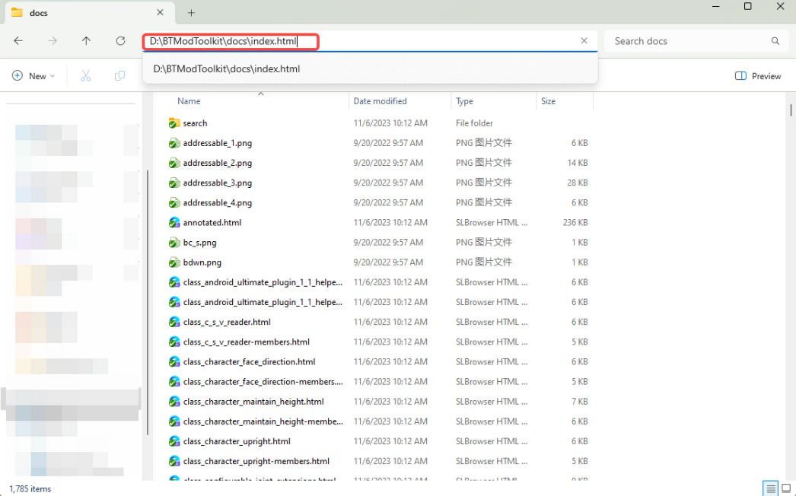

## Recommended IDE

* Recommended IDE to use by Fonzie is [ZeroBrane Studio](https://studio.zerobrane.com/) as lua editor [*SETUP GUIDE*](/docs/LuaScript/IDE/lua-env-config)
* [Cursor](https://www.cursor.com/) is a good choice with AI power

## How to use Lua in this project

To use Lua scripts, you first need to add the following components to your GameObject:

### 1. LuaBehavior  
- Basic Lua script component that can be added to any GameObject
- On your GameObject, click Add Component, search for and add the LuaBehavior component
- Fill in your script [filename](/docs/tools-in-mtk/addressable%20config/introduction#filename) in the Script Name field (without .txt extension)

### 2. InteractTriggerX  
- Component that defines various interaction behaviors for weapons
- On your GameObject, click Add Component, search for and add the InteractTriggerX component
- Fill in your interaction script [filename](/docs/tools-in-mtk/addressable%20config/introduction#filename) in the Script Name field
- Allows setting interaction range and trigger conditions

### 3. FlyObjectX  
- Component for simulate objects with independent trajectories and short life cycles, such as fireballs and bullets
- On your GameObject, click Add Component, search for and add the FlyObjectX component
- Fill in your flight control script [filename](/docs/tools-in-mtk/addressable%20config/introduction#filename) in the Script Name field
- Allows configuring flight speed, trajectory and other parameters

After adding these components, simply fill in your Lua script filename (without .txt extension) in the corresponding Script Name field to make the GameObject run your script logic.

You can add these components to your GameObjects and write corresponding Lua scripts to implement custom functionality.

## Scripting API

Open the Scripting Document via `BTModToolkit\docs\index.html`，you can query these API, then use them in lua.

