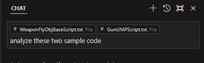
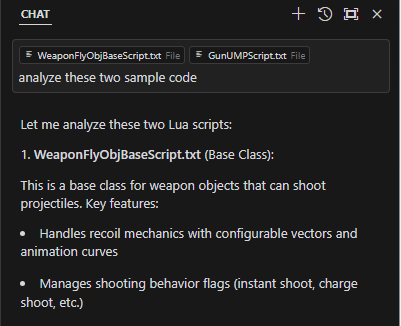
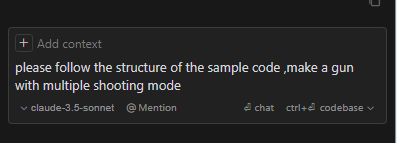
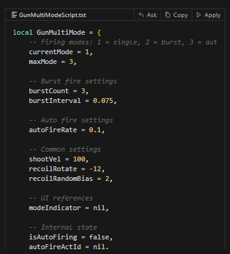

# Cursor

## Introduction

Cursor is a modern IDE based on VSCode that integrates powerful AI assistance features to help developers code more efficiently.

## Download & Installation

- Download from official website: [Cursor](https://www.cursor.com/)

## Configuration Steps

1. Open Cursor and import your project
2. Open any .txt script file
3. Click on the language configuration option in the bottom right corner
4. Select "Configure File Association for '.txt'" from the popup menu
5. Choose "Lua" from the language list

## Features

After configuration, Cursor provides complete Lua development support for all .txt files:

- Smart code completion
- Real-time syntax checking
- Code highlighting
- Intelligent code suggestions
- AI-assisted programming
- Integrated debugging tools
- Git version control

## Usage Tips

- Make good use of AI completion to significantly improve coding efficiency
- Use the built-in code formatter to keep code clean
- Leverage keyboard shortcuts to enhance development speed

## AI Shortcuts

Cursor provides powerful AI assistance features with the following common shortcuts:

- Ctrl+K: Generate code based on comments
- Ctrl+L: Open AI chat window for programming questions

These AI features can significantly improve development efficiency. It's recommended to master their usage.

### AI Code Generation Example

Here's an example of using Ctrl+K to generate weapon code:

1. First, provide the sample weapon code from MTK to AI for analysis:  
      
    get:  
    
2. Then, describe your weapon requirements, let AI generate new weapon based on the sample:  
      
    get:  
    
3. Copy the generated code to your project and adjust it as needed.
4. Test the weapon in the game to ensure it works as expected.
