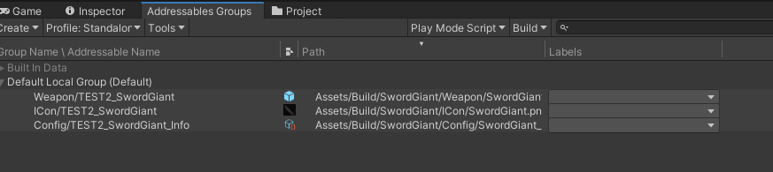
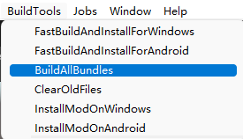
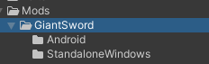

### 1. Update all addressables.

* Go to **AddressableConfig**(`Assets > Resources > AddressableConfig`) or use shortcut: `ctrl+shift+e`.
* Click `Clear Addressables` and `Create And Refresh Addressable Name`.

Then you will see this tool has already setup addressable path for you in the **Addressables Groups** window. (**Window/Asset Management/Addressables/Groups** to open this window)

### 3. Build

Click `BuildTools` > `BuildAllBundles` to Build.

Once you build it successfully,  then you will find your mod in the Assets/Mods. If something errors, please checkout the Console information, unity will tell you what's going wrong. And feel free to ask questions on our discord server.

