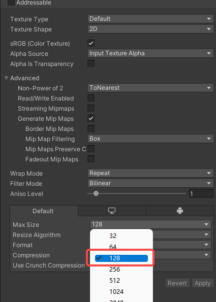

** Note, you cannot generate an icon for every mod type. Skip this step if you are creating a mod without a model (scene or song) and add one manually.**

#### 1.Generate the icon

* In the **Unity Toolbar**: Go to `Tools -> Icon Generator`.

* Drag the `Prefab` of your mod (the weapon, avatar, scene) into the field: `Game Object To Render`.
* Adjust the settings of the icon to your liking.
* Click the `Save PNG...` button.
* **Overwrite** the dummy icon in folder `ICon` of your mod that has been created for you previously. (** keep the name as is**. Don't change this).
* Set the Max size to `256` and click `Apply` to save (yes screenshot shows 128, my bad).

