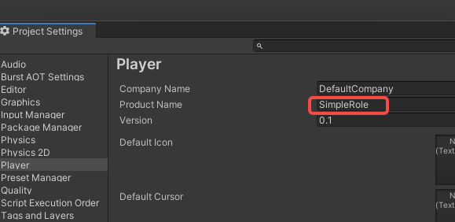
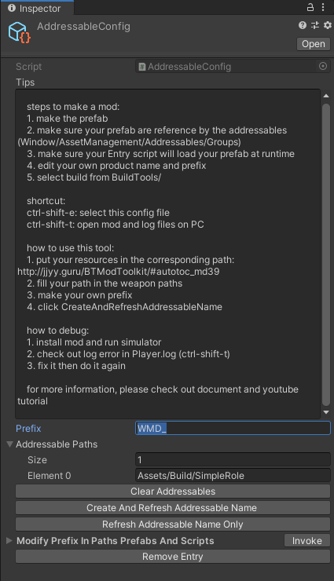

#### 1. New mod project
Make sure you have the prerequirements for modding and download a fresh ModToolkit to start.

* Download & Install [Unity Hub](https://unity3d.com/get-unity/download).
* Download & Install [Unity (2019.4.12)](https://unity3d.com/unity/whats-new/2019.4.12).
* Download the [Battle Talent ModToolkit](https://github.com/BattleTalent/BTModToolkit/archive/refs/heads/master.zip). (Wanna use git? [Check out the repo!](https://github.com/BattleTalent/BTModToolkit))
* Open the downloaded ModToolkit in Unity.

#### 2. Remove unused content
Make sure to remove the demo content so that we have a clean project to start with.

* In the Unity toolbar; click `Tools > Destructive > Cleanup All Content`.

<video controls width="90%">
  <source src="/community-docs/videos/clear_all_content.mp4"/>
</video>

#### 3. Product name
Change the product name so that the **mod folder name** will not conflict with other mods.

* In the **Unity Toolbar**: Go to `Edit -> Project Settings -> Player`.
* Modify field `Product Name` to your new mod name. Use the format: `YOURPREFIX_MyModName`.
  **Example:** `WMD_ChevalierWeapons`

#### 4. Prefix.
Change the project prefix so that the **mod files** will not conflict with other mods.

* In the **Unity file browser**: Open `Assets -> Resources -> AddressableConfig.asset`

* Modify field `Prefix` to your new prefix name. Use the format: `YOURPREFIX_MyModName_`.
  **Example:** `WMD_ChevalierWeapons_`

  **Note:** The prefix used in the tutorial is `WMD_`. You will need to fill in your new prefix instead of every `WMD_` in the tutorial.

