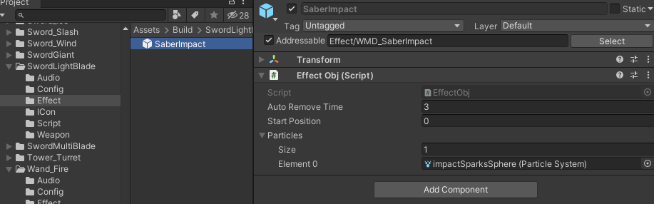

# EffectObj component- Special Effect

EffectObj is used for particle effect, but it will be reuse again and again. To use this script, simply add this component to the root of your particle effect, then make it prefab under Effect folder of your weapon.

