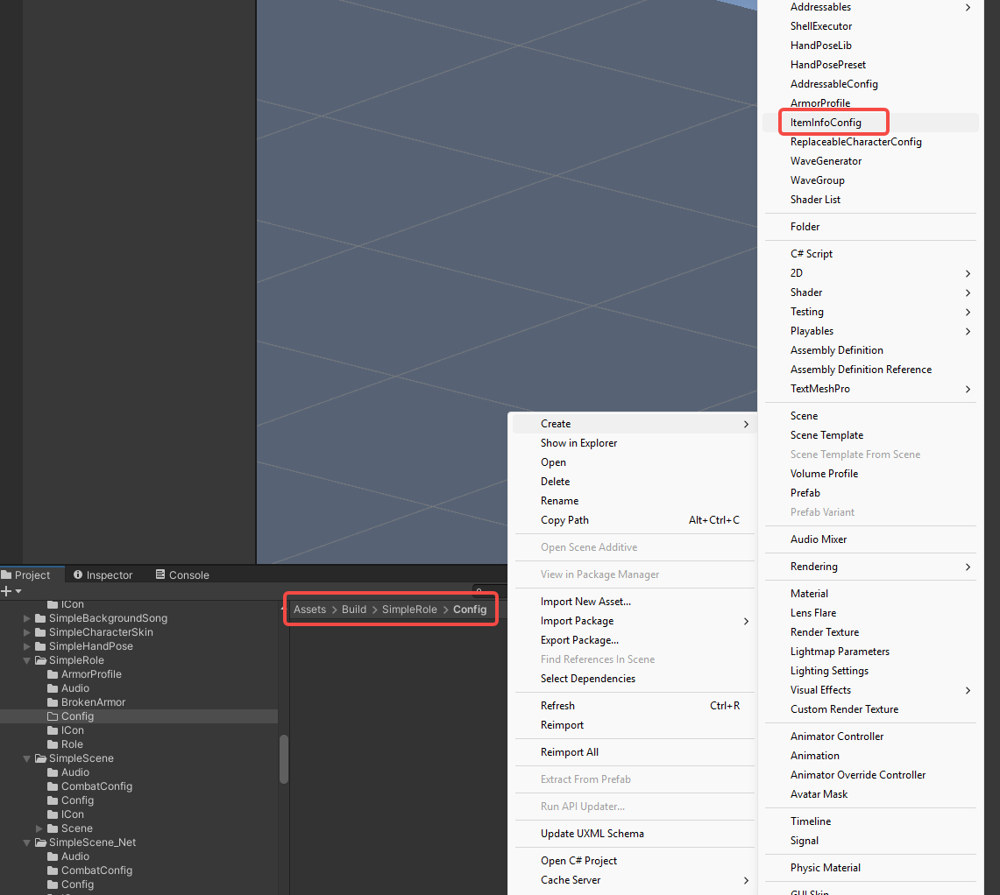
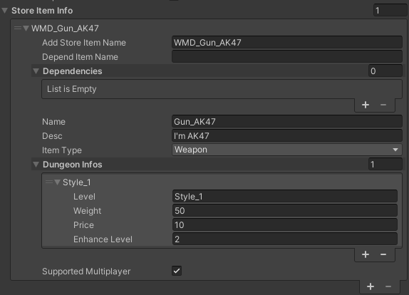
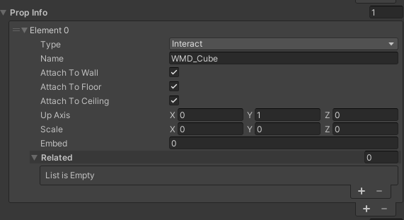
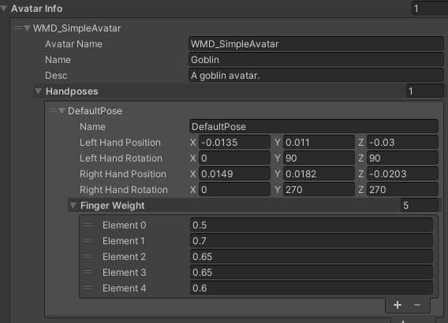
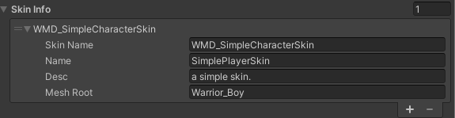
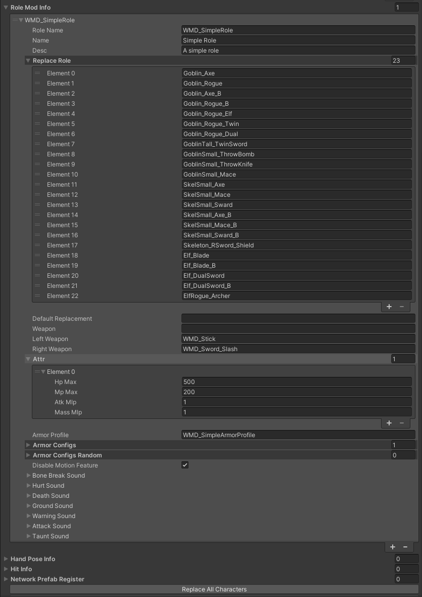

# Mod Configuration Guide

This guide covers various mod configuration types available for your custom content.

## Phase 1: Create Configuration Files

1. **Generate Configurations**:

   - Navigate to `Assets > build > YourModName >`

   - Create a `Config` folder

   - Right-click in the folder and select: `Create > ItemInfoConfig`

   - Rename the config file to match your mod name

      

## Phase 2: Configure Different Mod Types

### 1. StoreItemInfo (Weapons, Potions, etc.)
Fill in the following fields in your ItemInfoConfig:

- **Basic Settings**:
  
  - `AddStoreItemName`: Your item prefab's exact name
  - `Name`: Display name that appears in-game
  - `Desc`: Item description shown in-game
- `itemType`: Category type for the item
  
- **Dependencies (Optional)**:
  
- `DependItemName & Dependencies`: Required items for installation
  
- **Merchant Configuration**:
  - `DungeonInfos` (Optional): Dungeon merchant settings
    - `Level`: Dungeon level where item appears
    - `Weight`: Spawn probability
    - `Price`: Item cost
    - `EnhanceLevel`: Default enhance level

- **Multiplayer**:
  
  - `SupportedMultiplayer`: Check to enable multiplayer compatibility
  
    

---

### 2. SceneModInfo (Custom Scenes)
Fill in the following fields in your SceneModInfo:

- **Basic Settings**:
  - `SceneName`: Your scene file name
  - `Name`: Display name that appears in-game
  - `Desc`: Scene description

- **Multiplayer Configuration**:
  - `SupportedMultiplayer`: Enable multiplayer support
  - `MultiplayerConfig`:
    - `MaxPlayers`: Player limit (2-6)
    
    - `RebornTime`: Respawn delay in seconds
    
    - `PlayerHp`: Default health value
    
    - `PlayerMp`: Default mana value
    
    - `PlayerMpRecoverRate`: MP regeneration rate
    
      

---

### 3. PropInfo (Scene Objects)
Fill in the following fields in your PropInfo:

- **Basic Settings**:
  - `Name`: Prefab name
  - `Type`:
    - `Kinematic`: Static objects
    - `Interact`: Interactive objects
    - `Light`: Lighting objects

- **Placement Settings**:
  - `AttachToWall`: Snap to walls
  - `AttachToFloor`: Snap to ground
  - `AttachToCeiling`: Snap to ceilings
  - `UpAxis`: Upward facing axis (X/Y/Z)
  - `Scale`: Object size multiplier
  - `Embed`: Wall penetration depth

- **Compound Objects**:
  - `Related` (For multi-part objects):
    - `Name`: Child object name
    
    - `Embed`: Child object penetration depth
    

      

---

### 4. AvatarInfo (Player Characters)
Fill in the following fields in your AvatarInfo:

- **Basic Settings**:
  - `AvatarName`: Your prefab name (prefix+name format)
  - `Name`: Display name that appears in-game
  - `Desc`: Character description

- **Hand Configuration**:
  - `Handposes`:
    - `Name`: Pose name
    - `Left/RightHandPosition`: Hand coordinates (XYZ)
    - `Left/RightHandRotation`: Hand angles (XYZ)

- **Finger Settings**:
  - `FingerWeight`: Finger bend values (0-1)
    
    - Order: [Thumb, Index, Middle, Ring, Pinky]
    
      

---

### 5. SkinInfo (Player Skins)
Fill in the following fields in your SkinInfo:

- **Basic Settings**:
  - `SkinName`: Your prefab name
  - `Name`: Display name that appears in-game
  - `Desc`: Skin description

- **Technical Settings**:
  
  - `MeshRoot`: Root node name containing all meshes
  
    

### 6. RoleModInfo (NPCs/Enemies)
Fill in the following fields in your RoleModInfo :

- **Basic Settings**:
  - `roleName`: Your character prefab's exact name (prefix + name format)
  - `Name`: Display name that appears in-game
  - `Desc`: Character description shown in-game

- **Role Replacement**:
  - `ReplaceRole`: Existing characters this mod will replace
    - Click `ReplaceAllCharacters` button to auto-populate
    - Manually add/remove entries as needed
  - `DefaultReplacement`: Default character being replaced

- **Combat Setup**:
  - `Weapon`: Default weapon
  - `LeftWeapon`: Overrides left hand weapon (optional)
  - `RightWeapon`: Overrides right hand weapon (optional)

- **Attributes**:
  - `Attr > HpMax`: Maximum health points
  - `Attr > MpMax`: Maximum mana points
  - `Attr > AtkMlp`: Damage multiplier
  - `Attr > MassMlp`: Mass multiplier

- **Armor Configuration**: [(Armor Tutorial )](/docs/support-mod-types/Role/Tutorials/create-an-armor-mod)

  - `ArmorProfile`: Reference to your armor configuration
  - `ArmorConfigs`: Default armor sets (requires ArmorProfile)
  - `ArmorConfigsRandom`: Random armor variations (requires ArmorProfile)

- **Special Flags**:
  - `DisableMotionFeature`: Enable for boss characters (prevents knockback)

- **Audio (Optional)**:
  - `Sound`: Configure character-specific sound effects

## Phase 3: Finalize Configuration

1. Save configuration
2. Ensure all referenced prefabs exist
