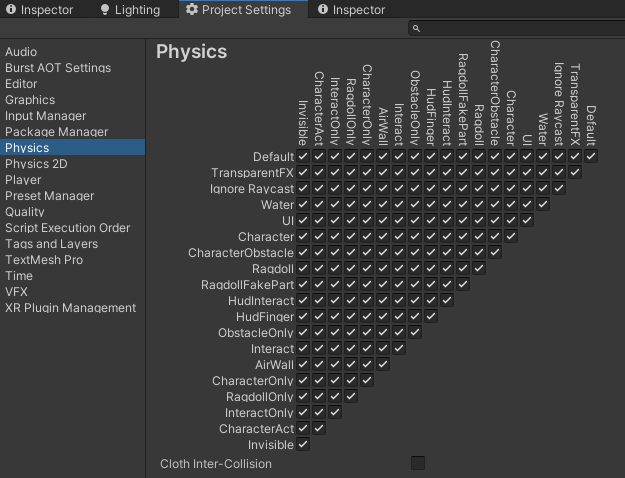

# Physics in Unity

### Collision message deliver rule

In Unity, collision message(such as OnCollisionEnter) will always deliver to the closest parents(including itself) with Rigidbody component. Which means if you have a child object with Collider under a parent with Rigidbody, then the child's collision message will deliver to the parent.

### Collision layer rule

In Unity, object in different layer may or may not be able to colliding each other. The collision relationship between them are mainly controlled by the **Physics Layer Table**.

But you don't need to remember this at all. In Battle Talent, we predefined some layers associate with specific objects, just follow these rules and you will be fine.

| layer name        | physics object associated      | Layer             |
| ----------------- | ------------------------------ | ----------------- |
| BodyMask          | Npc&Player's Bodypart          | Ragdoll           |
| EnvLayerMask      | Environment                    | CharacterObstacle |
| InteractLayerMask | Weapon, Item, Part of BodyPart | Interact          |

To access these mask in code, please check this: https://battletalent.github.io/BTModToolkit/class_cross_link_1_1_layer_define.html

### Convexing colliders

If you want convex collider, please divide it into multiple small concave colliders.

There is different ways to cut up your models:
- In Battle Talent, we're using Collider Creator in the unity asset store.
- It's also possible to manually cut the mesh in small pieces using Blender.
