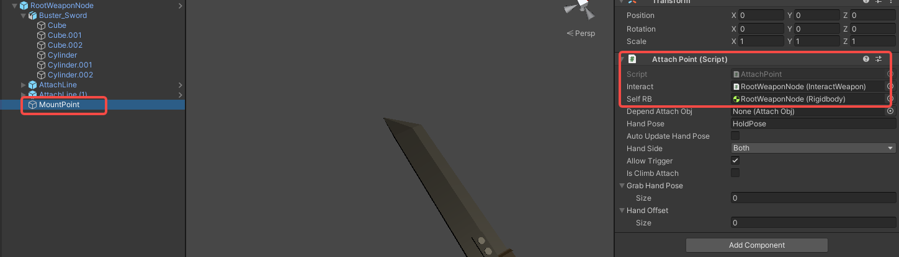

import ModTutorialFragmentPhaseBuild from '/docs/_fragments/_fragment-phase-build.mdx';
import ModTutorialFragmentPhaseTest from '/docs/_fragments/_fragment-phase-test.mdx';
import ModTutorialFragmentStepOpenUnity from '/docs/_fragments/_fragment-step-open-unity.mdx';
import ModTutorialFragmentStepCreateIcon from '/docs/_fragments/_fragment-step-create-icon.mdx';
import ModTutorialFragmentStepTemplateWizard from '/docs/_fragments/_fragment-step-template-wizard.mdx';

Here is a step by step tutorial for making a **weapon** mod.

## Phase 1: Define your mod

<ModTutorialFragmentStepOpenUnity />

#### 5.Generate folder structure using the template wizard.

<ModTutorialFragmentStepTemplateWizard modType="Weapon" />

#### 6.Place the model

* Open the newly created prefab in the `Weapon` folder.

* Drag your model of the sword into the prefab hierarchy under the <b>parent object</b>.
   Explanation: <b>Parent object is the top object of the prefab</b>. It will be called the same as the name of your prefab.
   (Example: Prefab file is called<code>NewModFolderName.prefab</code>. parent object will be called <code>NewModFolderName</code>).
* Rotate the model and resize the weapon until it feels ok in comparison to the **dummy weapon**.

* Under `InteractWeapon`, click `show example weapon` again to disable it.
* Reference the **MeshRenderer** from the model to **Skill Change Colors**. (quick tips: if you want to place multiple renderer at the same time, you can click the lock button to lock the inspector, then drag them all at once) (the **Skill Change Colors** will be used for change weapon color when it's needed, such as damaged).

#### 7.Add Collider for colliding

* Click **Add Component** to add **Mesh Collider**.
* select **Convex** and change default layer to **Interact layer**.
(quick tips: if you want accurate collision, we recommend Collider Creator in the unity asset store, but it's not free.)

#### 8. Define HitInfo and CollisionEffect

In short, **RagdollHitInfoObj** defines how a collider deals damage and **CollisionEffect** defines what's the collision physics material is.

* Change the values in `RagdollHitInfoObj` and `CollisionEffect` as (shown in screenshot) on the **Parent Object**.
  (Possible options to enter here are can be found on this page: [HitInfo and CollisionEffect](/docs/details/hitinfo-and-collisioneffect).)

* Then add these components(`RagdollHitInfoObj` and `CollisionEffect`) to the handle as well to distinguish hits between blade and handle.

(**Explanation**: To learn more about `RagdollHitInfoObj` and `CollisionEffect`, please read [HitInfo and CollisionEffect](/docs/details/hitinfo-and-collisioneffect).)

#### 9.Add AttachLine for grabbing

* Drag `AttachLine` from the path **Asset/Prefabs** to the **Parent Object**.
   Explanation: <code>AttachLine</code> describes how your hand grabbing it. If you toggle <b>Gizmos</b> in the scene editor, then you will see a blue line where your hand will attach to.
* Adjust the size of the **Line Start Point** and the **Line End Point** to modify the grab area.

Since this is a two-handed weapon, so we add another one:

* Add another `AttachLine`, and this one should depend on the previous one.
* Set **DependAttachObj** to the other.
* Set **Index Limit** to **Both**, so that this attach will limit to player's hand in two direction of your index finger.

* At last, reference these `AttachLine`s to the **InteractWeapon** component from the **Parent Object**. And select `Allow Second Hand`.  

#### 10.Add MountPoint for backpack
MountPoint will determine where it will mount to your inventory slots like belt or back.

* A MountPoint is already added for you by the template wizard (named `MountAttach`).
* Move it to the relative position where it should attach to the backpack.

#### 11.Add StabObject for stabbing

* Add `StabObject` to **Parent Object**.
* Define the **StabArea** to surround the blade. (Tips: you can hover the mouse over the parameter to view the tips.)

#### 12.Change weapon handling

* Click the `Swing Like Hammer` button. (it'll modify the grab force and hand speed)

* Save the prefab.

## Phase 2: Prepare to export your mod

Create Configuration files and fill [(StoreItemInfo)](/docs/details/item-info-config)

<ModTutorialFragmentStepCreateIcon modType="Weapon" />

## Phase 3: Build the mod

<ModTutorialFragmentPhaseBuild />

## Phase 4: Test & publish the mod

<ModTutorialFragmentPhaseTest />