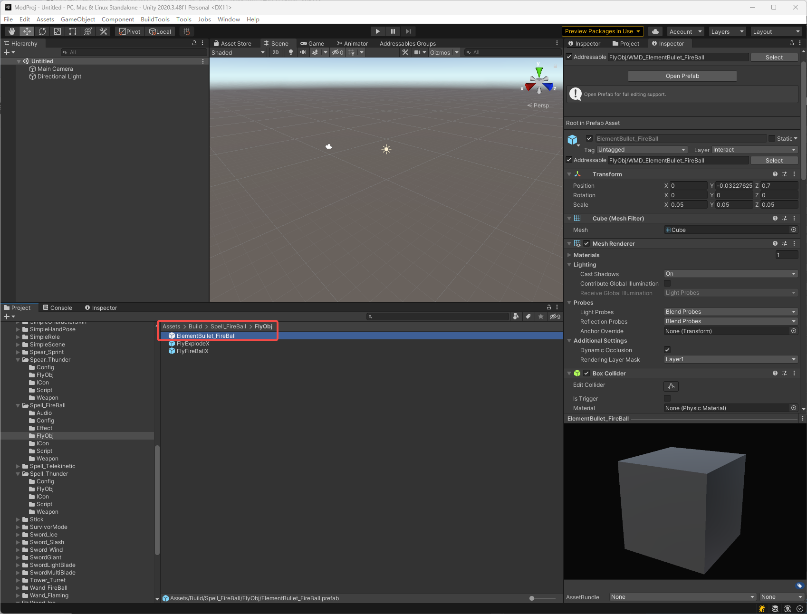
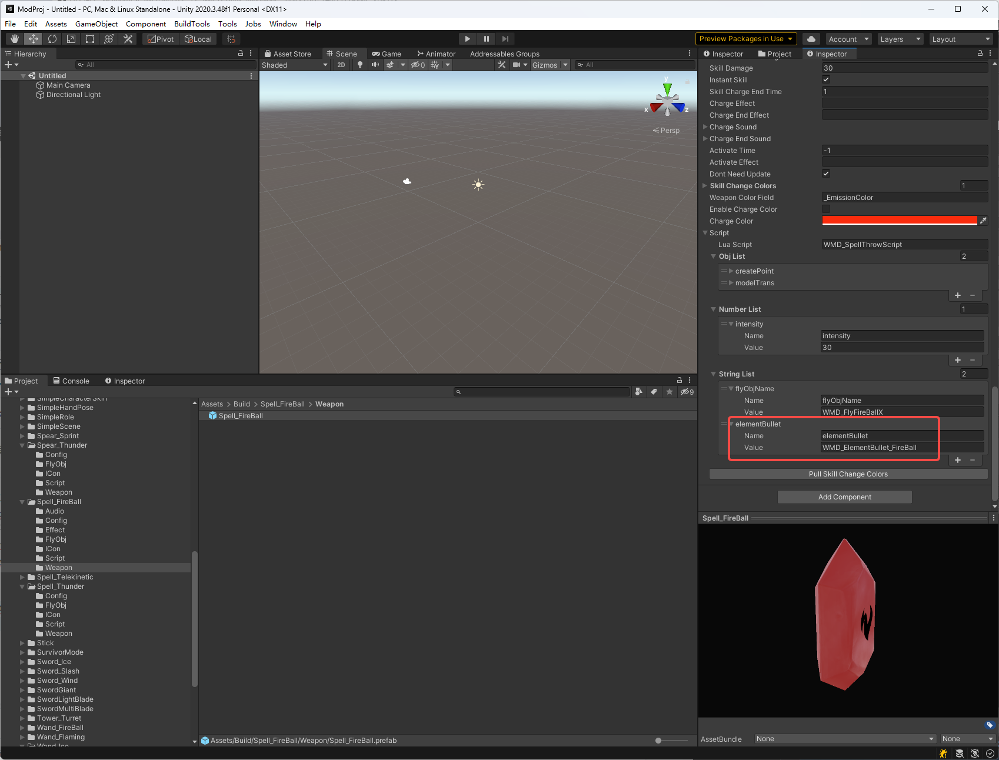
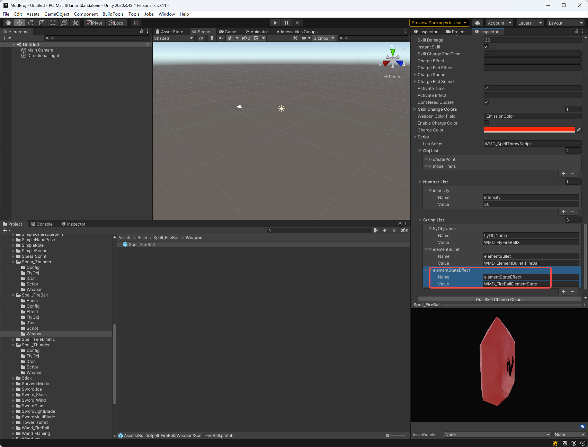

# Gem of Elemental Gun

Note: The prefixes used in the tutorial are "WMD\_", which can be replaced with your own prefix, and you will need to change the prefix in the AddressableConfig(Assets/Resources/AddressableConfig) file. Once you have changed the prefix, you will need to fill in your new prefix instead of "WMD\_" in the tutorial.

Follow the steps below to allow Spell Gems to be placed into Elemental Gun.

Here we use Spell_FireBall as an example.

#### 1.Setting up the ElementBullet

​	First, we need to make a bullet, save it to `Spell_FireBall/FlyObj`, you can refer to  [Create a gun mod](./advanced-create-a-gun-mod) for how to make a bullet. 

​	then select the spell you want to set up, add a new column in the String List of `InteractTriggerX` with the name `elementBullet`, Value Fill in the name of the bullet,here it is WMD_ElementBullet_FireBall.

​	Now Elemental Gun will be able to fire the bullet we made.

#### 2.Setting state effect (Optional)

​	If we want to create an Elemental Gun state effect when it is placed on our gem, again we need to make an effect, save it to `Spell_FireBall/Effect`, then we need to add another line to the String List with the name `elementStateEffect` and the Value with the name of the effect we made.

