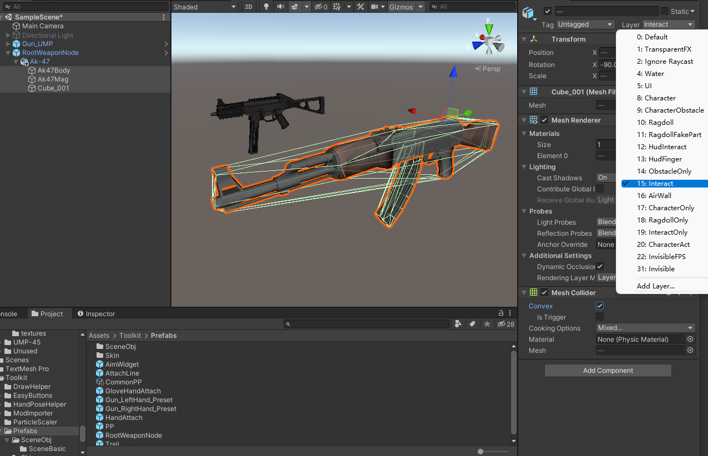
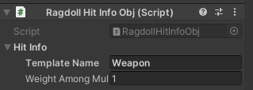
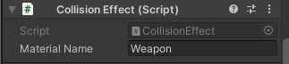
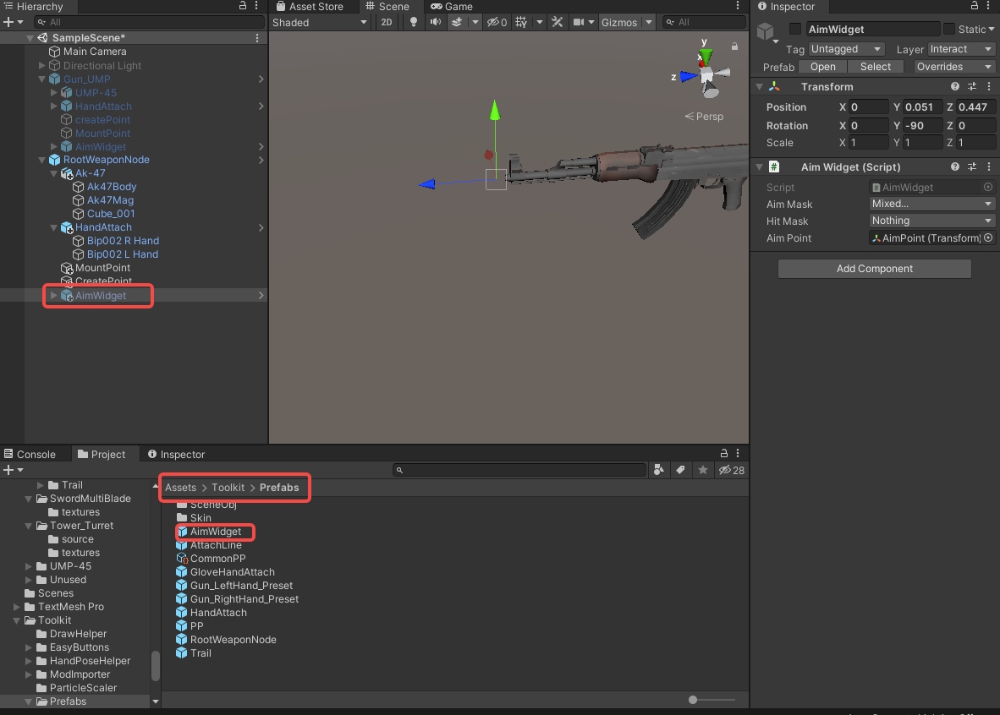
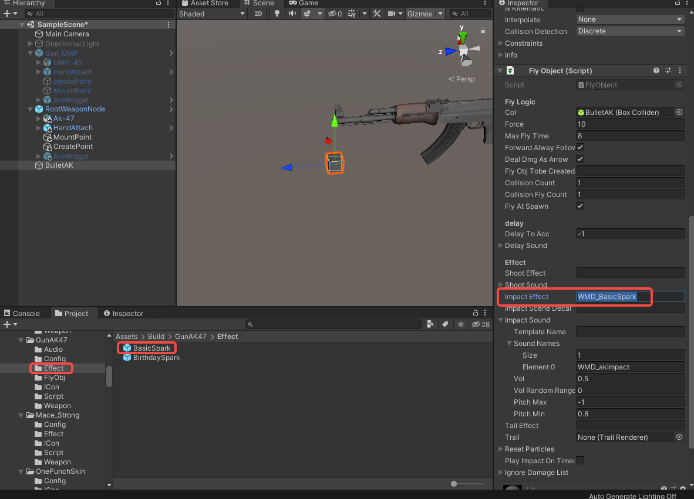

import ModTutorialFragmentPhaseBuild from '/docs/_fragments/_fragment-phase-build.mdx';
import ModTutorialFragmentPhaseTest from '/docs/_fragments/_fragment-phase-test.mdx';
import ModTutorialFragmentStepOpenUnity from '/docs/_fragments/_fragment-step-open-unity.mdx';
import ModTutorialFragmentStepCreateIcon from '/docs/_fragments/_fragment-step-create-icon.mdx';
import ModTutorialFragmentStepTemplateWizard from '/docs/_fragments/_fragment-step-template-wizard.mdx';

# Create a gun mod

Note: The prefixes used in the tutorial are "WMD\_", which can be replaced with your own prefix, and you will need to change the prefix in the AddressableConfig(Assets/Resources/AddressableConfig) file. Once you have changed the prefix, you will need to fill in your new prefix instead of "WMD\_" in the tutorial.

## Phase 1: Define your mod

<ModTutorialFragmentStepOpenUnity />

#### 5.Generate folder structure using the template wizard.

<ModTutorialFragmentStepTemplateWizard modType="Gun" />

#### 6.Place the model

* Drag the newly created prefab from the `Weapon` folder into the SampleScene (or any scene) and click on the right arrow of the prefab in the Hierarchy window to open it (if you edit the prefab directly, you may not see the hand in step 9 in the scene view).
* Drag your model of the gun into the prefab hierarchy under the <b>parent object</b>.

 Explanation: <b>Parent object is the top object of the prefab</b>. It will be called the same as the name of your prefab.
 (Example: Prefab file is called<code>NewModFolderName.prefab</code>. parent object will be called <code>NewModFolderName</code>).
* Rotate the model and resize the weapon until it feels ok in comparison to the **dummy weapon**.

* Under `InteractWeapon`, click `show example weapon` again to disable the example weapon.
* Reference the **MeshRenderer** from the model to **Skill Change Colors**. (quick tips: if you want to place multiple renderer at the same time, you can click the lock button to lock the inspector, then drag them all at once) (the **Skill Change Colors** will be used for change weapon color when it's needed, such as damaged).

#### 7.Add Collider for colliding

* Click **Add Component** to add **Mesh Collider**.
* select **Convex** and change default layer to **Interact layer**.
(quick tips: if you want accurate collision, we recommend Collider Creator in the unity asset store, but it's not free.)

#### 8. Define HitInfo and CollisionEffect

In short, **RagdollHitInfoObj** defines how a collider deals damage and **CollisionEffect** defines what's the collision physics material is.

* Change the values in `RagdollHitInfoObj` and `CollisionEffect` as (shown in screenshot) on the **Parent Object**.
(Possible options to enter here are can be found on this page: [HitInfo and CollisionEffect](/docs/details/hitinfo-and-collisioneffect).)

* Then add these components(`RagdollHitInfoObj` and `CollisionEffect`) to the handle as well to distinguish hits between blade and handle.

(**Explanation**: To learn more about `RagdollHitInfoObj` and `CollisionEffect`, please read [HitInfo and CollisionEffect](/docs/details/hitinfo-and-collisioneffect).)

#### 9.Add HandAttach for grabbing

* `HandAttach` is already added for you by the template wizard.
* Explanation: `HandAttach` describes how your hand grabbing it.

Drag a **HandPoseHelper** from the path **Asset/Toolkit/HandPoseHelper** to the scene and set the HandAttach reference to the HandPoseHelper's HandAttach

Click on AddDragTool and you can see the hand appear in the scene view.

Adjust the angle of the HandAttach according to the hand.

Click RemoveDrawTool to remove the hand.

#### 7. Add MountPoint for backpack
MountPoint will determine where it will mount to your inventory slots like belt or back.

* A MountPoint is already added for you by the template wizard (named `MountAttach`).
* Move it to the relative position where it should attach to the backpack.

#### 8. Change weapon handling

In the `InteractWeapon`, click `Swing Like Pistol`. (it'll modify the grab force and hand speed)

#### 9.Set InteractTriggerX

* Go to the Parent object
* Scroll down to `InteractTriggerX`.
* Click `Script` to show script options.
* Make sure the `Lua Script` value starts with your prefix. (so `WMD_WeaponFlyObjBaseScript` should be changed to `YOURPREFIX_WeaponFlyObjBaseScript`).
* Make sure the `String List > flyObjName value` value starts with your prefix. (so `WMD_Bullet` should be changed to `YOURPREFIX_Bullet`).

#### 10. shoot position
ShootPosition determines the position and rotation of where the bullet is fired from.

* Go to `shootPosition` transform and change it rotation and position to your preference.

#### 11. Sounds & Effects
Place your sound files in your Mod's **Audio** folder, add **SoundEffectPlayer** to the parent object, set the size of **SoundName** to 1, fill in **Element0** with the prefix + sound "**WMD_akshot**", and finally reference it to InteractTriggerX's **shootSound**.

Disable `SoundEffectPlayer` if you don't need it to play on spawn.

#### 11. AimWidget
Add **AimWidget** to the parent object and reposition it to the muzzle of the gun.

Similarly, select the parent object and lock the panel to set the **AimWidget** component reference to aimWidget.

#### 10.Create bullet
Your gun will ofcourse need a bullet.

* A bullet is automatically created for you in the `Build > FlyObj` folder.
* Open it and add a custom bullet model to it so it looks good.
* set up **ImpactEffect**, here we don't cover the creation of the Effect, just use BasicSpark from the project.，you can copy it to the Effect folder of the mod.

* set up ImpactSound, again you need to place the sound file in the Audio folder of the mod.

## Phase 2: Prepare to export your mod

<ModTutorialFragmentStepCreateIcon modType="Weapon" />

## Phase 3: Build the mod

<ModTutorialFragmentPhaseBuild />

## Phase 4: Test & publish the mod

<ModTutorialFragmentPhaseTest />