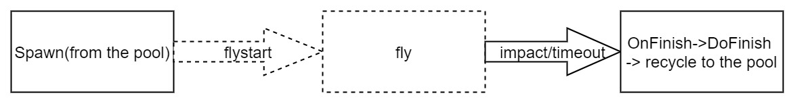

# FlyObject / FlyObjectX

## Overview

FlyObject is a component designed to simulate objects with independent trajectories and short life cycles, such as fireballs and bullets. FlyObjectX extends the base FlyObject class by adding scripting capabilities through Lua.

## Life Cycle

The following diagram illustrates the complete life cycle of a **FlyObject** from spawn to termination:

## Flight Mechanics

During flight state, FlyObject can:
- Generate and manage particle trails
- Track and update trajectory paths

The object will transition from flight to stopped state once the collision count reaches the configured `collisionFlyCount` value.

## Collision Configuration

FlyObject provides flexible collision filtering options:

- `ignoreDamageList`: Specify object types to ignore during collision detection
- `ignoreHolder`: Option to ignore collisions with the entity that spawned this FlyObject

## Collision Event Handlers

**Important**: Collision events will override the default Lua functions. To maintain proper life cycle management, you must manually call `OnCollisionUpdate()` in your handlers. See `FlySpellBaseScript.txt` for implementation examples.

|Target Type | Collision Handler          | Trigger Handler           |
|----------- | ------------------------- | ------------------------ |
|PlayerHand  | OnCollisionWithPlayerHand | OnTriggerWithPlayerHand |
|Player      | OnCollisionWithPlayer     | OnTriggerWithPlayer     |
|HitScan     | OnCollisionWithHitScan    |                         |
|Scene       | OnCollisionWithScene      | OnTriggerWithStaticScene|
|Role        | OnCollisionWithRole       | OnTriggerWithRole       |
|Default     | OnCollision               | OnTrigger               |