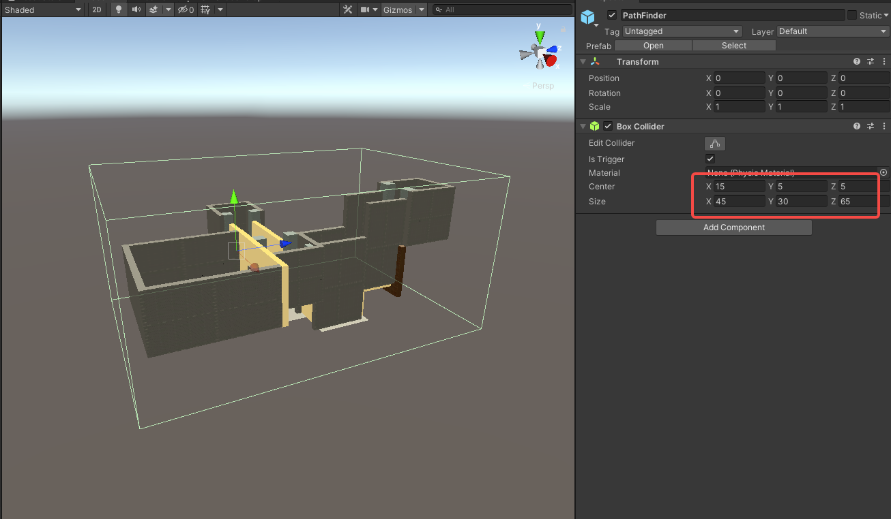

import ModTutorialFragmentPhaseBuild from '/docs/_fragments/_fragment-phase-build.mdx';
import ModTutorialFragmentPhaseTest from '/docs/_fragments/_fragment-phase-test.mdx';
import ModTutorialFragmentStepOpenUnity from '/docs/_fragments/_fragment-step-open-unity.mdx';
import ModTutorialFragmentStepCreateIcon from '/docs/_fragments/_fragment-step-create-icon.mdx';
import ModTutorialFragmentStepTemplateWizard from '/docs/_fragments/_fragment-step-template-wizard.mdx';

Here is a step by step tutorial for making a **scene** mod.

## Phase 1: Define your mod

<ModTutorialFragmentStepOpenUnity />

#### 5. Generate folder structure using the template wizard.

<ModTutorialFragmentStepTemplateWizard modType="Scene" />

#### 6. Place items in the scene

* Open the newly created `scene` file in the `Scene` folder. (for example: `Build > YourNewModFolder > Scene`)
* Add collision to the items by adding `MeshCollider`.
* Make sure to change the layer of the objects to: `CharacterObstacle` or else they will not collide with the player.

**Extra:** There are a couple of prefabs you can use the place special interactable objects.

| Prefab      | Description                                                         |
|-------------|---------------------------------------------------------------------|
| `HookRoot`  | Allows you to add a root that you can swing across gaps.            |
| `SlideWall` | Allows you to add a wall object that you can run along.             |
| `StoneGate` | A togglable gate.                                                   |
| `SkeletonStatue` | A grabbable statue that can start waves.                       |
| `WeaponPendant` | A grabbable weapon that will float in a location until grabbed. |
| `RespawnTrigger` | A collider that will set the respawn point to the center of the collider when a player enters it. |

#### 7. CharacterPos

* Adjust the `CharacterPos` (under `SceneScriptNode`) to adjust the character spawning position.

#### 8. DeadZone

* Adjust the `Transform`'s `Y` value to change the position of the [DeadZone](/docs/details/deadzone-respawntrigger) (under `SceneScriptNode`).
* Place [RespawnTrigger](/docs/details/deadzone-respawntrigger)'s to place respawn points.

#### 9. PathFinder

* Adjust `BoxCollider` of the `PathFinder` (under `SceneScriptNode`) to enclose the whole scene.

* Save the scene.

#### 7. Bake the scene
This step is not required, but it will increase performance, because it will not render objects that are currently not visible for the player.

* Mark all objects that do not move `Occluder Static`.

* Open the `Occlusion` window by going to `Window > Rendering > Occlusion Culling`.

* In the `Occlusion` window, click the `Bake` button.

* Save the scene again.

#### Extra - StabableObj
Want some items to be stabbable (and also climbable)? You can do this as followed:

* Find the object you want to be stabbable/climbable.
* Give it a `RigidBody` component and mark it `Is Kinematic`.

* Give it a `StabableObj` component.

#### Extra - Combat Room
* Want to know how to create a **Combat Room**? Please read [Create Combat Room](./create-combat-room).

## Phase 2: Prepare to export your mod

Create Configuration files and fill [(SceneModInfo)](/docs/details/item-info-config)

<ModTutorialFragmentStepCreateIcon modType="Scene" />

## Phase 3: Build the mod

<ModTutorialFragmentPhaseBuild />

## Phase 4: Test & publish the mod

<ModTutorialFragmentPhaseTest />