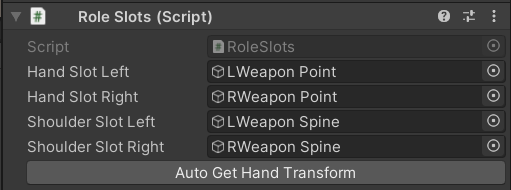
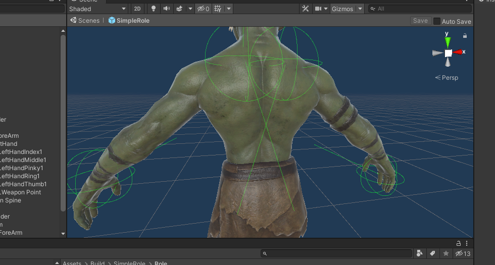
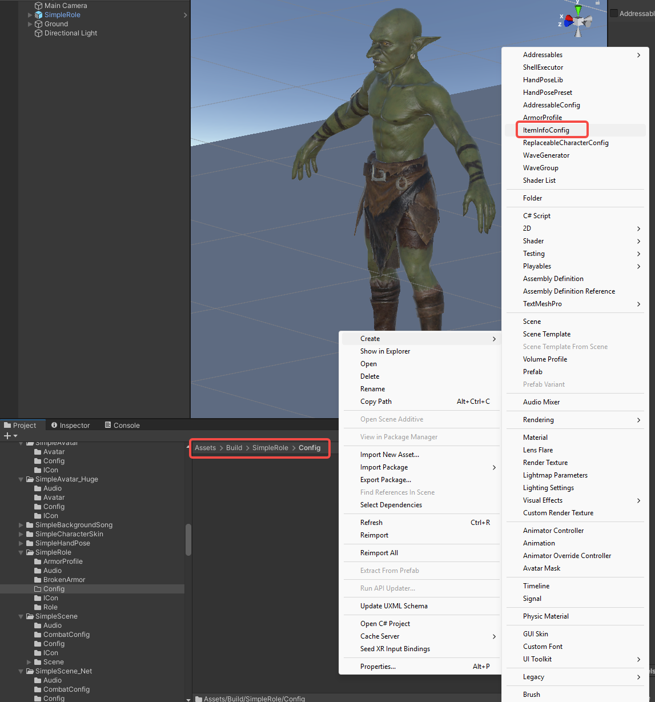
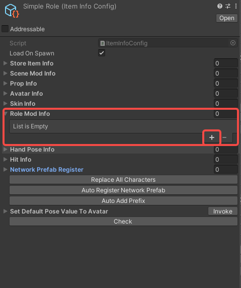
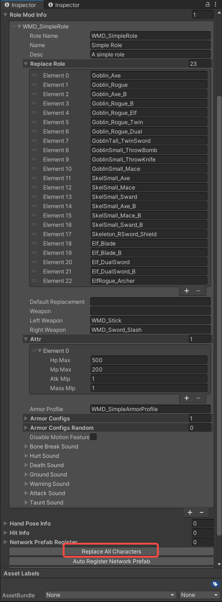

import ModTutorialFragmentPhaseBuild from '/docs/_fragments/_fragment-phase-build.mdx';
import ModTutorialFragmentPhaseTest from '/docs/_fragments/_fragment-phase-test.mdx';
import ModTutorialFragmentStepOpenUnity from '/docs/_fragments/_fragment-step-open-unity.mdx';
import ModTutorialFragmentStepTemplateWizard from '/docs/_fragments/_fragment-step-template-wizard.mdx';
import ModTutorialFragmentStepCreateIcon from '/docs/_fragments/_fragment-step-create-icon.mdx';

# Create a role mod

Here is a step to make a simple **role(NPC)** mod.

## Phase 1: Define your mod

<ModTutorialFragmentStepOpenUnity />

#### 5.Generate folder structure using the template wizard.

<ModTutorialFragmentStepTemplateWizard modType="Role" />

#### 6.Set the Animation Type to humanoid and Avatar Definition to Create From This Model

* Add your custom model to your `Resources` folder in Unity.
* Change the following settings on the model like the image **and click apply**.

#### 7.Configure the model into the prefab

* Open the newly created prefab in the `Role` folder.
* Drag your model into it.
* Disable the animator on the **model you just added**.
* On the **prefabs parent object**, Make sure the `animator` component has the armature selected of the newly added model.

#### 5.Hand transform configuration

* Open the newly created prefab in the `Role` folder.
* Navigate to the highest object (should be the same as the name of your mod) so that you see component `RoleSlots`.
* Should look something like this: (button has since then been renamed to `Generate Slots` so you are good.).

* Click the `Generate Slots` button.
* Avatar should now show some spheres and lines. those indicate your newly created slots. Adjust the transforms of the variables added to `RoleSlots` to make those fit your avatar better.

* **Save the prefab**

## Phase 2: Prepare to export your mod

#### Configuration Setup

1. ##### Create configuration file

* Navigate to `Assets > Build > YourModName ` 

* Create a `Config` folder

* Right-click in the folder and select: `Create > ItemInfoConfig`

* Rename the config file to match your character name

  

* Click the `+` button in the `RoleModInfo` section to create character configuration

  

##### 2. Configure character properties
Fill in the following fields in your ItemInfoConfig:

- **Basic Settings**:
  - `roleName`: Your character prefab's exact name (prefix + name format)
  - `Name`: Display name that appears in-game
  - `Desc`: Character description shown in-game

- **Role Replacement**:
  - `ReplaceRole`: Existing characters this mod will replace
    - Click `ReplaceAllCharacters` button to auto-populate
    - Manually add/remove entries as needed
  - `DefaultReplacement`: Default character being replaced

- **Combat Setup**:
  - `Weapon`: Default weapon
  - `LeftWeapon`: Overrides left hand weapon (optional)
  - `RightWeapon`: Overrides right hand weapon (optional)

- **Attributes**:
  - `Attr > HpMax`: Maximum health points
  - `Attr > MpMax`: Maximum mana points
  - `Attr > AtkMlp`: Damage multiplier
  - `Attr > MassMlp`: Mass multiplier

- **Armor Configuration**: [(Armor Tutorial )](/docs/support-mod-types/4.Role/Tutorials/5.create-an-armor-mod)
  - `ArmorProfile`: Reference to your armor configuration
  - `ArmorConfigs`: Default armor sets (requires ArmorProfile)
  - `ArmorConfigsRandom`: Random armor variations (requires ArmorProfile)

- **Special Flags**:
  - `DisableMotionFeature`: Enable for boss characters (prevents knockback)

- **Audio (Optional)**:
  - `Sound`: Configure character-specific sound effects

<ModTutorialFragmentStepCreateIcon modType="Role" />

## Phase 3: Build the mod

<ModTutorialFragmentPhaseBuild />

## Phase 4: Test & publish the mod

<ModTutorialFragmentPhaseTest />