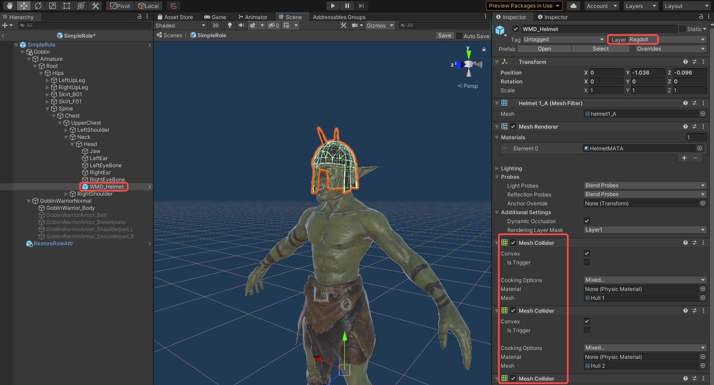
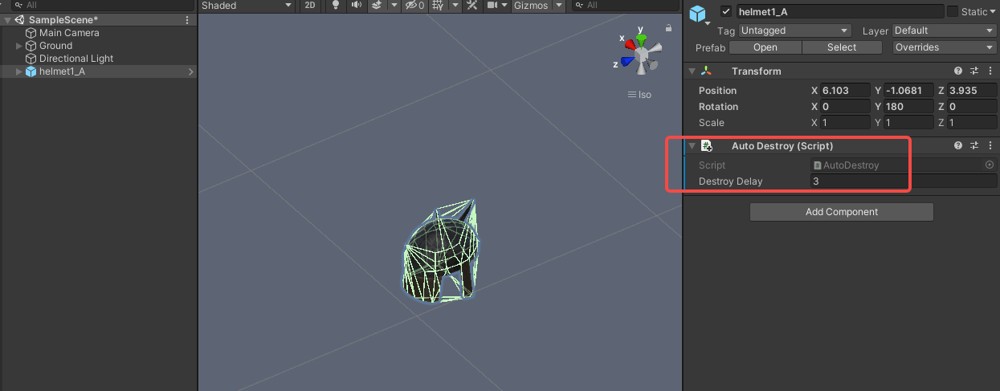
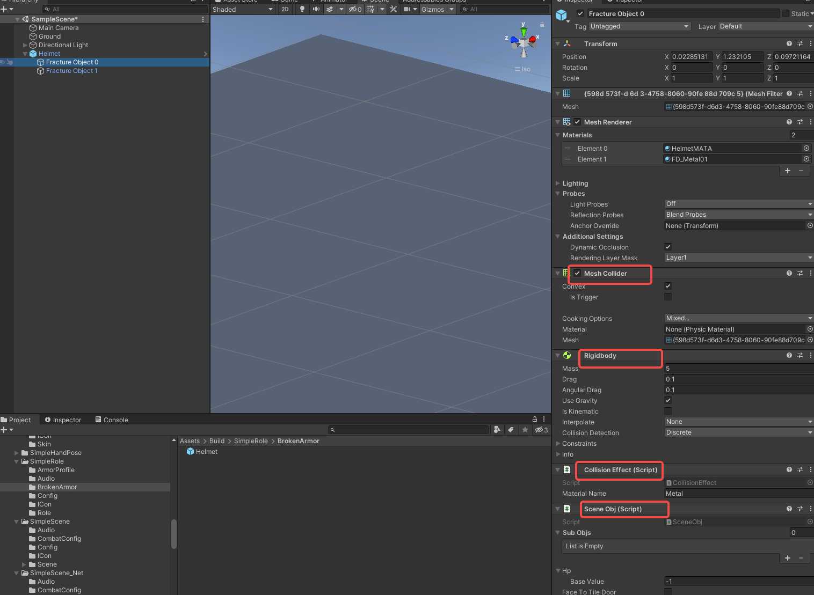
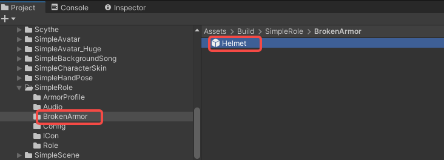
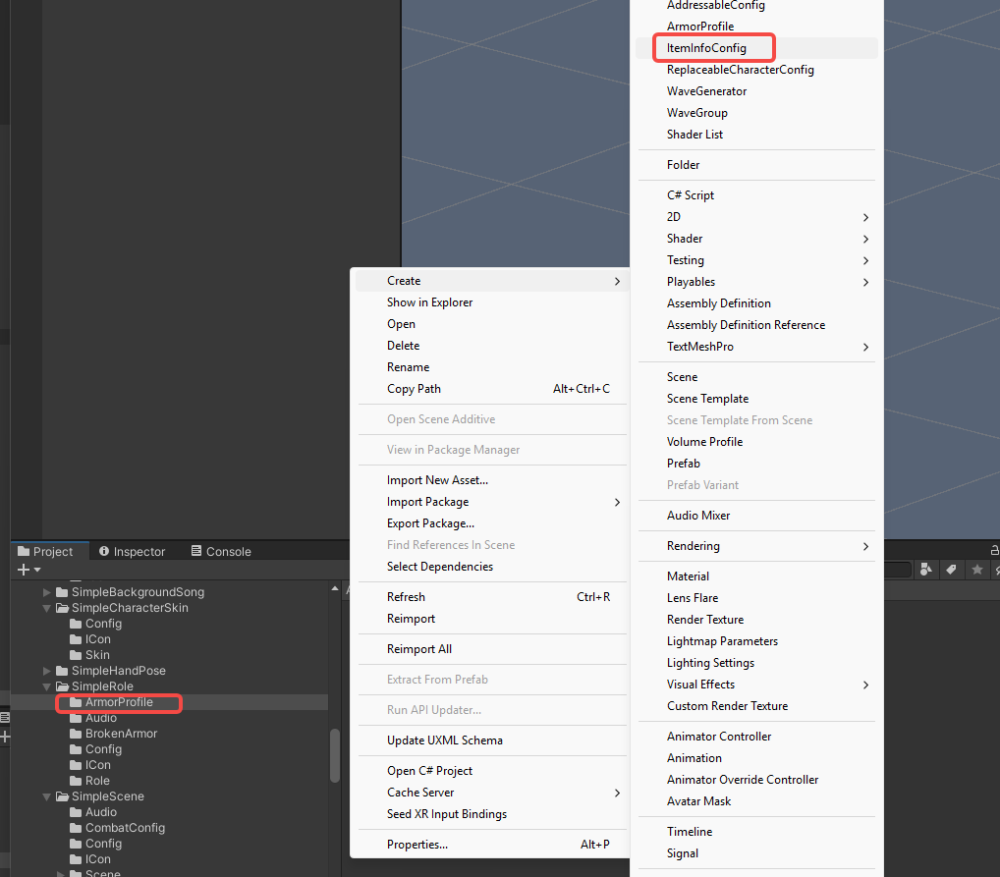
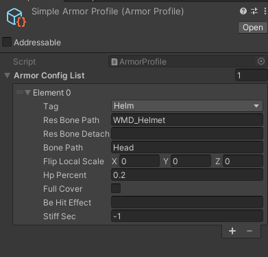
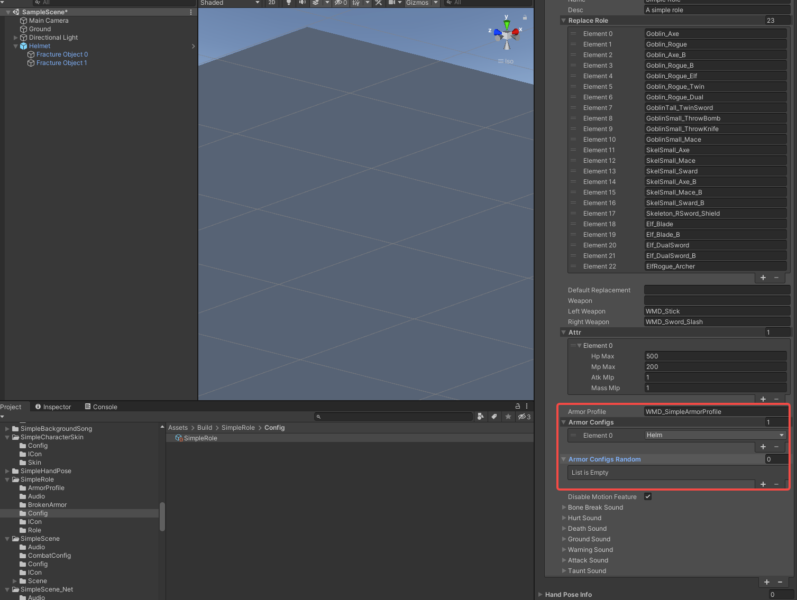

import ModTutorialFragmentPhaseBuild from '/docs/_fragments/_fragment-phase-build.mdx';
import ModTutorialFragmentPhaseTest from '/docs/_fragments/_fragment-phase-test.mdx';

# Create an Armor Mod

Follow these steps to create custom armor for your characters.

## Phase 1: Prepare your armor assets

* Add your armor model files to the `Resources` folder in Unity
* Open your character mod prefab

## Phase 2: Attach armor to your character

#### 1. Place armor on correct bone nodes
* Drag your armor pieces into the prefab hierarchy
* Parent each armor piece to its corresponding bone:
  - Helmets → "Head" bone
  - Chest Protector → "Chest" bone
  - Pauldrons → "RightArm"/ "LeftArm" bones
  - Arm Sleeve → "RightForeArm"/"LeftForeArm" bones
  - Shin Guard → "RightThigh"/"LeftThigh" bones

#### 2. Adjust armor
- Modify scale, rotation, and position to fit your character

- Set the Layer to "Ragdoll"

- Name the armor piece using `prefix+naming` convention (this name will be used in ArmorProfile)

- Add appropriate Collider components to each armor piece

  

#### 3. Hide armor and save
* Disable the armor GameObjects
* Save the prefab

## Phase 3: Create broken armor prefab

1. Create broken armor prefab:
   
   - Drag broken armor into the scene
   
2. Add components:
   - Add an `AutoDestroy` component with DestroyDelay set to 3 (disappears after 3 seconds)
   
     
   
- Add Colliders, Rigidbody, and CollisionEffect components
  
   - Set CollisionEffect MaterialName to "Metal" for metallic armor
   
   - Add SceneObj component
   
   - For simple armor, add these components to the root object
   
     
   
3. Save broken prefab:
   - Create a `BrokenArmor` folder in your mod directory
   
   - Save broken armor as a prefab here,  renaming it to match the armor GameObject name in your character prefab (but `without the prefix`)
   
     

## Phase 4: Configure armor properties

1. Setup profile:
   - Create an `ArmorProfile` folder in your mod directory
   
   - Right-click → Create → ArmorProfile

   - Rename the profile appropriately
   
   
   
2. Configure settings:
   - **Tag**: Select appropriate category (Helm, Chest, Legs, etc.)
   
   - **ResBonePath**: Enter the exact name of the armor GameObject as it appears in your character prefab
   
   - **BonePath**: Enter the bone name where armor is attached (see common bones below)
   
   - **HpPercent**: Set armor durability (0.1 = 10% of character's health)
   
   - **fullCover** (optional): Check if armor fully protects the body part
   
   - **BeHitEffect** (optional): Assign hit effect prefab
   
   - **stiffSec** (optional): Set stun duration when armor breaks
   
   

#### Common Bone Names:
"Pelvis", "Head", "Spine2", "Chest",
"RightUpperArm", "LeftUpperArm", "RightForeArm", "LeftForeArm",
"RightHand", "LeftHand", "RightThigh", "LeftThigh",
"RightCalf", "LeftCalf", "RightFoot", "LeftFoot"

## Phase 5: Assign armor to characters

1. Open your character's `ItemInfoConfig`
2. In `ArmorProfile` field, enter your profile name (prefix+name)
3. For fixed armor:
   - Add tags to `ArmorConfigs` (e.g., "Helm" for helmets)
4. For random armor (optional):
   - Add tags to `ArmorConfigsRandom` for randomized armor distribution

## Phase 6: Build the mod

<ModTutorialFragmentPhaseBuild />

## Phase 7: Test & publish the mod

<ModTutorialFragmentPhaseTest />
