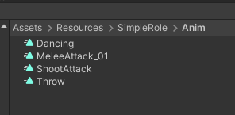
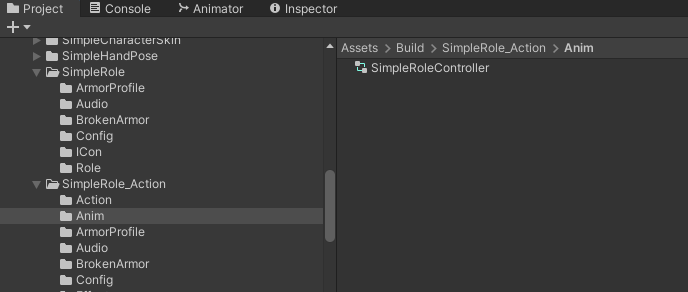
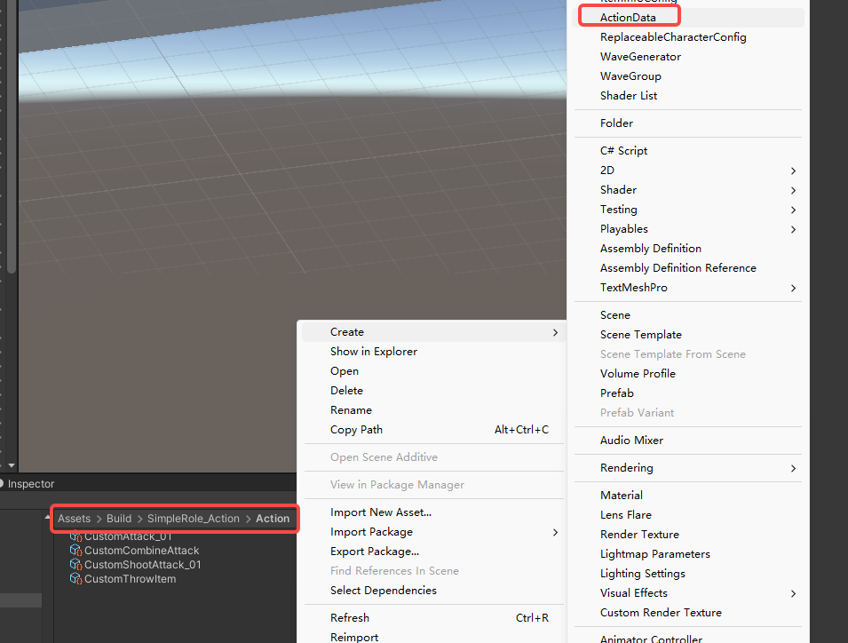
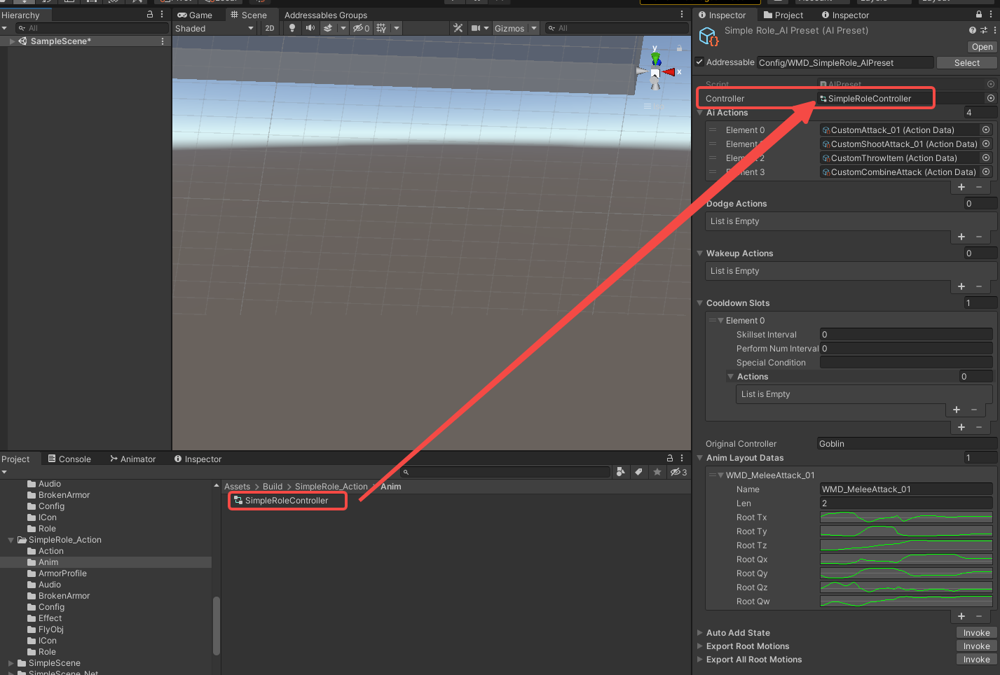
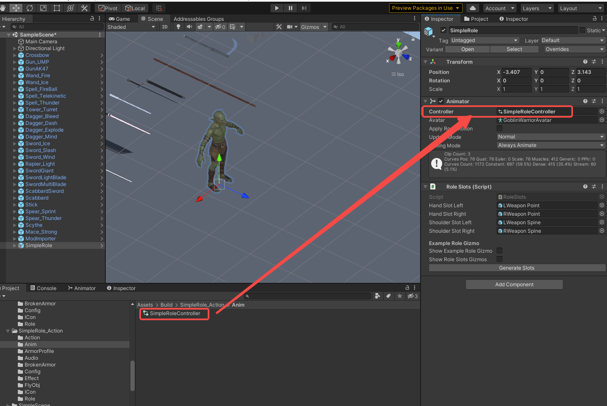
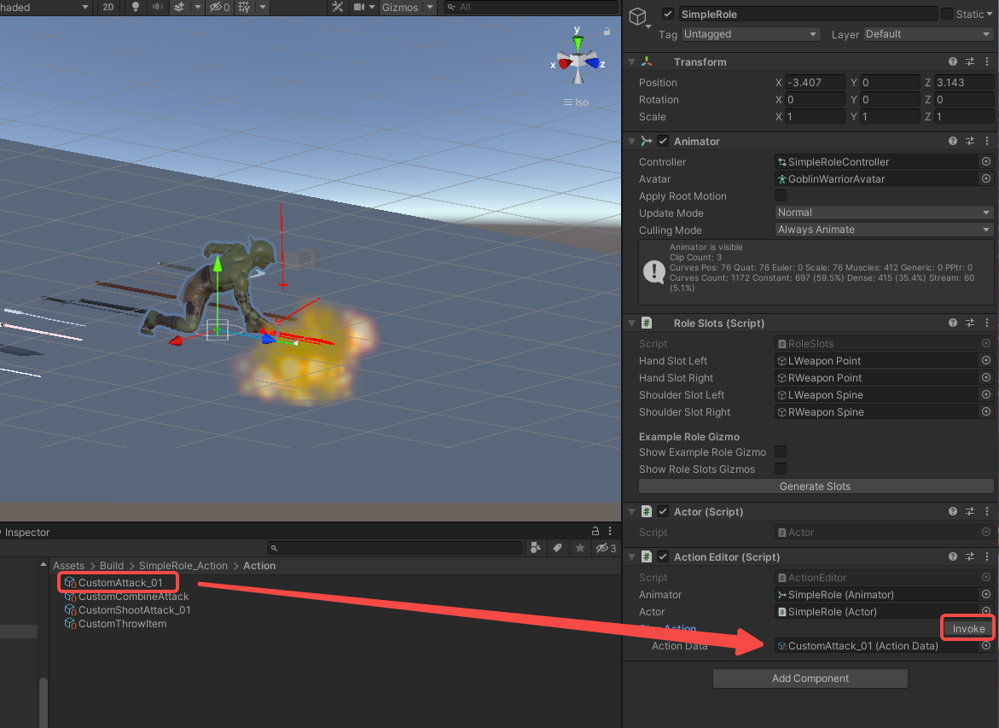

import ModTutorialFragmentPhaseBuild from '/docs/_fragments/_fragment-phase-build.mdx';
import ModTutorialFragmentPhaseTest from '/docs/_fragments/_fragment-phase-test.mdx';
import ModTutorialFragmentStepOpenUnity from '/docs/_fragments/_fragment-step-open-unity.mdx';

# Advanced NPC: Custom Actions

This guide explains how to enhance your NPCs with the **Custom Actions** system, allowing for complex behaviors like unique attacks, dodges, and interactions.

## Prerequisites
* You have completed the basic [Create a Role Mod](/docs/support-mod-types/Role/Tutorials/create-a-role-mod) tutorial.
* You have a working NPC prefab and its basic `ItemInfoConfig` set up.

## Phase 1: Prepare Animation Resources

#### 1. Organize Animation Files
* Place your custom `AnimationClip` files inside a folder under `Resources`. For example: `SimpleRole/Anim`

  

* Create an `Anim` folder in your project. Copy the `Goblin.controller` from `Toolkit/CharacterAnimator` into this folder and rename it (e.g., `MyRole_Controller`).
  
  
  
  
  
  * *Note: This allows you to reuse the Goblin's base state machine. Currently, only `Goblin.controller` is provided as a template.*

## Phase 2: Configure Custom Actions

#### 1. Create ActionData
* Create an `Action` folder **within your mod's project folder** (e.g., `Assets/Build/SimpleRole_Action/Action`).

* Right-click and select `Create > ActionData`. Configure its parameters based on your desired behavior (hover over parameters for tooltips).

  

* **CombineList Feature**: Use `CombineList` to chain multiple simple actions into one complex action. Click `OutputCombine` to auto-generate the `Timeline`.

  

#### 2. Create and Configure AIPreset
* In your mod's `config` folder, create an `AIPreset` file named after your role (e.g., SimpleRole_AIPreset`).

  

  

* **Assign Controller**: Drag your renamed controller (e.g., SimpleRoleController`) into the `Controller` field.

  

* **Add Actions**: Drag your configured `ActionData` assets into the `AIActions` list.
  * *Optional*: Assign specific actions to the `DodgeActions` and `WakeupActions` slots if your NPC needs them.
  * *Optional*: Configure cooldowns for actions in the `CooldownSlots` list.
  
* **Set Original Controller**: Since your controller was copied from `Goblin.controller`, enter **"Goblin"** in the `OriginalController` field.

* **Auto-Generate Animation States**:
  
  * In the `AutoAddState` section, enter the path to your `AnimationClip` folder (e.g., `YourModName/Animations`).
  
  * Click **Invoke**. This will automatically create animation states and assign clips inside your Controller, in this case, `SimpleRoleController`.
  
    
  
    
  
* **Generate Root Motion Data**:
  * For clips requiring root motion, drag them into the `ExportRootMotions` field and click **Invoke**. Data will be inserted into `AnimLayoutDatas`.
  
    
  
  * For batch processing, Enter the folder path **relative to `Resources`** (e.g., `SimpleRole/Anim`) in `ExportAllRootMotions` and click **Invoke**.

## Phase 3: Test Actions In-Editor

#### 1. Setup for Testing
* Drag your NPC's prefab into a scene.

* Assign your custom controller (e.g., SimpleRoleController) to the **Controller** slot of the prefab's `Animator` component.

* 

* Select the prefab's root object and click `Add Component` to add an **`ActionEditor`** component.

  

#### 2. Play and Debug
* Enter **Play Mode**.

* With the prefab selected, drag an `ActionData` you want to test into the `PlayAction` slot in the `ActionEditor` component.

* Click **Invoke** to see your NPC perform the action.

  

* You can modify `ActionData` parameters at runtime and click **Invoke** again to see changes immediately.

## Phase 4: Finalize Mod Configuration

#### 1. Link AIPreset to Your Role
* Open your `ItemInfoConfig` file.

* In your character's `RoleModInfo` section, find the `AiPreset` field.

* Drag your configured `AIPreset` file (e.g., SimpleRole_AIPreset`) into this slot.

  

#### 2. Final Build Steps
* Refresh Addressables via `Resources > AddressableConfig` and click **CreateAndRefreshAddressableName**.
* Proceed to build your mod. `BuildTools>BuildAllBundles`

<ModTutorialFragmentPhaseBuild />

## Phase 5: Test & Publish

<ModTutorialFragmentPhaseTest />