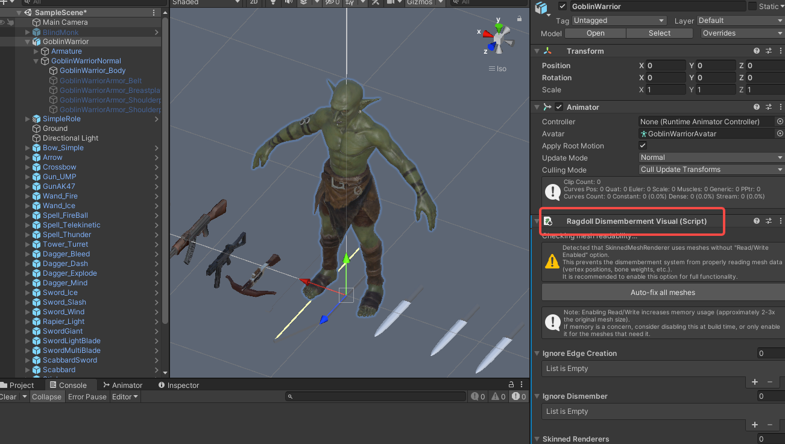
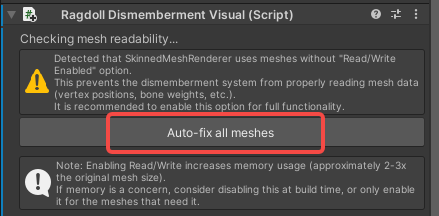
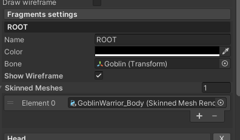
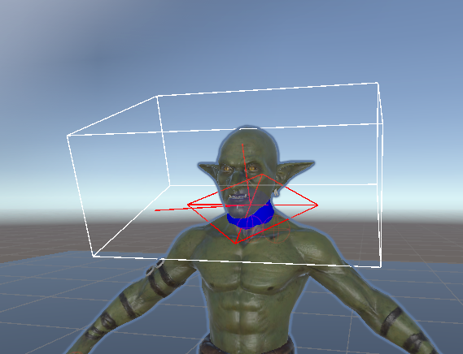
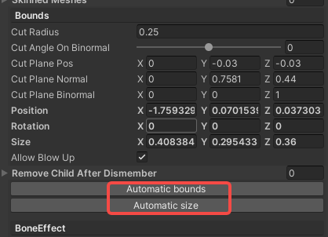
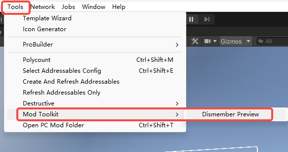
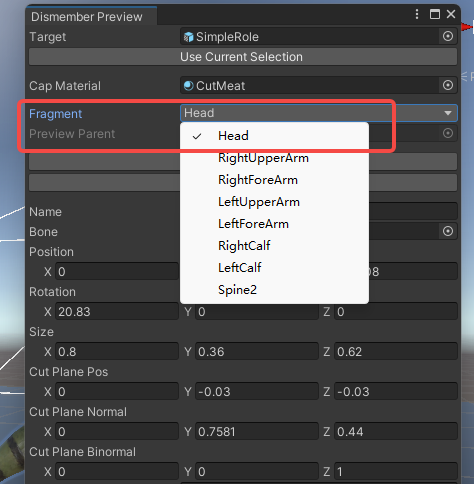
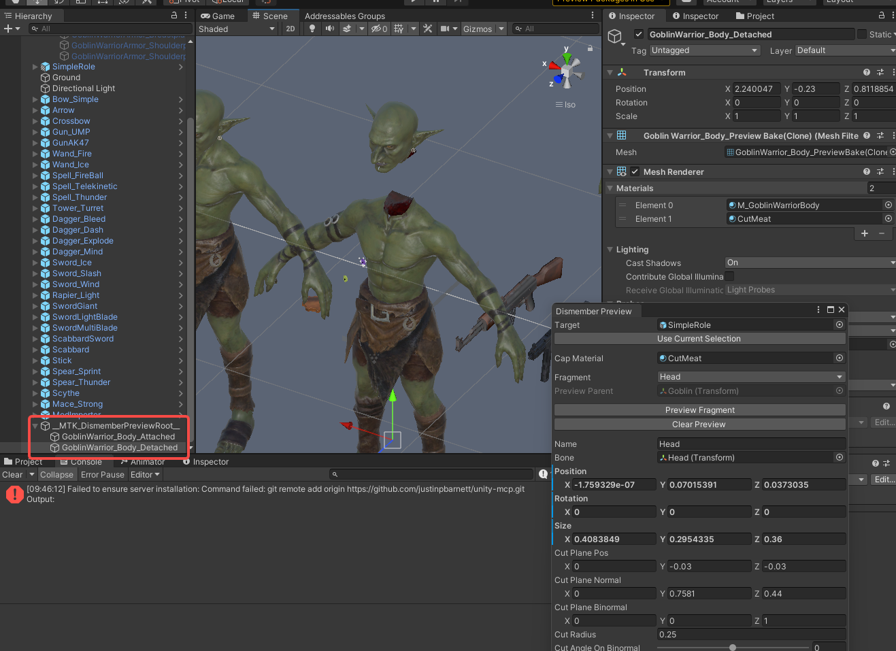

import ModTutorialFragmentPhaseBuild from '/docs/_fragments/_fragment-phase-build.mdx';
import ModTutorialFragmentPhaseTest from '/docs/_fragments/_fragment-phase-test.mdx';

# Advanced NPC: Dismemberment System

This guide explains how to implement dynamic **dismemberment** for your NPCs, allowing body parts to be severed during combat for enhanced visual feedback and gameplay mechanics.

## Prerequisites
* You have completed the basic [Create a Role Mod](/docs/support-mod-types/Role/Tutorials/create-a-role-mod) tutorial.
* You have a working NPC prefab with SkinnedMeshRenderer components.
* Your character model has a proper bone hierarchy.

## Phase 1: Setup Dismemberment Component

#### 1. Add RagdollDismembermentVisual Component
* Drag your NPC's prefab into a scene.

* Select the prefab's **root object** and click `Add Component` to add a **`RagdollDismembermentVisual`** component.

  

#### 2. Fix Mesh Read/Write Settings
* If your character's meshes do not have **Read/Write** enabled, a warning will appear in the component.

* Click the **`Auto-fix all meshes`** button that appears to automatically enable Read/Write on all required meshes.

  

  > *Note: This step is essential. Dismemberment requires access to mesh data at runtime.*

#### 3. Configure Basic Settings
* **Ignore Edge Creation**: Skinned mesh renderers that should not generate cap geometry on cut edges.

* **Ignore Dismember**: Skinned mesh renderers that should be skipped entirely during dismemberment.

## Phase 2: Configure Fragment Root

The **ROOT fragment** serves as the parent container for all dismemberable body parts.

#### 1. Add ROOT Fragment
* In the `RagdollDismembermentVisual` component, click **`Add Fragment`**.

* Name the new fragment **`ROOT`**.

  

#### 2. Configure ROOT Settings
* **Bone**: Drag the **root bone** of your character's skeleton into this field

* **SkinnedMeshes**: Add all `SkinnedMeshRenderer` components that can potentially be dismembered to this list.

## Phase 3: Configure Dismemberable Body Parts

Once ROOT is configured, you can add individual body parts like head, arms, legs, etc.

#### 1. Add a Fragment
* Click **`Add Fragment`** to create a new fragment.

* Give it a descriptive name ( `Head`, `LeftUpperArm`,`LeftForeArm` `RightUpperArm` `RightForeArm` `LeftCalf` `RightCalf` `Spine2`).

#### 2. Configure Bone Binding
* **Bone**: Drag the corresponding bone for this body part into the field (e.g., for Head fragment, drag the "Head" bone).

#### 3. Configure Cut Parameters

The following parameters control how the dismemberment cut is performed. **Visual guides** (helper lines) will appear in the Scene view when a fragment is selected, allowing you to see the effect of your adjustments in real-time.

| Parameter | Description |
|-----------|-------------|
| **cutRadius** | Radius of the cutting area used to determine which nearby vertices are affected. |
| **cutAngleOnBinormal** | Rotation angle around the cut binormal used to fine-tune the cut direction. |
| **cutPlanePos** | Cut plane position in the local space of the fragment bone. |
| **cutPlaneNormal** | Cut plane normal direction in the local space of the fragment bone. |
| **cutPlaneBinormal** | Cut plane binormal direction in the local space of the fragment bone, used as the rotation reference. |
| **Position** | Center of the fragment bounds in bone local space, used for setup and visualization. |
| **Rotation** | Euler rotation of the fragment bounds, used for editor visualization. |
| **Size** | Size of the fragment bounds, used for setup and visualization. |

  

#### 4. Use Auto-Sizing Tools

To speed up setup, use the helper buttons to automatically calculate initial bounds:

* **`AutomaticBounds`**: Automatically calculates the Position and Size based on the bone's associated mesh geometry.

* **`AutomaticSize`**: Automatically calculates only the Size parameter based on mesh geometry.

  

  > *Tip: After using auto tools, fine-tune the parameters manually while observing the visual guides in the Scene view.*

## Phase 4: Preview Dismemberment

Before building your mod, preview the dismemberment effect directly in the Unity Editor.

#### 1. Open Dismemberment Preview Tool
* Navigate to **`Tools > ModToolkit > DismemberPreview`** in the top menu.

  

#### 2. Select and Preview a Fragment
* In the preview window, use the **Fragment** dropdown menu to select the body part you want to test.

  

* Click **`PreviewFragment`** to see the dismemberment effect applied to your NPC in the Scene view.

#### 3. Iterate on Parameters
* If the preview result looks incorrect (e.g., jagged cuts, wrong body part severed), return to the `RagdollDismembermentVisual` component.

* Adjust the fragment's cut parameters and click **`PreviewFragment`** again to see the updated result.

* Repeat until you achieve the desired visual effect.

  

## Phase 5: Finalize Mod Configuration

#### 1. Apply to Prefab
* Once you are satisfied with all fragment configurations, ensure the `RagdollDismembermentVisual` component is attached to your NPC's prefab root.
* Save or Override the prefab to persist the configuration.

#### 2. Final Build Steps
* Refresh Addressables via `Resources > AddressableConfig` and click **CreateAndRefreshAddressableName**.
* Proceed to build your mod via `BuildTools > BuildAllBundles`

<ModTutorialFragmentPhaseBuild />

## Phase 6: Test & Publish

<ModTutorialFragmentPhaseTest />

## Troubleshooting

| Issue | Solution |
|-------|----------|
| Warning about Read/Write | Click the **Auto-fix all meshes** button in the component |
| Preview shows no effect | Ensure ROOT fragment is properly configured with bone and SkinnedMeshes |
| Cut looks jagged | Increase mesh quality or adjust cutRadius and cut plane parameters |
| Wrong body part is severed | Verify the correct bone is assigned to the fragment |
| Fragment bounds helpers not visible | Select the node that has the RagdollDismembermentVisual component attached |