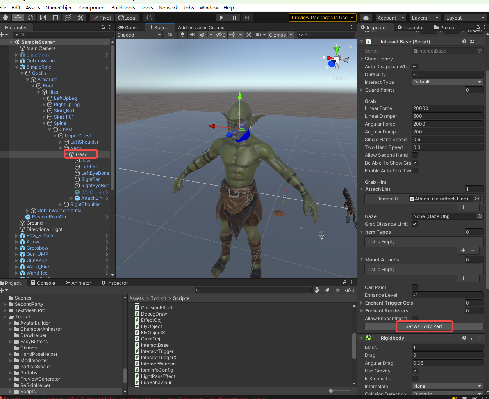
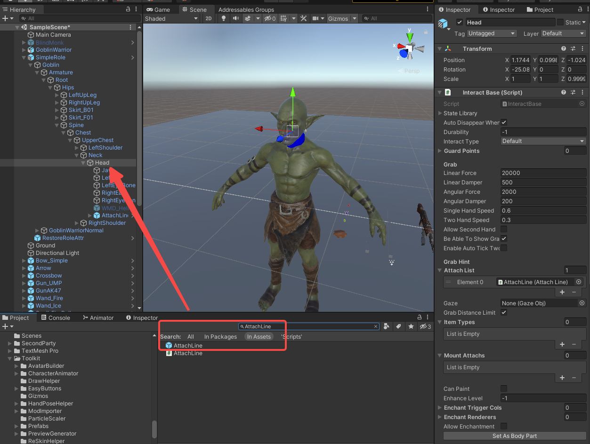
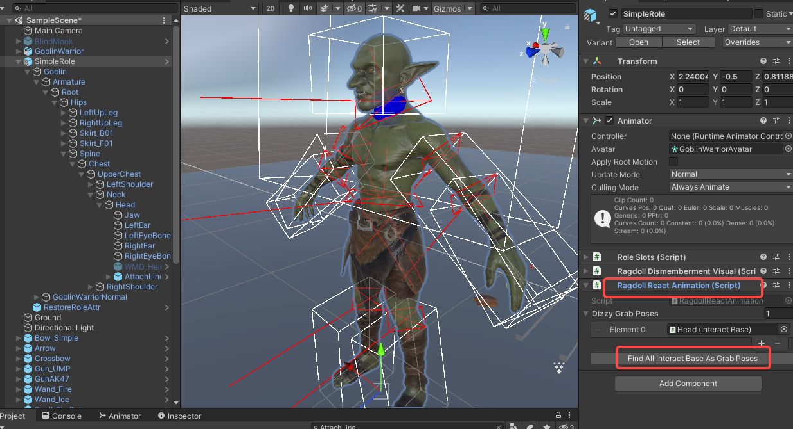

import ModTutorialFragmentPhaseBuild from '/docs/_fragments/_fragment-phase-build.mdx';
import ModTutorialFragmentPhaseTest from '/docs/_fragments/_fragment-phase-test.mdx';

# Advanced NPC: Grab Points Configuration

This guide explains how to configure grab points on your NPCs, allowing players or other NPCs to grab, hold, and interact with specific body parts.

## Prerequisites
* You have completed the basic [Create a Role Mod](/docs/support-mod-types/Role/Tutorials/create-a-role-mod) tutorial.
* You have a working NPC prefab with a proper bone hierarchy.

## Phase 1: Add InteractBase Component

#### 1. Select the Target Bone
* Drag your NPC's prefab into a scene.

* In the Hierarchy, navigate to the **bone** where you want the grab point to be located (e.g., chest, arm, shoulder).

#### 2. Add InteractBase Component
* Select the target bone and click `Add Component` to add an **`InteractBase`** component.

#### 3. Set as Body Part
* On the `InteractBase` component, click **`SetAsBodyPart`** to automatically configure it as a body part grab point.

  

## Phase 2: Add Required Components

#### 1. Add Rigidbody
* Select the same bone and click `Add Component` to add a **`Rigidbody`** component.

  > *Note: The Rigidbody is required for physics-based interactions with the grab point.*

#### 2. Configure AttachLine
* In the Hierarchy, drag the **`AttachLine`** prefab under the target bone as a child object.

  

  *The AttachLine prefab can be found in `Toolkit/InteractBase/AttachLine`.*

* Adjust **`LineStartPoint`** and **`LineEndPoint`** to define the grab range and visual line position.

  

## Phase 3: Auto-Configure AttachLine

#### 1. Automatic Field Population
* When both `InteractBase` and `Rigidbody` are properly configured on the same bone:

* The `AttachLine` component will automatically populate its **`Interact`** field (reference to the parent InteractBase) and **`selfRB`** field (reference to the Rigidbody).

* If the fields do not auto-populate, manually assign them:

* Drag the parent bone's `InteractBase` component into the **`Interact`** field.

* Drag the parent bone's `Rigidbody` component into the **`selfRB`** field.

## Phase 4: Add RagdollReactAnimation Component

#### 1. Add to Root Node
* Select your NPC's **root object**.

* Click `Add Component` to add a **`RagdollReactAnimation`** component.

  

* On the `RagdollReactAnimation` component, click **`FindAllInteractBaseAsGrabPoses`**.

* This will automatically scan your NPC's hierarchy and register all configured `InteractBase` components as valid grab poses.

## Phase 5: Finalize Mod Configuration

#### 1. Apply to Prefab
* Once all grab points are configured, ensure all components are properly attached and fields are assigned.
* Save or Override the prefab to persist the configuration..

#### 2. Final Build Steps
* Refresh Addressables via `Resources > AddressableConfig` and click **CreateAndRefreshAddressableName**.
* Proceed to build your mod via `BuildTools > BuildAllBundles`

<ModTutorialFragmentPhaseBuild />

## Phase 6: Test & Publish

<ModTutorialFragmentPhaseTest />