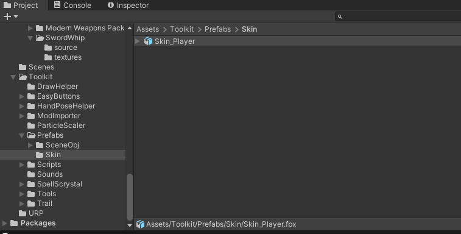
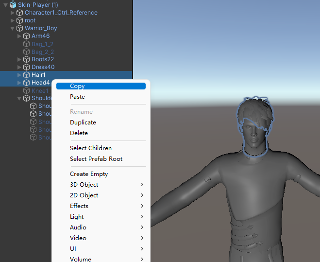
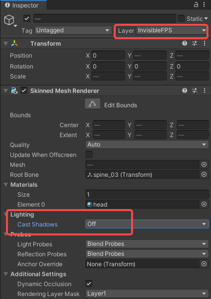
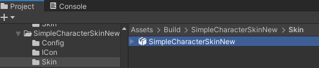

import ModTutorialFragmentPhaseBuild from '/docs/_fragments/_fragment-phase-build.mdx';
import ModTutorialFragmentPhaseTest from '/docs/_fragments/_fragment-phase-test.mdx';
import ModTutorialFragmentStepOpenUnity from '/docs/_fragments/_fragment-step-open-unity.mdx';
import ModTutorialFragmentStepCreateIcon from '/docs/_fragments/_fragment-step-create-icon.mdx';
import ModTutorialFragmentStepTemplateWizard from '/docs/_fragments/_fragment-step-template-wizard.mdx';

# Create a skin mod

Here is a step to make a simple **player's skin** mod.

** Note, this method is the old method of creating playable skins. It is now recommended to use the Avatar mods.**
* Pro: those are way easier.
* Con: only skins are compatible with the demo.

## Phase 1: Define your mod

<ModTutorialFragmentStepOpenUnity />

#### 5.Generate folder structure using the template wizard.

<ModTutorialFragmentStepTemplateWizard modType="Skin" />

#### 6.Binding the model

* Navigate to `Toolkit > Prefabs > Skin > Skin_player`.

* Use the model in ToolKit as a template to bind your model.
* Save your model.

#### 4.Hide the head of the model

* Drag the model into a scene.

To prevent the head from blocking the view, we need to set the head.

* First we select and copy the head node.

* Set the original node CastShadows to "ShadowsOnly".  

* Set the copied node layer to InvisibleFPS and set CastShadows to "Off"

#### 5.Save the mode

* Drag the model into the `Skin` folder to save.
* Name it the same as your mod folder.  (Example: `Build > SimpleCharacterSkinNew > Skin > SimpleCharacterSkinNew.prefab`)

## Phase 2: Prepare to export your mod

Create Configuration files and fill [(SkinInfo)](/docs/details/item-info-config)

<ModTutorialFragmentStepCreateIcon modType="Skin" />

## Phase 3: Build the mod

<ModTutorialFragmentPhaseBuild />

## Phase 4: Test & publish the mod

<ModTutorialFragmentPhaseTest />

