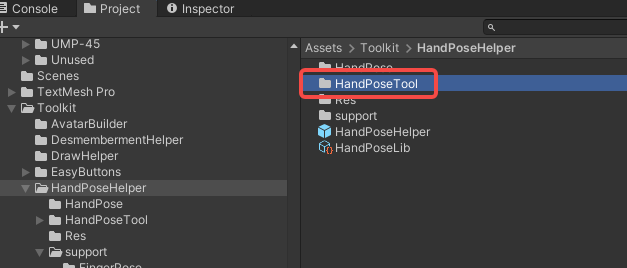
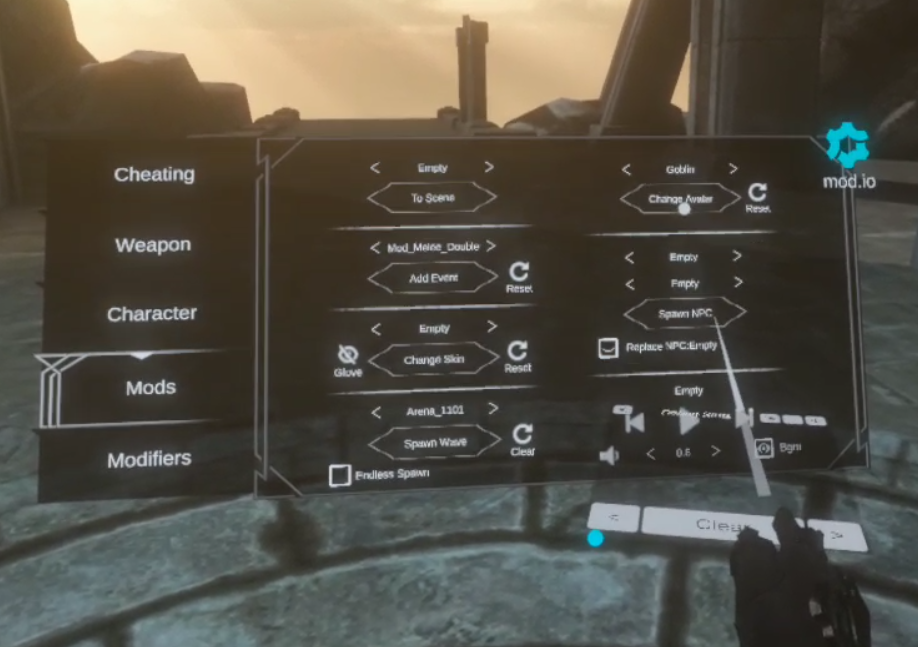
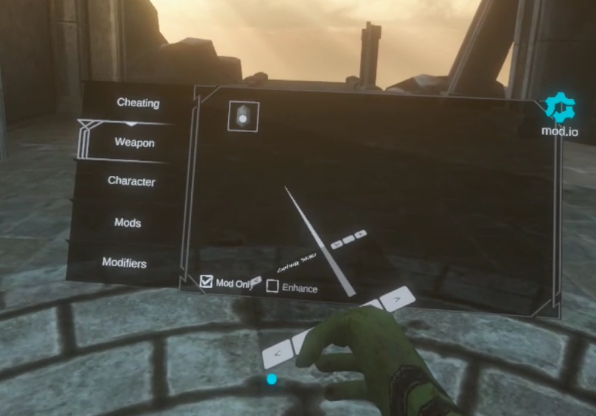
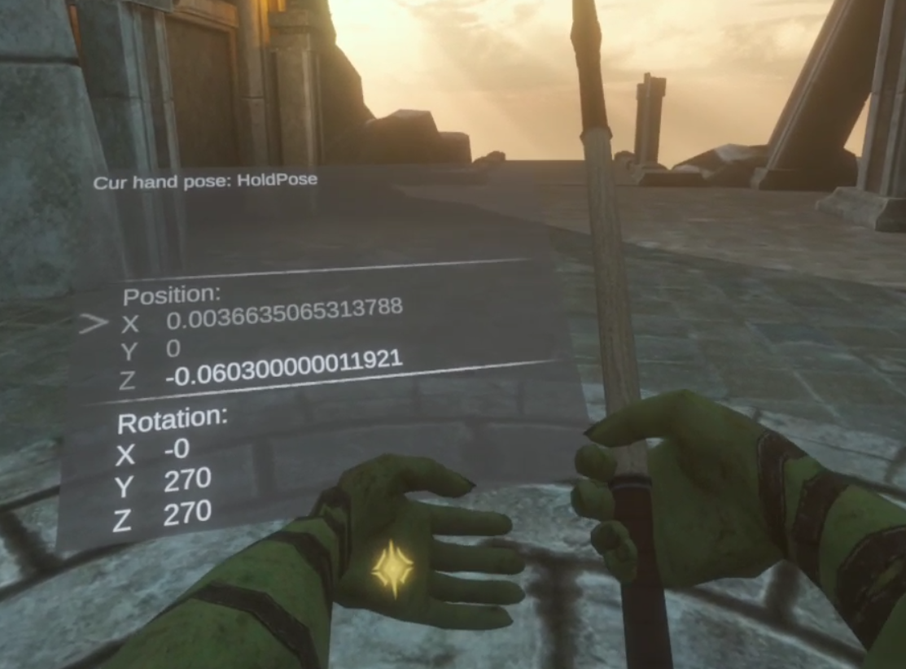
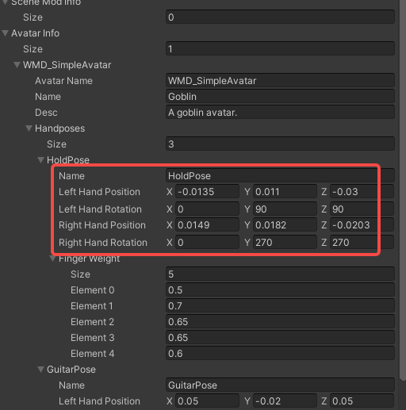

# Modify Avatar HandPose

Note: The prefixes used in the tutorial are "WMD\_", which can be replaced with your own prefix, and you will need to change the prefix in the AddressableConfig(Assets/Resources/AddressableConfig) file. Once you have changed the prefix, you will need to fill in your new prefix instead of "WMD\_" in the tutorial.

#### 1.Install the HandPoseTool Mod

HandPoseTool Mod path:Asset/Toolkit/HandPoseHelper. It has been built so just copy the mod files to the corresponding path on Windows or Quest.

* To run on Windows: `C:\Users[username]\AppData\LocalLow\CyDream\BattleTalent\Mods`
* To run on Quest: `/sdcard/Android/data/com.CyDream.BattleTalent/files/Mods/`

More details about how to install Mod please check  [Quick Start](/docs/).

#### 2.Switch Avatar in the Game

Switch to the Avatar you need to modify in the game.

#### 3.Use HandPoseTool

Spawn the **HandPoseTool** and place it in the hand slot.

Spawn weapons that use the `HandPose` you need to modify.
Hold it with the other hand.
In this case the panel of the handPoseTool shows the HandPose information of the gripping hand.

Using the hand with the HandPoseTool placed:

1. You can press **Trigger** to select the parameter to be modified.
1. Use the **joystick** to adjust the values.
1. For ease of operation, you can **disable character movement** by pressing and holding the trigger, and release it by pressing and holding it again.

#### 4.Use adjusted values

Back to  [Create a avatar mod](create-an-avatar-mod) step 6. Use the adjusted values on your `AvatarInfo`, taking care to distinguish between left and right handedness.

Done！
