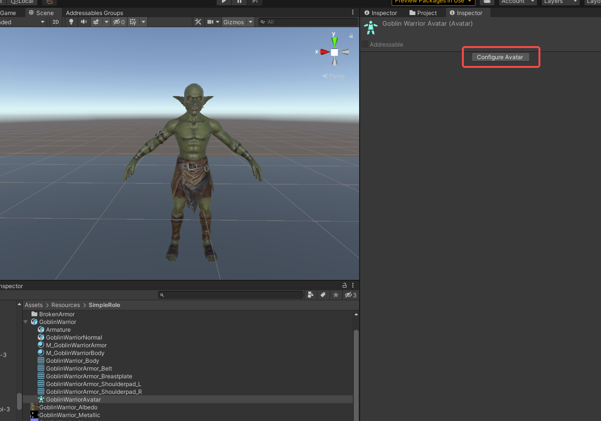
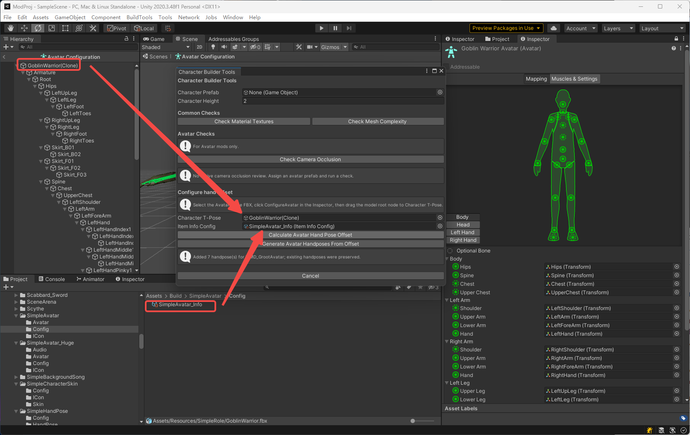
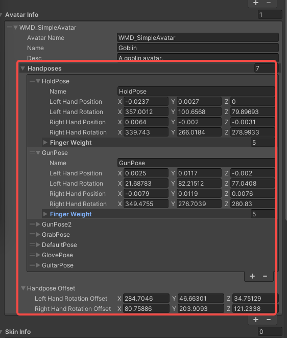
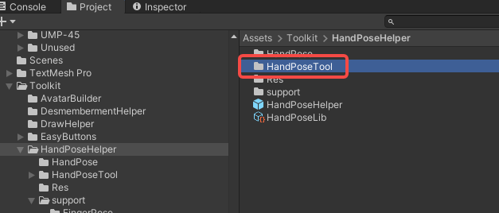
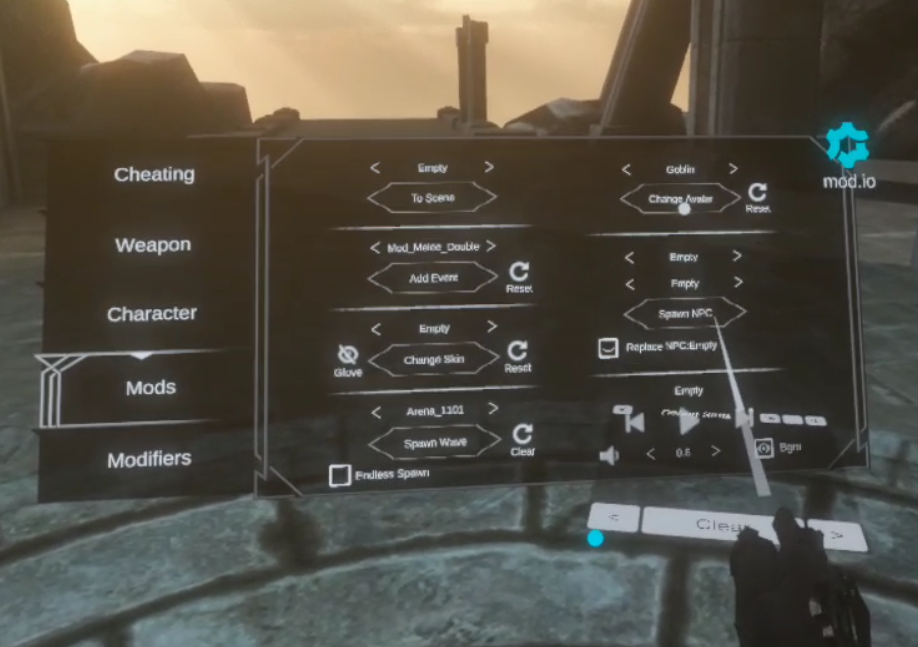
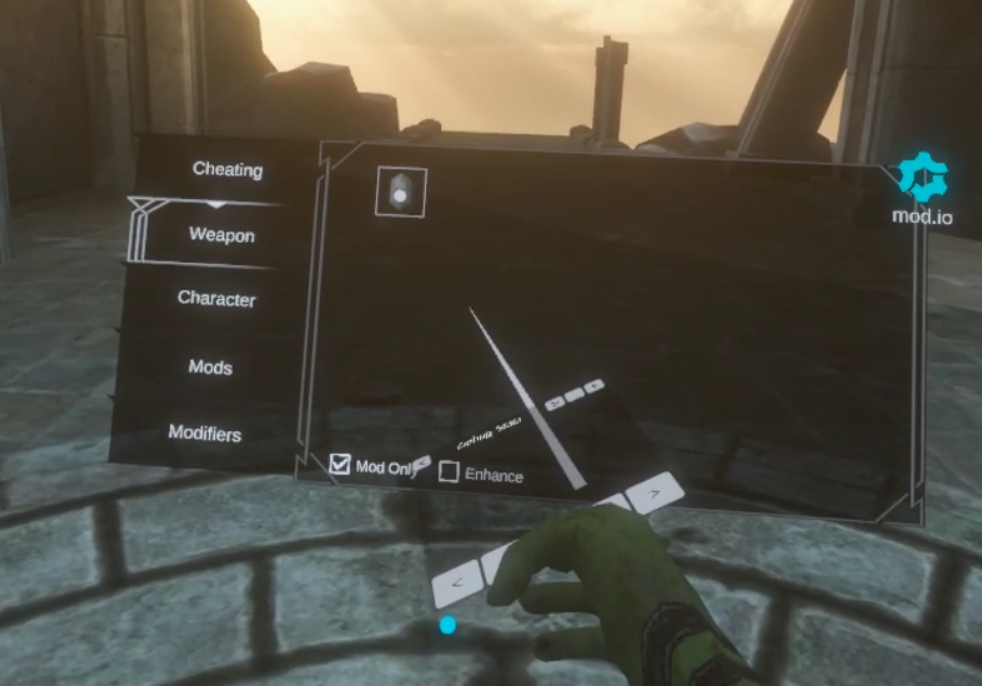
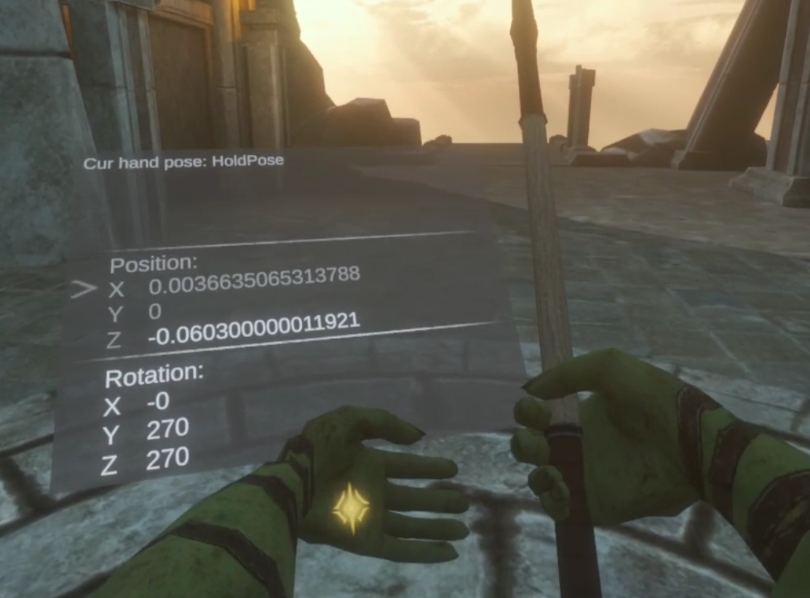
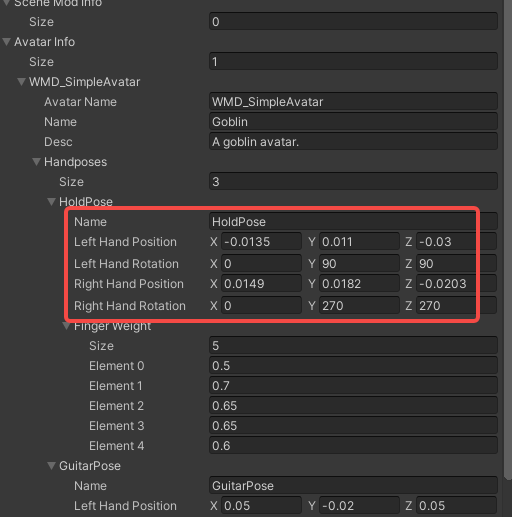

# Modify Avatar HandPose

Note: The prefixes used in the tutorial are "WMD\_", which can be replaced with your own prefix, and you will need to change the prefix in the AddressableConfig(Assets/Resources/AddressableConfig) file. Once you have changed the prefix, you will need to fill in your new prefix instead of "WMD\_" in the tutorial.

#### 1.Generate Avatar Handposes Automatically

Use `CharacterBuilderTools` to generate the default hand poses from the avatar's hand rotation offset before making manual adjustments in the game.

1. In the Unity Project window, expand the target avatar FBX and select its `Avatar` asset.

1. Click `ConfigureAvatar` in the Inspector and configure the avatar in T-Pose.

   

1. Open `Tools > Character Builder Tools`.

1. Drag the model root GameObject into the `Character T-Pose` field.

1. Drag the target `ItemInfoConfig.asset` into the `Item Info Config` field.

   

1. Click **Calculate Avatar Hand Pose Offset**.

1. After the calculation succeeds, click **Generate Avatar Handposes From Offset**.

   

The tool uses the default character's humanoid hand bones and the target avatar's `HumanBodyBones.LeftHand` and `HumanBodyBones.RightHand` bones to calculate the rotation offset. It then adds the missing default hand poses to the matching `AvatarInfo`. Existing hand poses with the same name are preserved.

If one `ItemInfoConfig` contains multiple `AvatarInfo` entries, make sure each `avatarName` matches the name of the corresponding `Character T-Pose` root GameObject. The tool uses this name to select which `AvatarInfo` to update.

The target avatar must have a valid Humanoid Animator and both left and right hand bones. If the tool reports an error, fix the avatar setup and run the calculation again.

#### 2.Install the HandPoseTool Mod

HandPoseTool Mod path:Asset/Toolkit/HandPoseHelper. It has been built so just copy the mod files to the corresponding path on Windows or Quest.

* To run on Windows: `C:\Users[username]\AppData\LocalLow\CyDream\BattleTalent\Mods`
* To run on Quest: `/sdcard/Android/data/com.CyDream.BattleTalent/files/Mods/`

More details about how to install Mod please check  [Quick Start](/docs/).

#### 3.Switch Avatar in the Game

Switch to the Avatar you need to modify in the game.

#### 4.Use HandPoseTool

Spawn the **HandPoseTool** and place it in the hand slot.

Spawn weapons that use the `HandPose` you need to modify.
Hold it with the other hand.
In this case the panel of the handPoseTool shows the HandPose information of the gripping hand.

Using the hand with the HandPoseTool placed:

1. You can press **Trigger** to select the parameter to be modified.
1. Use the **joystick** to adjust the values.
1. For ease of operation, you can **disable character movement** by pressing and holding the trigger, and release it by pressing and holding it again.

#### 5.Fine-tune and use the adjusted values

After the automatic generation, use HandPoseTool only when you need to fine-tune an individual hand pose.

Back to  [Create a avatar mod](create-an-avatar-mod) step 6. Use the adjusted values on your `AvatarInfo`, taking care to distinguish between left and right handedness.

Done！
