# Basic - Create an avatar mod

import ModTutorialFragmentPhaseBuild from '/docs/_fragments/_fragment-phase-build.mdx';
import ModTutorialFragmentPhaseTest from '/docs/_fragments/_fragment-phase-test.mdx';
import ModTutorialFragmentStepOpenUnity from '/docs/_fragments/_fragment-step-open-unity.mdx';
import ModTutorialFragmentStepTemplateWizard from '/docs/_fragments/_fragment-step-template-wizard.mdx';
import ModTutorialFragmentStepCreateIcon from '/docs/_fragments/_fragment-step-create-icon.mdx';

Here is a step to make a simple **avatar** mod.

## Phase 1: Define your mod

<ModTutorialFragmentStepOpenUnity />

#### 5.Generate folder structure using the template wizard.

<ModTutorialFragmentStepTemplateWizard modType="Avatar" />

#### 6.Set the Animation Type to humanoid and Avatar Definition to Create From This Model

* Add your custom model to your `Resources` folder in Unity.
* Change the following settings on the model like the image **and click apply**.

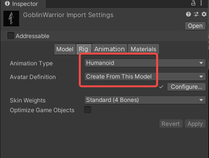

#### 7.Configure the model into the prefab

* Open the newly created prefab in the `Avatar` folder.
* Drag your model into it the hierarchy.
* Navigate to the highest object (should be the same as the name of your mod) so that you see component `RuntimeAvatarBuilder`.

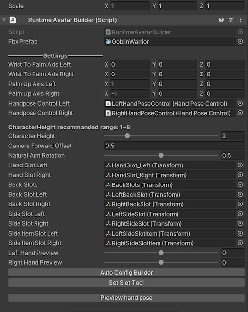

* Drag your model object into the `fbx prefab` variable.

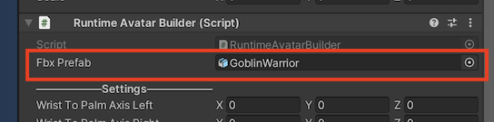

* Click `Auto Config Builder` button.

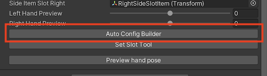

#### 8.Slots configuration
The weapon and spell slots of an avatar need to be positioned. The positioning tools have been initialized by clicking the `auto config builder` button that help you position your slots on the avatar.
* Click the `Hand Slot Left` field to navigate to that transform.

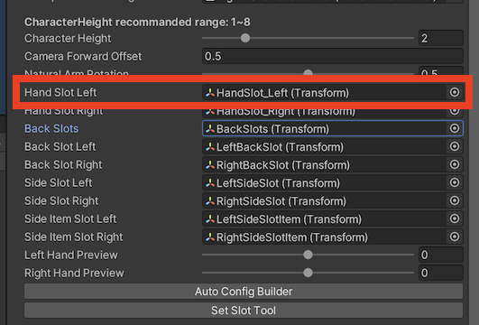

* Reposition the hand slot transform to be on top of your hand.

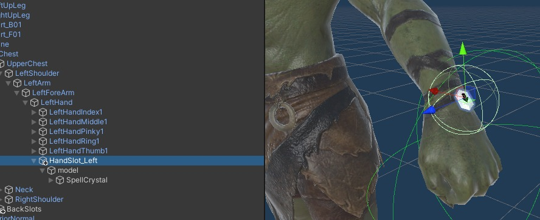

* Click the `Hand Slot Right` field to navigate to that transform.

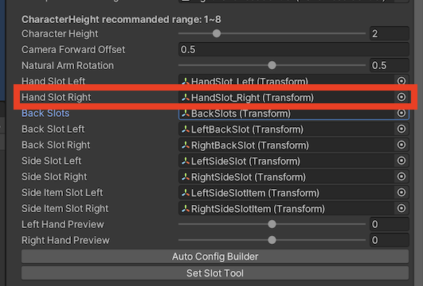

* Reposition the hand slot transform to be on top of your hand.

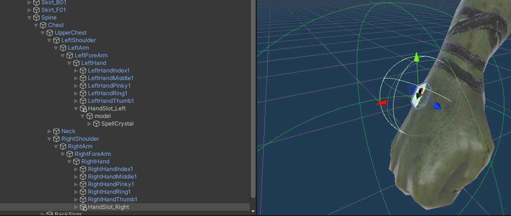

* Click the `Back Slots` field to navigate to that transform.

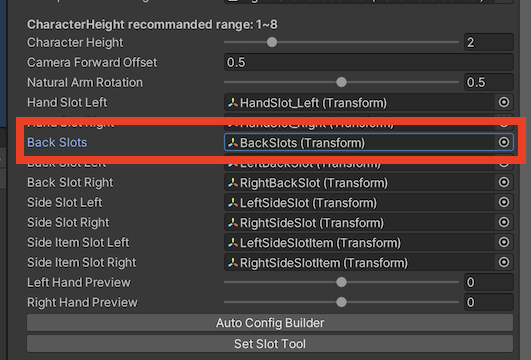

* Reposition the back slot transform to be on your back.

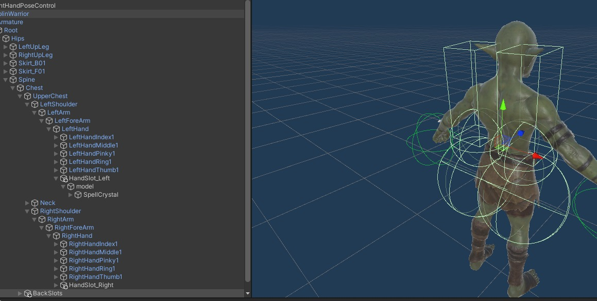

* Click `Set Slot Tool` button to apply the new positions & rotations.

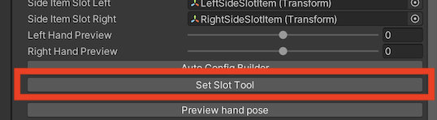

#### 9.Finger configuration

* Open the `Avatar` prefab.
* Navigate to the highest object (should be the same as the name of your mod) so that you see component `RuntimeAvatarBuilder`.

* Click `HandPose Control Left` to the left handpose component.

For avatar, you will manually need to set the hand poses. Do that like so:

* Invoke the `Auto Config Fingers`. with the number of ** gameobjects in a finger** (usually 3 or 4).

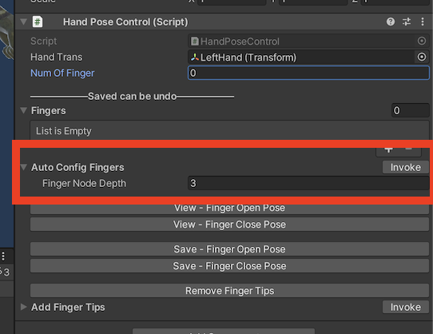

* Go back to the `RuntimeAvatarBuilder` component.
* Adjust the `Left hand preview` slider to the **left** & click the `Preview hand pose` button.

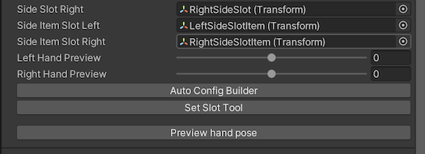

* The hand should now be closed. Open the `HandPoseControlLeft` component and click `Save - Fingers Close Pose`.

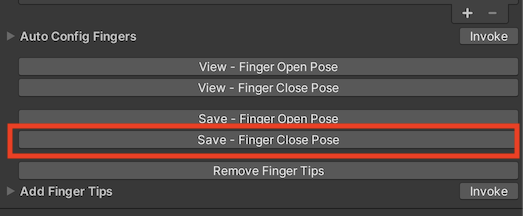

* Go back to the `RuntimeAvatarBuilder` component.
* Adjust the `Left hand preview` slider to the **right** & click the `Preview hand pose` button.
* The hand should now be closed. Open the `HandPoseControlLeft` component and click `Save - Fingers Open Pose`.

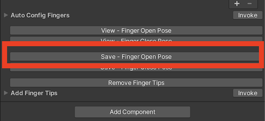

* Test if grips are ok by clicking `View - Fingers Close Pose`  &  `View - fingers Open Pose`.

Great, you just did the left hand.

* Go back to the `RuntimeAvatarBuilder` component and do the same for the right hand.
* **Save the prefab**.

#### 10.Handpose configuration

If you find that some of the hand poses are **offset** after packing and using them in the game, you can set the avatar's exclusive **HandPose** by following these steps.

* Open the config file in `Assets > build > YourModName > Config`. Under the **SetDefaultPoseValueToAvatar** field, fill in the **AvatarName** and the name of the **HandPose** you want to override.

  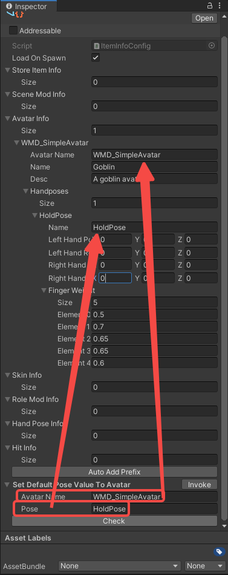

* Click on **Invoke**. The corresponding HandPose data will be filled in **automatically**.

  

* Adjust the data to suit your needs, the adjustment will only affect the hand pose of this avatar in the game. Please check [Modify Avatar HandPose](./modify-avatar-hand-pose)

#### 11.FAQ

Q: The model's face is visible in front of the camera. Anything I could do about that?
A: Yes! You could give the face **mesh** the layer: `InvisibleFPS` to fix this problem. If the model does not have a separate mesh for the head (which is usually the case), then you can follow [this](/docs/support-mod-types/Weapon/Tutorials/Advanced%20-%20create-near-perfect-convex-colliders) tutorial to cut of the models head in Blender.

Q: My controllers control the wrong fingers. What's up with that?
A: Using "auto config" on the fingers requires the fingers to be in a specific order. Use the following to always have correct controls:
1. thumb
2. index
3. middle
4. ring
5. pinky

## Phase 2: Prepare to export your mod

Create Configuration files and fill [(AvatarInfo)](/docs/details/item-info-config)

<ModTutorialFragmentStepCreateIcon modType="Avatar" />

## Phase 3: Build the mod

<ModTutorialFragmentPhaseBuild />

## Phase 4: Test & publish the mod

<ModTutorialFragmentPhaseTest />