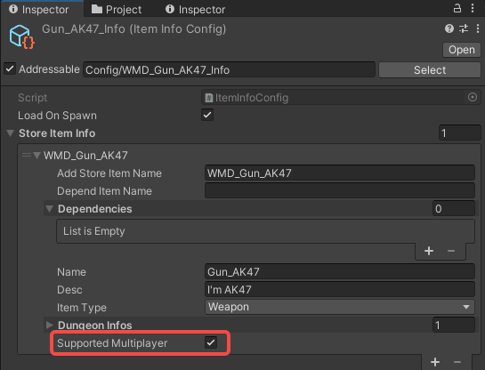
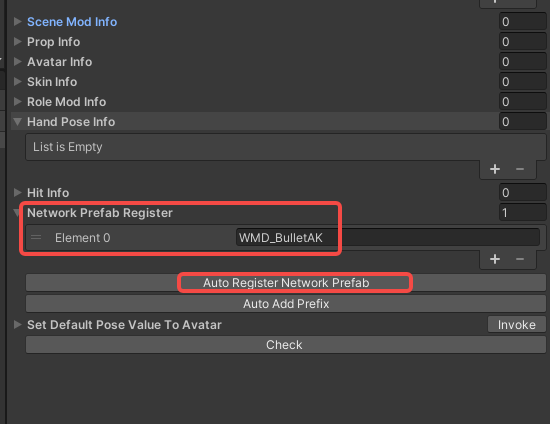

# Create a network mod

Note: The prefixes used in the tutorial are "WMD\_", which can be replaced with your own prefix, and you will need to change the prefix in the AddressableConfig(Assets/Resources/AddressableConfig) file. Once you have changed the prefix, you will need to fill in your new prefix instead of "WMD\_" in the tutorial.

## 

note: The game host is the server, basically all changes are processed on the server and synchronised to the client.

The only difference between a network mod and a normal mod is the script and configuration, so let's use the gun mod as an example of a modification.


#### Introduction:

- RPC: The server uses a Remote Procedure Call (RPC) to run this function on clients

- CMD: Call this from a client to run this function on the server

- netId: The unique network Id of this object


When making a multiplayer mod, we will use `NetworkStateX` to receive data, send data and synchronize data. By injecting Function into NetworkStateX in a lua script, we can use the RPC and CMD interfaces to transfer data, and we can also use the SetState and GetState interfaces provided to synchronize data from the server to all clients.

Different types of NetworkStateX: 

- FlyObject : `NetworkFlyObjectStateX`
- InteractBase: `NetworkIBStateX`
- SceneObj: `NetworkSceneObjStateX`

​	You can open the NetworkStateX file in ModToolKit to see more interfaces.


#### 1.Script

1. RPC - Server to Client

   The server calls the client function using Remote Procedure Call (RPC).

   A function that needs to be called on the client:

   ```
   function WeaponFlyObj:RpcOnShoot(bullet)
       --client to do
   end
   ```

   

   Registering Function in NetworkInject so that the client can find the same function and run it when the server calls it.

   ```
   function WeaponFlyObj:NetworkInject()
       self.host.interact.networkIB.networkIBState:InjectFunc("RpcOnShoot", self.RpcOnShoot)
       --inject other function
   end
   ```

   

   The server uses the interface `ServerRpcIntFunc` (Please read `NetworkIBStateX` for more interfaces) in networkIBState to call functions in the client. (RpcOnShoot). 

   ​	other interface refer to `NetworkIBStateX`

   ServerRpcIntFunc(funtionName, int, includeServer)

   - functionName: The name of the function to be called on the client
   - int:  int value
   - includeServer: run this function on the server as well，In this case, includeServer is false, so it will only run RpcOnShoot on the client side.

   ```
   function WeaponFlyObj:ServerOnShoot(bullet)
       self.host.interact.networkIB.networkIBState:ServerRpcIntFunc("RpcOnShoot", bullet.netId, false)
   end
   ```

   


2. CMD - Client to Server

   The client calls the server function using Command(CMD). In general, there are very few cases where the client calls the server function.

   ​	

   Similarly, complete the function and register

   ```
   function WeaponFlyObj:NetworkInject()
       self.host.interact.networkIB.networkIBState:InjectFunc("CmdToShoot", self.CmdToShoot)
       --inject other function
   end
   
   function WeaponFlyObj:CmdToShoot()
       --Server shoot
   end
   ```

   The client uses the interface `CommandFunc` (Please read `NetworkIBStateX` for more interfaces) in networkIBState to call function (CmdToShoot) in the server.

   CommandFunc(funtionName)

   - functionName: Name of the function to call on the server
   
   ```
   function WeaponFlyObj:ClientToShoot()
       self.host.interact.networkIB.networkIBState:CommandFunc("CmdToShoot", null, null, null, null)
end
   ```
   


3. NetworkState - state synchronization

   We can use NetworkState for data synchronization, which currently only supports server synchronization of data to all clients.

   

   Similarly, complete the function and register

   ```
   function Test:Awake()
   	
   	--The client updates the value upon receipt.
       self.onValueChange = function(value)
           self.value = value
       end
   end
   
   function Test:NetworkInject()
       self.host.interact.networkIB.networkIBState:InjectIntState("value", self.onValueChange)
       --inject other function
   end
   ```

   The server updates the value using `SetIntStateValue` (Please read `NetworkIBStateX` for more interfaces).

   ```
   function Test:ServerUpdateValue()
   	if CL.Network.VRNetworkManager.ServerOnline then
   		self.host.interact.networkIB.networkIBState:SetVec3StateValue("value", self.value)
   	end
   end
   ```

   

#### 2.Config

* Check Supported Multiplayer to display it in multiplayer mode.
  

  

* Click AutoRegisterNetworkPrefab, to register the prefabs that need to be used in multiplayer mode, such as FlyObject.
  

  


