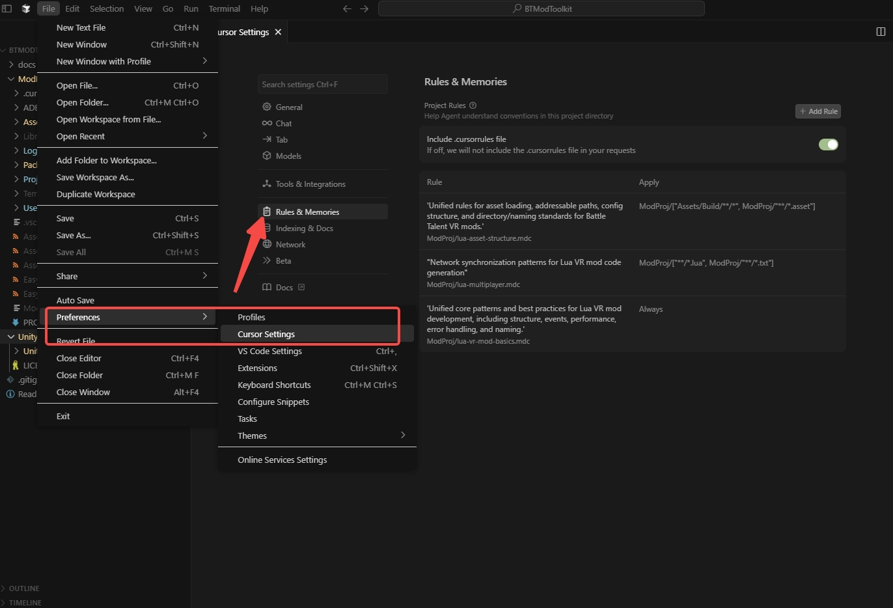
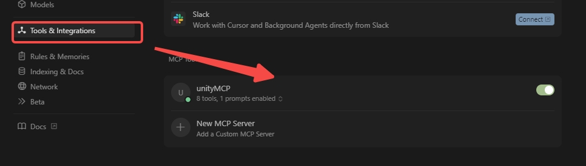

# Introduction

UnityMcpServer is a Model Context Protocol (MCP) server implementation designed specifically for Unity development environments. It provides a bridge between AI language models and Unity projects, enabling intelligent code assistance, project analysis, and automated development workflows.


## What is UnityMcpServer?
UnityMcpServer implements the MCP standard to expose Unity project capabilities to AI assistants. It allows AI models to:

- **Analyze Unity project structure** - Understand your project hierarchy, scripts, and assets
- **Read and modify code files** - Assist with lua scripting, shader development, and configuration files
- **Generate Unity-specific content** - Create prefabs, scenes, and component configurations
- **Provide contextual assistance** - Offer suggestions based on your actual project state
- **Automate repetitive tasks** - Generate boilerplate code, documentation, and project scaffolding

See [unity-mcp](https://github.com/justinpbarnett/unity-mcp) for more details.


## How to Use
1. Install and configure UnityMcpServer in your Unity project
2. Connect your preferred AI assistant to the MCP server
3. Start using AI-assisted Unity development features through natural language commands
4. Let the AI help you analyze, modify, and generate Unity project content


## Pre-requisites
- Python: Version 3.13 or newer. Download Python from [python.org](https://www.python.org/downloads/).
- uv (Python package manager)
```
pip install uv
# Or see: https://docs.astral.sh/uv/getting-started/installation/
```
- An MCP Client: (Recommend Cursor)
    - [Claude Desktop](https://claude.ai/download)
    - [Cursor](https://www.cursor.com/en/downloads)
    - [Visual Studio Code Copilot](https://code.visualstudio.com/docs/copilot/overview)
    - (Others may work with manual config)


## Configuration
- Option A: Auto-Configure (Recommended for Claude/Cursor/VSC Copilot)
    - In Unity, go to `Window > Unity MCP`.
    - Click Auto Configure on the IDE you uses.
    - Look for a green status indicator 🟢 and "Connected". (This attempts to modify the MCP Client's config file - automatically).
- You can see these steps in [unity-mcp](https://github.com/justinpbarnett/unity-mcp) Installation/step2.

### Cursor Examples
You should open the project on Root directory `.\BTModToolkit\ModProj` of BTModToolkit Unity project, to ensure cursor rules take effect.
#### Successfully applied cursor rules

#### Successfully connected to UnityMcpServer



## FAQs
- If you encounter errors or experience long delays after starting the MCP server, it's best to manually run the command to install the dependencies after install uv python package manager.
    - Run the following command in the BTModToolkit root directory and close CMD after download completes:
        ```
        uv --directory .\UnityMCP\UnityMcpServer\src run server.py
        ```
- If the Unity MCP Tool remains red or if other IDEs fail to establish a connection, try restarting the Unity MCP Bridge in the Unity Editor, followed by restarting the cursor or any affected IDEs.
