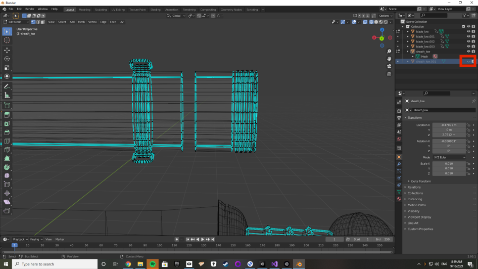

## Introduction

This tutorial will show you how to make mesh colliders for your weapons that will fix the weapon almost perfectly. 
It won't take long and will improve the quality of your weapons greatly.
**This tutorial requires you to already have Blender installed.**

## Step by Step

1. Open **Blender**.
2. Import your model file by clicking `File > Import > fbx` (or, **.obj** or **whatever floats your boat**).
3. Click the mesh you want to cut on the right side of the screen.

4. Enter **edit mode** in the top left corner.

5. Press this little button to see all vertices instead of only the front (This makes it transparent).

6. Select vertices by hand which you want to separate (**Tip**: hold down `shift` key to keep your selection after letting go).

7. Right click and `separate > selection`.

8. Toggle the `eye` icon to hide and show your to see if your mesh was cut correctly. (**Tip:** if not, you can just `undo` by doing `Ctrl+Z` on Windows or `Cmd+Z` on Mac.)

9. Then finally after your meshes are all cut, export by clicking `File > Export > fbx`.
