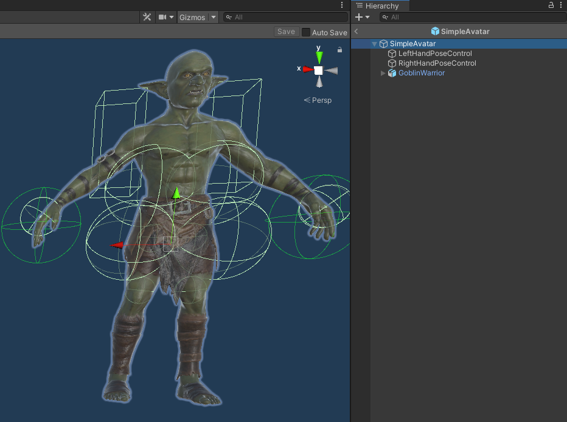
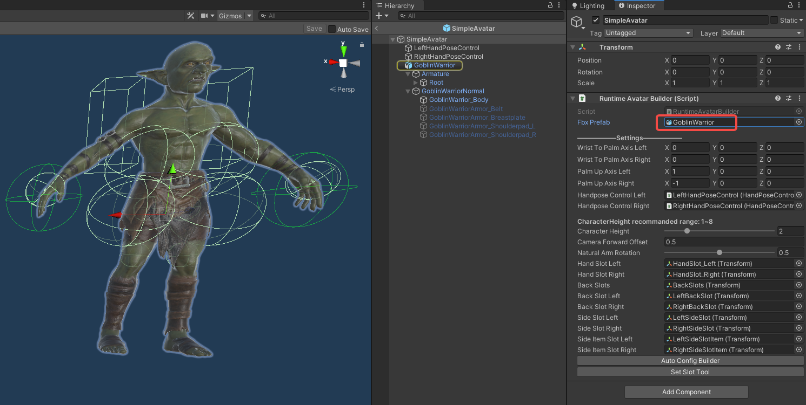
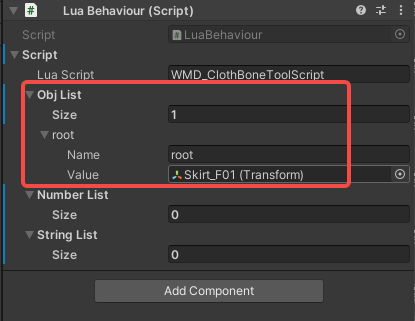
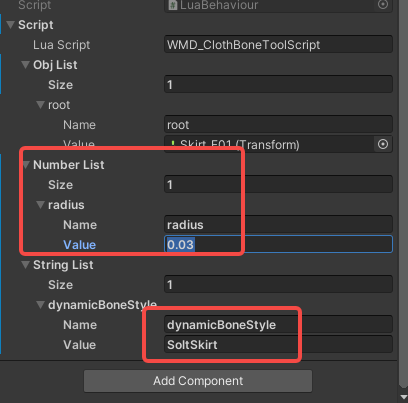
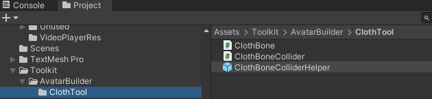
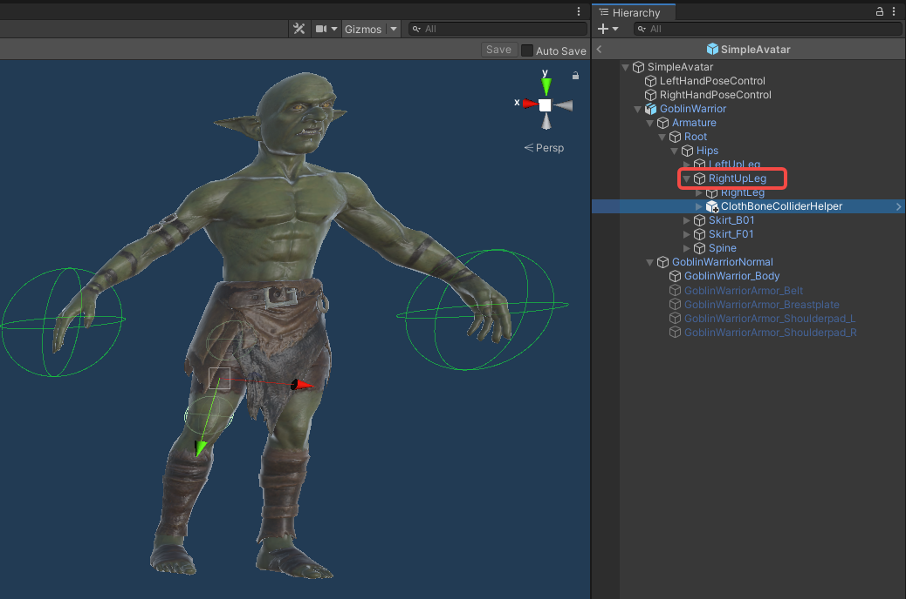
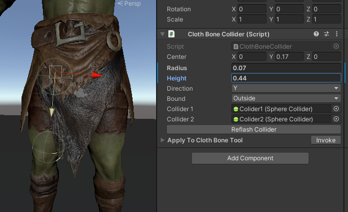
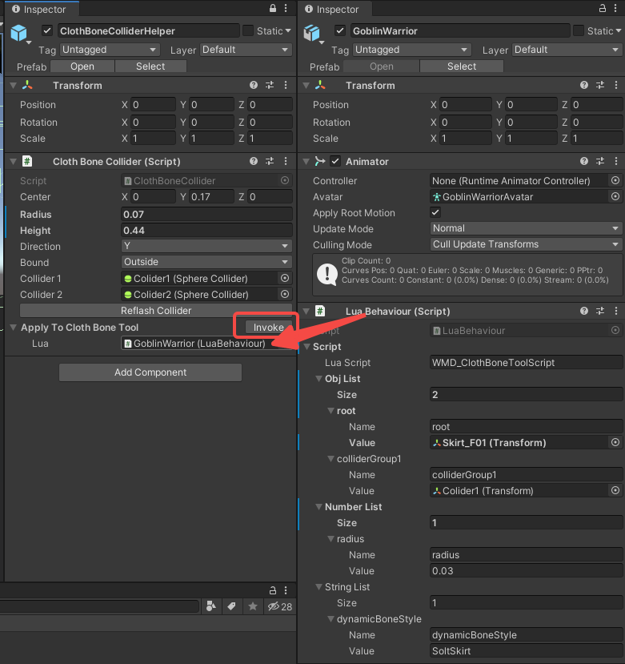

# Avatar Clothing

Note: The prefixes used in the tutorial are "WMD\_", which can be replaced with your own prefix, and you will need to change the prefix in the AddressableConfig(Assets/Resources/AddressableConfig) file. Once you have changed the prefix, you will need to fill in your new prefix instead of "WMD\_" in the tutorial.

#### 1.Place LuaBehaviour  

1.Open the Avatar prefab you made.

2.Double-click the RuntimeAvatarBuilder's FbxPrefab to jump to the target node.

3.Add a LuaBehaviour component.

- Fill in "prefix_ClothBoneToolScript".
- Add a new ObjList with the name root, and assign the node of your model's clothing skeleton to root.

- Several cloth style options are available in ClothBoneToolScript to use pre-made parameters.

        SoltSkirt
        NormalSkirt
        HardSkirt
        LongHair
        ShortHair
        Tail
        Breasts
- You can also manually modify each parameter by adding a new NumberList to LuaBehaviour.

#### 2.Use Cloth Bone Collider

If you want clothing to not be able to pass through the body, you need to use ClothBoneCollider for the body.

1.Drag the ClothBoneColliderHelper to the node that has a collision with the clothing.

2.Adjust the parameters of clothBoneCollider to the size of the avatar part.

3.Assign the LuaBehaviour you just set to Lua. 

click Invoke to automatically apply it to the ClothBoneTool.

#### 3.Save the Prefab

Done!
