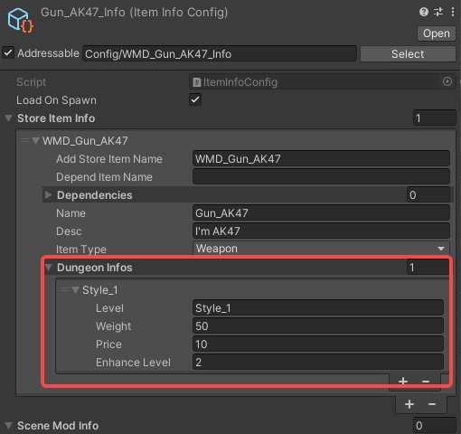

# Dungeon merchandise

Note: The prefixes used in the tutorial are "WMD\_", which can be replaced with your own prefix, and you will need to change the prefix in the AddressableConfig(Assets/Resources/AddressableConfig) file. Once you have changed the prefix, you will need to fill in your new prefix instead of "WMD\_" in the tutorial.

Fill in the following configuration to customise dungeon merchandise.

Here we use Gun_AK47 as an example.

- `level`: The level of the dungeon, your mod will appear in the configuration of the level. The currently configurable levels : `Style_1`, `Style_1_2`, `Style_2`, `Style_2_2`, `Style_3`, `Style_3_2`.
- `weight`: The probability that a merchant will sell this item. Typical configurations range `from 1 to 100`.
- `price`: the base price of the item.
- `enhance level`: `Initial enhancement level` of the weapon. the weapon will be enhanced to the configured level at the time of sale.

​	

