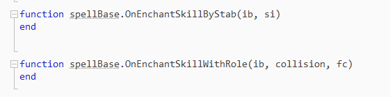
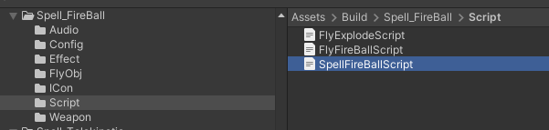
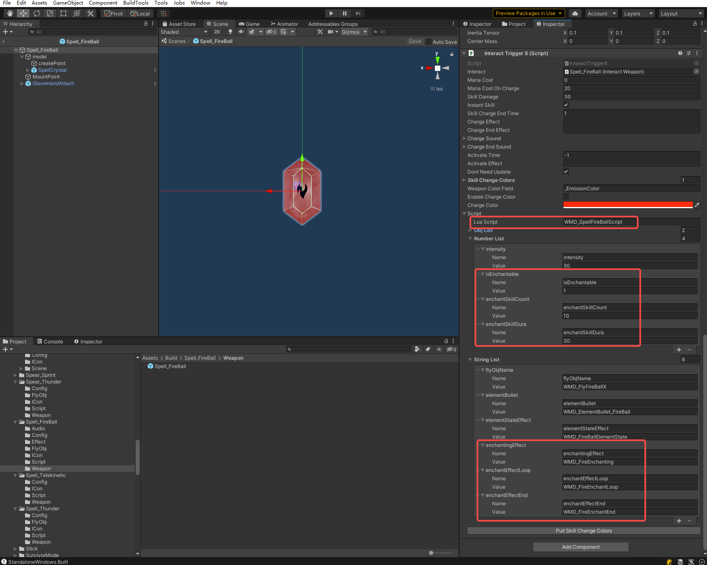

# Enchantment Spell

Note: The prefixes used in the tutorial are "WMD\_", which can be replaced with your own prefix, and you will need to change the prefix in the AddressableConfig(Assets/Resources/AddressableConfig) file. Once you have changed the prefix, you will need to fill in your new prefix instead of "WMD\_" in the tutorial.


Making enchantment spells requires `updating ModToolkit` to the latest version.

Here we use Spell_FireBall as an example.


#### 1.make enchantment skills

Open SpellBaseScript, you can see the following api.



-  `OnEnchantSkillByStab`: called when the enchanted weapon is stab a unit. 

  - ib: InteractBase of the enchanted weapon
- si:  [infomation]( https://battletalent.github.io/BTModToolkit/class_cross_link_1_1_stab_object_1_1_stab_info.html) about the stab.
-  `OnEnchantSkillWithRole`:  called when the enchanted weapon is collision with role
  - ib: InteractBase of the enchanted weapon
  - collision: [collision](https://docs.unity3d.com/2020.3/Documentation/ScriptReference/Collision.html) info. 
  - fc: [FullCharacterControl](https://battletalent.github.io/BTModToolkit/class_cross_link_1_1_full_character_control.html) of the role.


With these api, we can make spell's enchantment skill. Refer to SpellfireballScript:



```
function spellFireBall.OnEnchantSkillWithRole(ib, fc, mu, thisCol, otherRB, otherCol, point, normal, relaVel)
    if mu then
    	--Cannot ignite flames on armour.
        local state = fc.muscleState.stateRecord[mu.muscleName]
        if fc.muscleState:IsArmor(state, thisCol) then
            return
        end
    end
    
    --Skill release count.
    ib:EnchantSkillCountUpdate()
    
    local pos = point
    if thisCol.sharedMesh and not thisCol.convex then
        pos = point
    else
        pos = thisCol:ClosestPoint(point)
    end
    
    --Calling your enchantment skill
    spellFireBall.SpawnFire(ib, thisCol.transform, pos, normal)
end
```


```
function spellFireBall.SpawnFire(ib, trans, pos, normal)
    local fo = CL.FlyObject.CreateFlyObj("Zone_Fire_Small_Short", ib, pos, UE.Vector3.up)
    fo.trans.position = pos
    fo.trans:SetParent(trans)
end
```


#### 2.Fill in the enchantment skill parameters



- `isEnchantable`: 1 means it can enchant weapons, 0 means it can't.
- `enchantSkillCount`:  The number of times the enchantment skill can be used
- `enchantSkillDura`: The duration of the enchantment.


 [Optional]

- `enchantingEffect`: The effect at the start of the enchantment.
- `enchantingEffectLoop`: The effect that loops after successful enchantment.
- `enchantEffectEnd`: The end of the enchantment effect.


