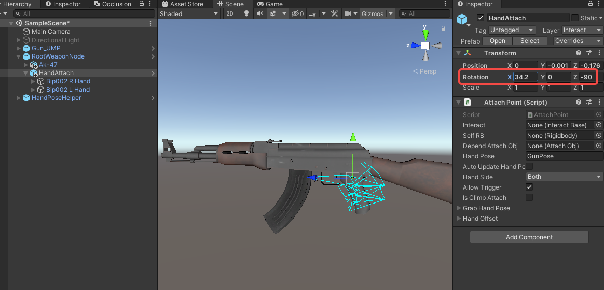
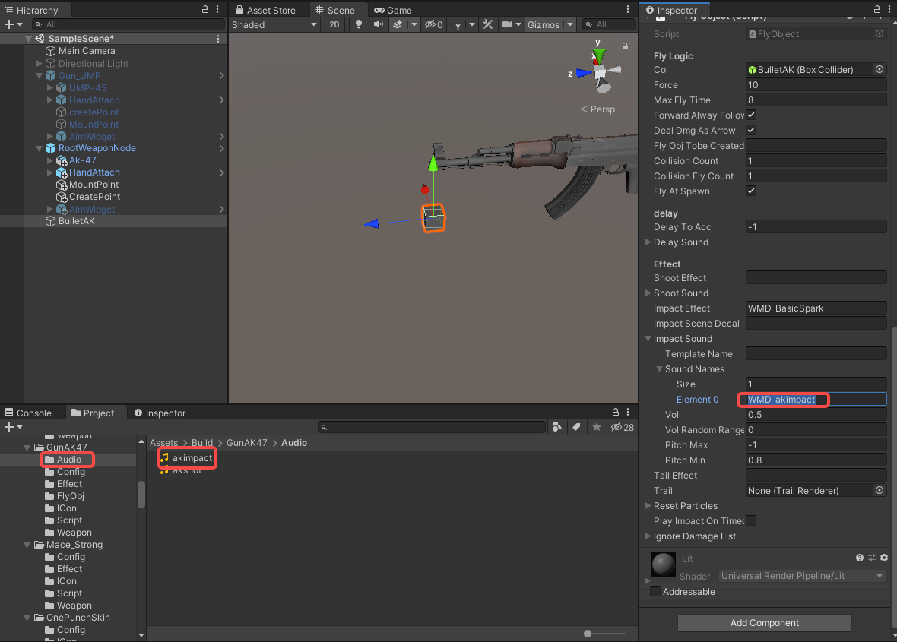

# Create a gun mod

Note: The prefixes used in the tutorial are "WMD\_", which can be replaced with your own prefix, and you will need to change the prefix in the AddressableConfig(Assets/Resources/AddressableConfig) file. Once you have changed the prefix, you will need to fill in your new prefix instead of "WMD\_" in the tutorial.

#### 1.Open the Modproj by Unity2019.4.12f1

Please check the  [Mod Toolkit Overview](../getting-started/1.modtoolkit-overview.md) 

#### 2.Create Folder

Create Folder under Build folder. 

#### 3.Place the model

Drag the **RootWeaponNode**(under Assets/Toolkit/Prefabs/) to the scene.

Place the model of the gun under the **RootWeaponNode**.

Rotate the model towards the **Z axis** of **RootWeaponNode**. resized according to the other weapon examples inside the project.

#### 4.Add Collider for colliding

Click **Add Component** to add **Mesh Collider**, select **Convex** and change default layer to **Interact layer**. (quick tips: if you want accurate collision, we recommend Collider Creator in the unity asset store, but it's not free.)

#### 5. Define HitInfo and CollisionEffect

Select the RootWeaponNode,

Based on the [HitInfo and CollisionEffect](..\details\hitinfo-and-collisioneffect.md), we can set the **TempateName** of the gun to Weapon, and of course Metal as well. Fill the MaterialName of CollisionEffect with Metal.

Fill in the **MaterialName** of the gun's CollisionEffect with **Metal**.

#### 6.Add HandAttach for grabbing

Drag **HandAttach** from the path **Asset/Prefabs** to the **RootWeaponNode**. **HandAttach** describes how your hand grabbing it.

Set the **Interact** and **SelfRB** of the AttachPoint (you can drag the RootWeaponNode  to assign that and Unity will automatically select the corresponding component)

Drag a **HandPoseHelper** from the path **Asset/Toolkit/HandPoseHelper** to the scene and set the HandAttach reference to the HandPoseHelper's HandAttach

Click on AddDragTool and you can see the hand appear in the scene.

Adjust the angle of the HandAttach according to the hand.

Click RemoveDrawTool to remove the hand.

At last, reference these **AttachLine**s to the **InteractWeapon** component from the **RootWeaponNode**.

#### 7.Add MountPoint for backpack

Create Empty node name **MountPoint** and add **AttachPoint** Component. Then move it to the relative position where they should attach to backpack.

Reference the **MountPoint** to the **InteractWeapon** from the **RootWeaponNode** like before.

#### 8.Select the how your weapon feels like when swinging 

We click "Swing Like Postol" here. (it'll modify the grab force and hand speed)

#### 9.Set InteractTriggerX

Remove the InteractTrigger under RootWeaponNode and add an InteractTriggerX instead.

Reference the **MeshRenderer** from the model to **Skill Change Colors**.(quick tips: if you want to place multiple renderer at the same time, you can click the lock button to lock the inspector, then drag them all at once) (the **Skill Change Colors** will be used for change weapon color when it's needed, such as damaged)

Copy the project's **WeaponFlyObjX** to the Mod's Script folder, Fill in the LuaScript for InteractTriggerX with **WMD_WeaponFlyObjX**.

Create Empty node name **createPoint** and move to the position of the muzzle, which is where the bullet will be fired.

To assign the Transform of CreatePoint to shootPosition, you can select the RootWeaponNode and lock the panel and assign the Transform of CreatePoint to shootPosition in another Inspector.

Place your sound files in your Mod's **Audio** folder, add **SoundEffectPlayer** to the RootWeaponNode, set the size of **SoundName** to 1, fill in **Element0** with the prefix + sound "**WMD_akshot**", and finally reference it to InteractTriggerX's **shootSound**.

Disactive SoundEffectPlayer if you don't need it to play when generated.

Add **AimWidget** to the RootWeaponNode and reposition it to the muzzle of the gun.

Similarly, select the RootWeaponNode and lock the panel to set the **AimWidget** component reference to aimWidget.

Set the parameter **autoSetupBulletIgnore** to a value of 1. The effect of this value is to **ignore** bullet and gun **collisions**.

#### 10.Create bullet

Create a Cube in the scene and resize it.

Add CollisionEffect and RagdollHitInfoObj，with the TemplateName of the HitInfo set to **Bullet**.

Add **Rigidbody** and **FlyObject**. 

set up **ImpactEffect**, here we don't cover the creation of the Effect, just use BasicSpark from the project.，you can copy it to the Effect folder of the mod. 

set up ImpactSound, again you need to place the sound file in the Audio folder of the mod.

set the Layer of the bullet and drag it to the FlyObj folder.

Set the **bulletName** of **InteractTriggerX**  in the RootWeaponNode to **WMD_BulletAK**.

Finally we need to set **ManaCost** to a value greater than 0, otherwise it will be considered as no skill and Script's UpdateSkill will not be called.

#### 11.Save Prefab and done

Drag the **RootWeaponNode** you created from the scene to the Weapon folder and rename it to GunAK47.

#### 12.Take a screenshot for the store

Select the Prefab and take a screenshot from the Inspector window. Save the screenshot to **ICon** folder. (tips: or you can create you own one)

Set the Max size to 128 or 256(this is optional).

#### 13. Config as an item

Right click under your mod's **Config** folder, then create an **ItemInfoConfig**, then rename it as you need.(**ItemInfoConfig** is one of our entry point of your mod. Battle Talent will load all the **ItemInfoConfig** files in your mod, and add them into the game. Another entry point of mod, is entry script. Battle Talent will always load this script if your mod have it with addressable path "Entry"(we'll cover this later))

**ItemInfoConfig** is the way the game knows your mod, so please make sure you have addressable associate with it before building mod (we will cover this part later on)

#### 14. Update addressable path

Select the file **AddressableConfig**(Assets/Resources/AddressableConfig or **shortcut: ctrl-shift-e**)

Click **Clear Addressables** to remove all unrelated items from the Toolkit.

Enter your **Prefix** and **File path**, then click **Create And Refresh Addressable Name**.

Then you will see this tool has already setup addressable path for you in the **Addressables Groups** window. (**Window/Asset Management/Addressables/Groups** to open this window)

#### 15. Build and export

Now it's time to name your mod, click **File/Build Settings/PlayerSettings/Player** to fill in your **ProductName**.

Click **BuildTools/BuildAllBundles** to Build your mod. (tips: first time will take a bit longer)

Once you build it successfully,  then you will find your mod in the Assets/Mods. If something errors, please checkout the Console information, unity will tell you what's going wrong. And feel free to ask questions on our discord server.

Done！

