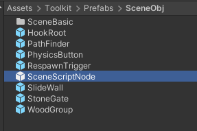
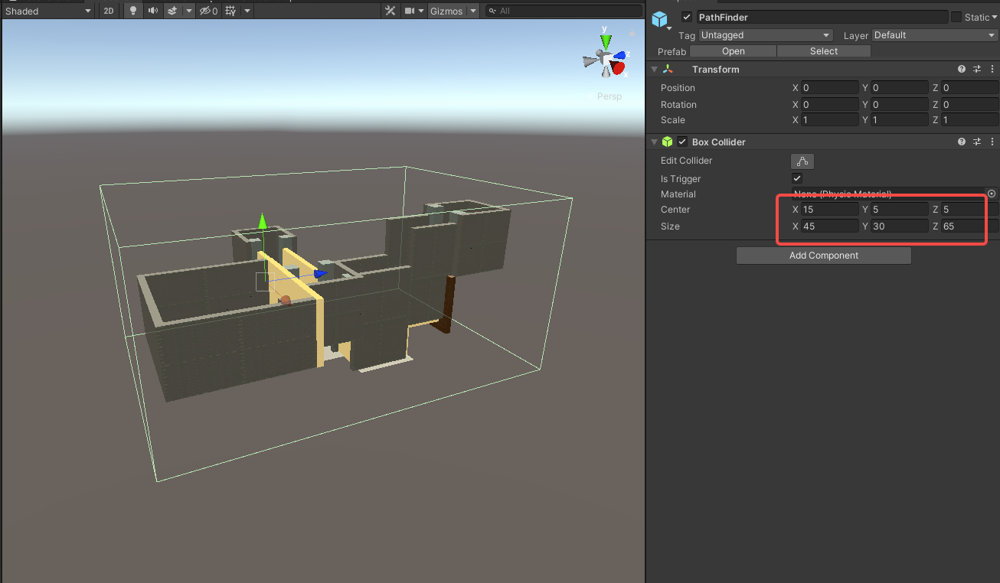

import ModTutorialFragmentPhaseBuild from '../_fragments/_fragment-phase-build.mdx';
import ModTutorialFragmentPhaseTest from '../_fragments/_fragment-phase-test.mdx';
import ModTutorialFragmentStepOpenUnity from '../_fragments/_fragment-step-open-unity.mdx';
import ModTutorialFragmentStepCreateIcon from '../_fragments/_fragment-step-create-icon.mdx';
import ModTutorialFragmentStepTemplateWizard from '../_fragments/_fragment-step-template-wizard.mdx';

# Create a scene mod

Here is a step by step tutorial for making a **scene** mod.

## Phase 1: Define your mod

<ModTutorialFragmentStepOpenUnity />

#### 5.Generate folder structure using the template wizard.

<ModTutorialFragmentStepTemplateWizard modType="Scene" />

#### 6.Edit the scene

* Open the newly created `scene` file in the `Scene` folder. (for example: `Build > YourNewModFolder > Scene`)
* Place items, place DirectionalLight and adjust it, place HookRoot, SlideWall, StoneGate, etc.

* Want to know how to create a **Combat Room**? Please read [Create Combat Room](../tutorials-advanced/2.create-combat-room.md).
* Adjust the `CharacterPos` (under `SceneScriptNode`) to adjust the character spawning position.

* Adjust the height of the [DeadZone](../details/deadzone-respawntrigger.md) (under `SceneScriptNode`) and place the  [RespawnTrigger](../details/deadzone-respawntrigger.md)  respawn point

* Adjust `BoxCollider` of the `PathFinder` (under `SceneScriptNode`) to enclose the whole scene.
* Save the scene.

#### 7. Bake the scene (not required but good for performance)
* Using [occlusion culling](https://docs.unity3d.com/2019.4/Documentation/Manual/occlusion-culling-getting-started.html), follow the tutorial steps until the baking is complete.

## Phase 2: Prepare to export your mod

<ModTutorialFragmentStepCreateIcon modType="Scene" />

## Phase 3: Build the mod

<ModTutorialFragmentPhaseBuild />

## Phase 4: Test & publish the mod

<ModTutorialFragmentPhaseTest />