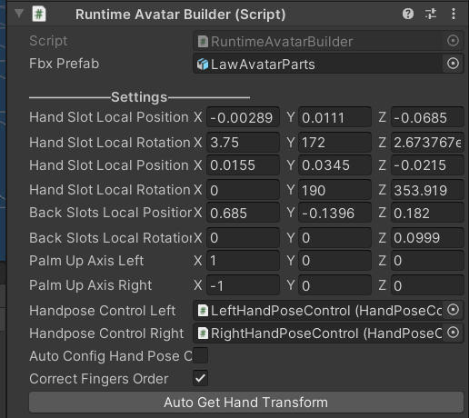
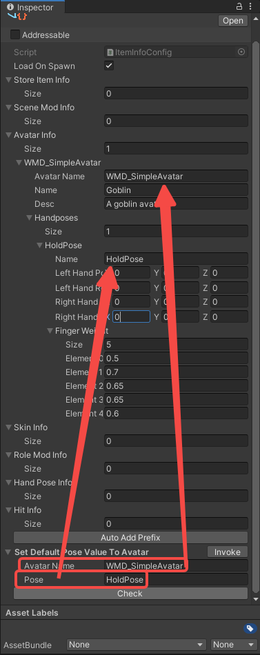
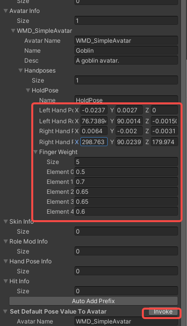

import ModTutorialFragmentPhaseBuild from '../_fragments/_fragment-phase-build.mdx';
import ModTutorialFragmentPhaseTest from '../_fragments/_fragment-phase-test.mdx';
import ModTutorialFragmentStepOpenUnity from '../_fragments/_fragment-step-open-unity.mdx';
import ModTutorialFragmentStepTemplateWizard from '../_fragments/_fragment-step-template-wizard.mdx';
import ModTutorialFragmentStepCreateIcon from '../_fragments/_fragment-step-create-icon.mdx';

# Create an avatar mod

Here is a step to make a simple **avatar** mod.

## Phase 1: Define your mod

<ModTutorialFragmentStepOpenUnity />

#### 5.Generate folder structure using the template wizard.

<ModTutorialFragmentStepTemplateWizard modType="Avatar" />

#### 6.Set the Animation Type to humanoid and Avatar Definition to Create From This Model

* Add your custom model to your `Resources` folder in Unity.
* Change the following settings on the model like the image **and click apply**.

#### 7.Configure the model into the prefab

* Open the newly created prefab in the `Avatar` folder.
* Drag your model into it the hierarchy.
* Navigate to the highest object (should be the same as the name of your mod) so that you see component `RuntimeAvatarBuilder`.
* Drag your model object into the `fbx prefab` variable.

* Click `Auto Get Hand Transform` button.

#### 8.Finger configuration

* Open the `Avatar` prefab.
* Navigate to the highest object (should be the same as the name of your mod) so that you see component `RuntimeAvatarBuilder`.

* Click `HandPose Control Left` to the left handpose component.

For avatar, you will manually need to set the hand poses. Do that like so:

* Click `Auto Config Fingers`.
* Manually close the fingers in the hands. (if they aren't already closed).
* Click `Save Fingers Close Pose`.
* Manually open the fingers in the hands.
* Click `Save Fingers Open Pose`.
* Test if grips are ok by clicking `View Fingers Close Pose`  &  `View fingers Open Pose`.

- Great, you just did the left hand. Go back to the `RuntimeAvatarBuilder` component and do the same for the right hand.

- **Save the prefab**.

#### 9.Handpose configuration

If you find that some of the hand poses are **offset** after packing and using them in the game, you can set the avatar's exclusive **HandPose** by following these steps.

- Open the config file in `Assets > build > YourModName > Config`. Under the **SetDefaultPoseValueToAvatar** field, fill in the **AvatarName** and the name of the **HandPose** you want to override.

  

- Click on **Invoke**. The corresponding HandPose data will be filled in **automatically**.

  

- Adjust the data to suit your needs, the adjustment will only affect the hand pose of this avatar in the game. Please check [Modify Avatar HandPose](../tutorials-advanced/10.modify-avatar-hand-pose.md)

## Phase 2: Prepare to export your mod

<ModTutorialFragmentStepCreateIcon modType="Avatar" />

## Phase 3: Build the mod

<ModTutorialFragmentPhaseBuild />

## Phase 4: Test & publish the mod

<ModTutorialFragmentPhaseTest />