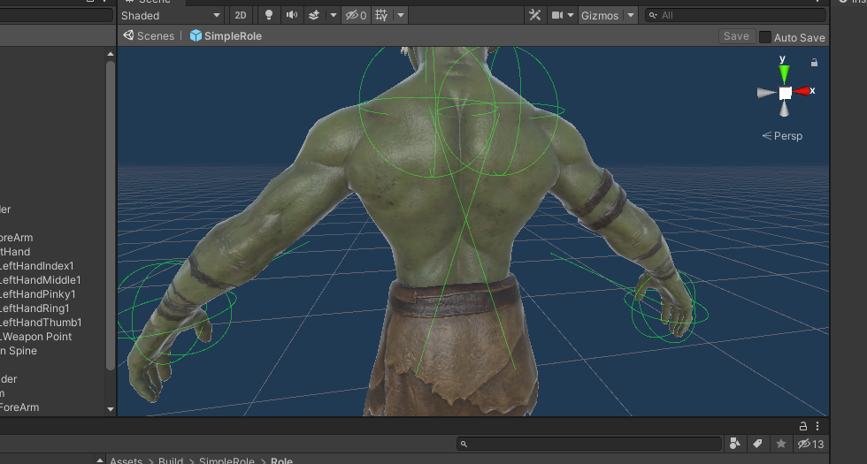

import ModTutorialFragmentPhaseBuild from '../_fragments/_fragment-phase-build.mdx';
import ModTutorialFragmentPhaseTest from '../_fragments/_fragment-phase-test.mdx';
import ModTutorialFragmentStepOpenUnity from '../_fragments/_fragment-step-open-unity.mdx';
import ModTutorialFragmentStepTemplateWizard from '../_fragments/_fragment-step-template-wizard.mdx';
import ModTutorialFragmentStepCreateIcon from '../_fragments/_fragment-step-create-icon.mdx';

# Create a role mod

Here is a step to make a simple **role(NPC)** mod.

## Phase 1: Define your mod

<ModTutorialFragmentStepOpenUnity />

#### 5.Set the Animation Type to humanoid and Avatar Definition to Create From This Model

* Add your custom model to your `Resources` folder in Unity.
* Change the following settings on the model like the image **and click apply**.

#### 6.Generate folder structure using the template wizard.

<ModTutorialFragmentStepTemplateWizard modType="Role" />

#### 7.Configure the model into the prefab

* Open the newly created prefab in the `Role` folder.
* Drag your model into it.
* Disable the animator on the **model you just added**.
* On the **prefabs parent object**, Make sure the `animator` component has the armature selected of the newly added model.

#### 5.Hand transform configuration

* Open the newly created prefab in the `Role` folder.
* Navigate to the highest object (should be the same as the name of your mod) so that you see component `RoleSlots`.
* Should look something like this: (button has since then been renamed to `Generate Slots` so you are good.).

* Click the `Generate Slots` button.
* Avatar should now show some spheres and lines. those indicate your newly created slots. Adjust the transforms of the variables added to `RoleSlots` to make those fit your avatar better.

* **Save the prefab**

## Phase 2: Prepare to export your mod

<ModTutorialFragmentStepCreateIcon />

## Phase 3: Build the mod

<ModTutorialFragmentPhaseBuild />

## Phase 4: Test & publish the mod

<ModTutorialFragmentPhaseTest />