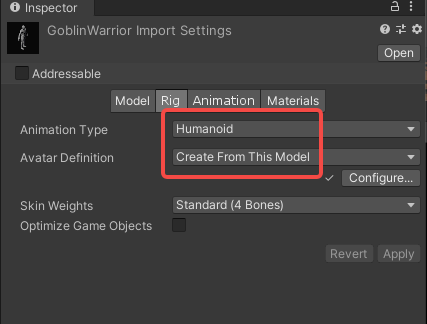
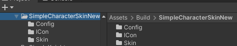
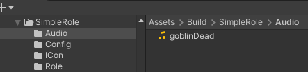
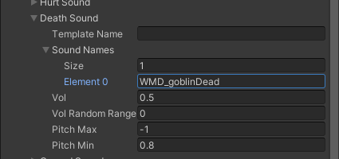

import ModTutorialFragmentPhaseBuild from '../_fragments/_fragment-phase-build.mdx';
import ModTutorialFragmentPhaseTest from '../_fragments/_fragment-phase-test.mdx';
import ModTutorialFragmentStepOpenUnity from '../_fragments/_fragment-step-open-unity.mdx';
import ModTutorialFragmentStepCreateIcon from '../_fragments/_fragment-step-create-icon.mdx';

# Create a role mod

Here is a step to make a simple **role(NPC)** mod.

## Phase 1: Define your mod

<ModTutorialFragmentStepOpenUnity />

#### 2.Set the Animation Type to humanoid and Avatar Definition to Create From This Model

#### 3.Placement of the model into the scene

Create an Empty node under the left hand node, named "LWeapon Point", and do the same for the right hand node.

Adjust the direction of the node, the z-axis direction of LWeapon Point is the direction of the weapon

Create two empty nodes under the Chest node, named "LWeapon Spine" and "RWeapon Spine",  This is the hanging point of the weapon, again requiring an angle adjustment.

Apply.

#### 3.Save Model

Create these folder under Build folder.

Drag the character of the scene to the role folder.

## Phase 2: Prepare to export your mod

<ModTutorialFragmentStepCreateIcon />

#### ItemInfoConfig

Create an ItemInfoConfig file in the Config folder, name it with "YourModName"

Fill in the RoleModInfo

**ReplaceRole**: Replaceable NPC in the game.

**Weapon**: character's weapon.

To know more about **ReplaceRole** and **Weapon**, please read [Role and Weapon](../details/role-and-weapon.md).

**attr**: character's attribute, read only the first data of this array, Use default data when array length is 0.

If you want to modify the sound effects of your character, you will need to place the sound files in the Audio folder.

Fill in the sound file name in the config under SoundNames, and don't forget to add your prefixes.

## Phase 3: Build the mod

<ModTutorialFragmentPhaseBuild />

## Phase 4: Test & publish the mod

<ModTutorialFragmentPhaseTest />