# Create hand pose mod

Note: The prefixes used in the tutorial are "WMD\_", which can be replaced with your own prefix, and you will need to change the prefix in the AddressableConfig(Assets/Resources/AddressableConfig) file. Once you have changed the prefix, you will need to fill in your new prefix instead of "WMD\_" in the tutorial.

#### 1.Open the Modproj by Unity2019.4.12f1

Please check the  [Mod Toolkit Overview](../getting-started/1.modtoolkit-overview.md) 

#### 2.Create Folder

**Create Folder** under Build folder. 

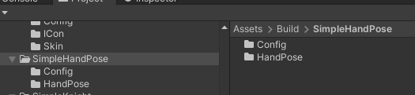

#### 3.Copy A Preset

Select a preset from path "Asset/Toolkit/HandPoseHelper/HandPose" , both left and right handed, and drag it into the scene.

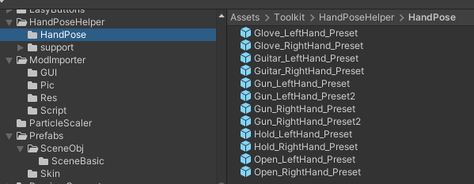

#### 4.Modify Values

Modify the hand **position** and **rotation** of this pose as required.

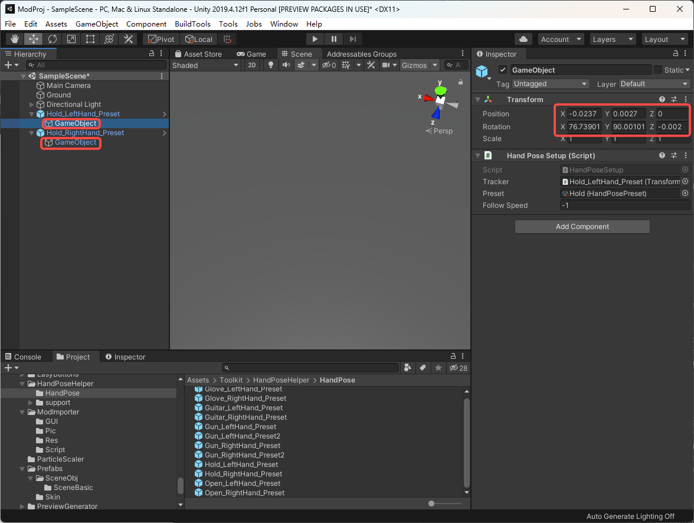

#### 5. Modify Finger Pose

Click on the Preset of the **HandPoseSetup** and jump to the path "Asset/Toolkit/HandPoseHelper/support/FingerPose".

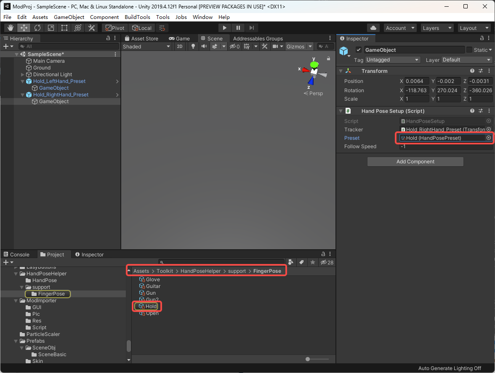

Copy and **rename**.

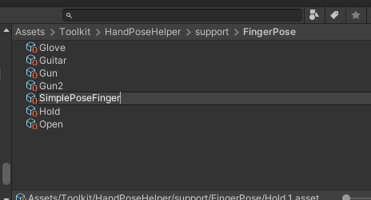

Adjust **finger posture**. 

The fingers are, in order, **thumb**, **index**, **middle**, **ring** and **pinky**(pinkie).

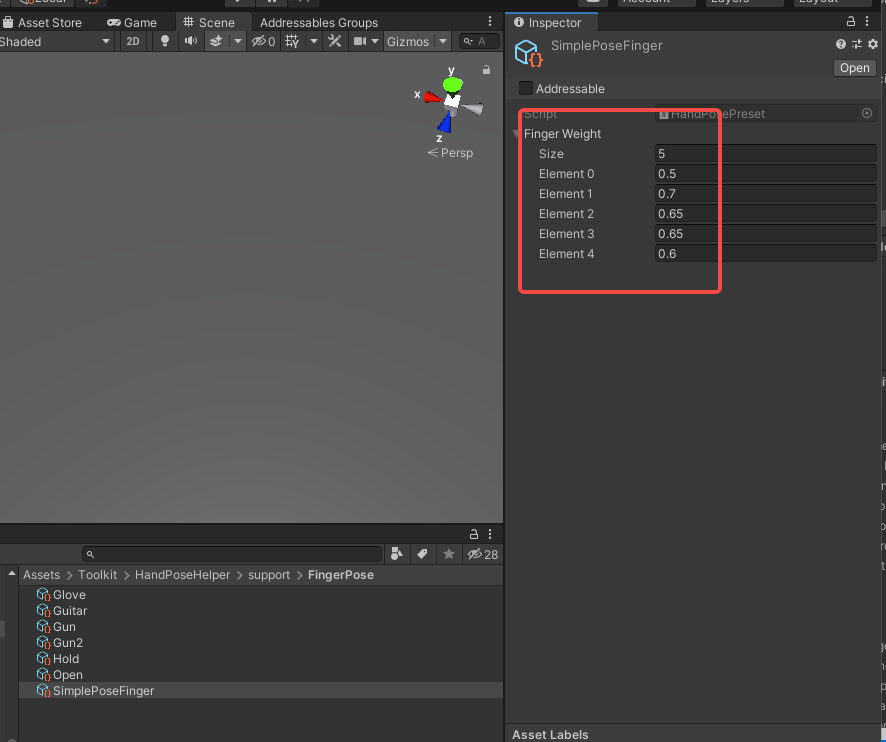

**Assign** it to the Preset in the scene.

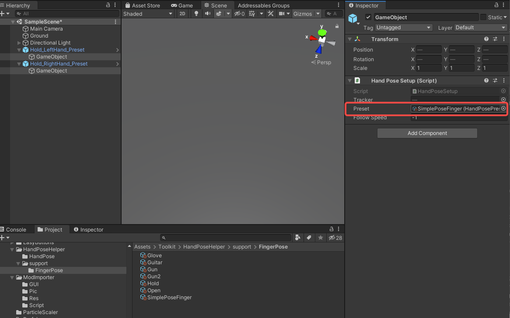

#### 6.Save Preset

Drag the Preset in the scene under your HandPose path and click on **OriginalPrefab**.

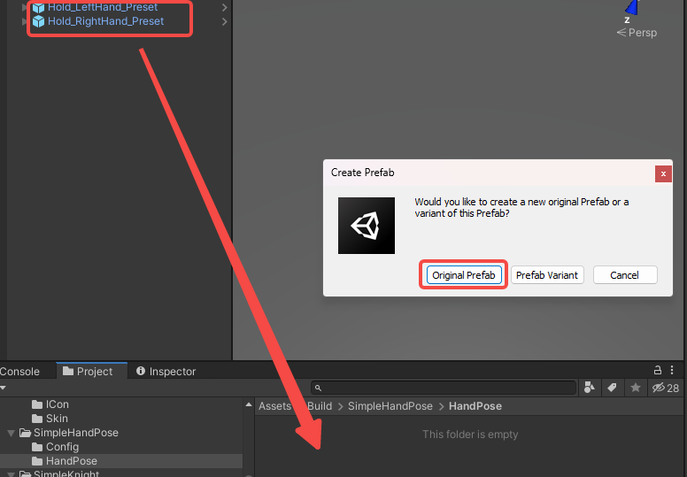

**Rename** the Preset

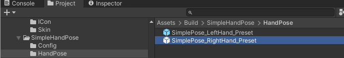

Generate **ItemInfoConfig** in the Config folder and **rename** it.

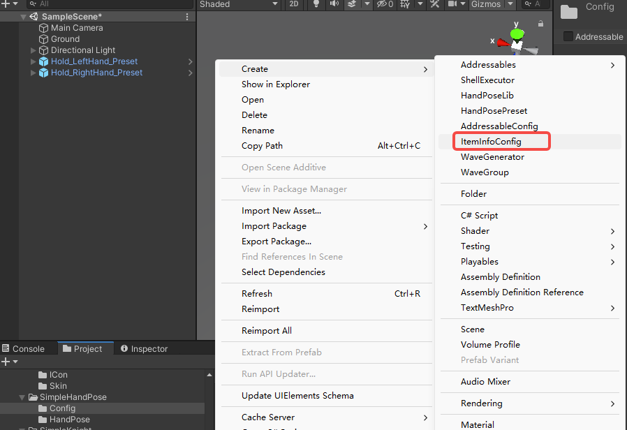

**Fill** in the **Hand Pose name** and the **Preset name** 

Note the need to add your own **prefix**.

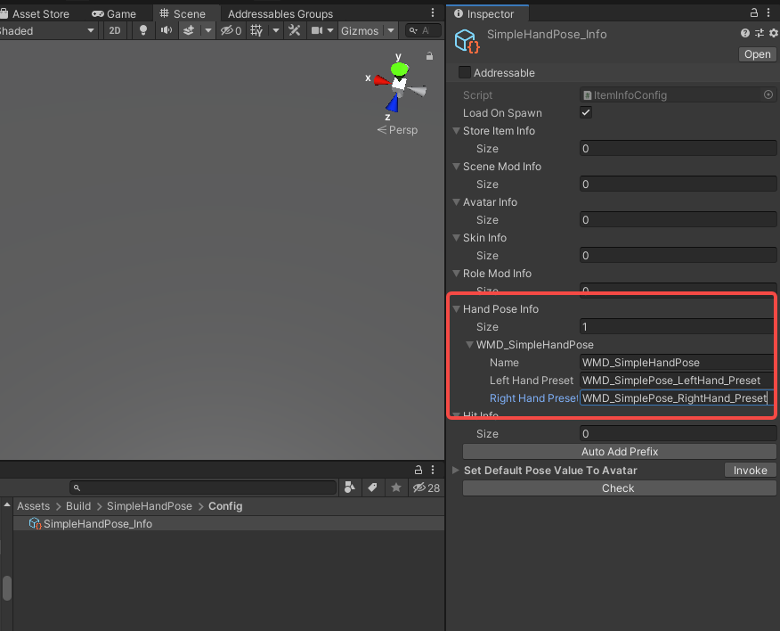

#### 7. Update addressable path

Select the file **AddressableConfig**(Assets/Resources/AddressableConfig or **shortcut: ctrl-shift-e**)

Click **Clear Addressables** to remove all unrelated items from the Toolkit.

Enter your **Prefix** and **File path**, then click **Create And Refresh Addressable Name**.

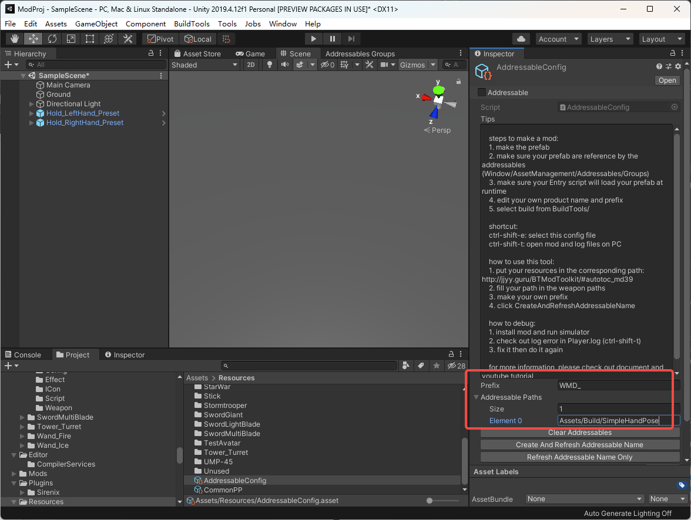

Then you will see this tool has already setup addressable path for you in the **Addressables Groups** window. (**Window/Asset Management/Addressables/Groups** to open this window)

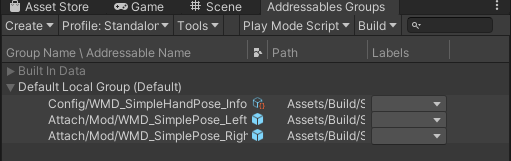

#### 8. Build and export

Now it's time to name your mod, click **File/Build Settings/PlayerSettings/Player** to fill in your **ProductName**.

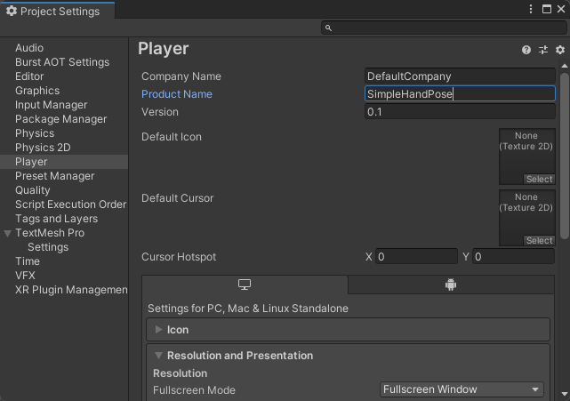

Click **BuildTools/BuildAllBundles** to Build your mod. (tips: first time will take a bit longer)

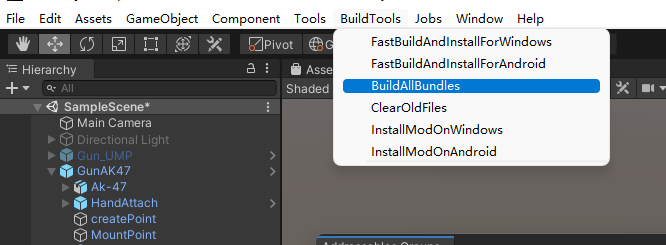

Once you build it successfully,  then you will find your mod in the Assets/Mods. If something errors, please checkout the Console information, unity will tell you what's going wrong. And feel free to ask questions on our discord server.

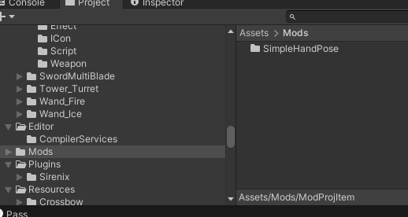

Done！

#### How do I use this HandPose inside my weapon?

​	Note: To ensure that weapons that use a custom HandPose work properly, it is best to **package the HandPose with the weapon.**

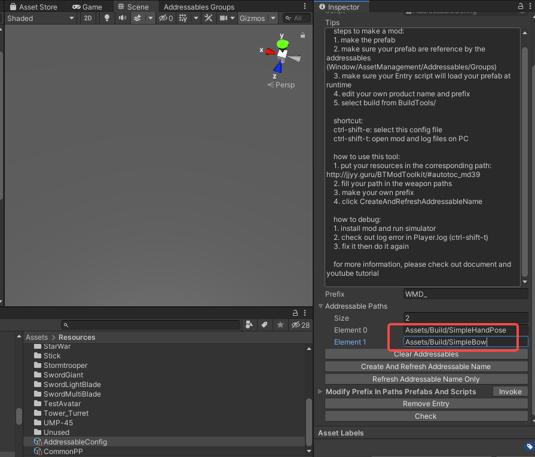

1. Find the **AttachLine** or **AttachPoint** of your weapon.

2. Change the **HandPose** property inside to the name of your HandPose.

  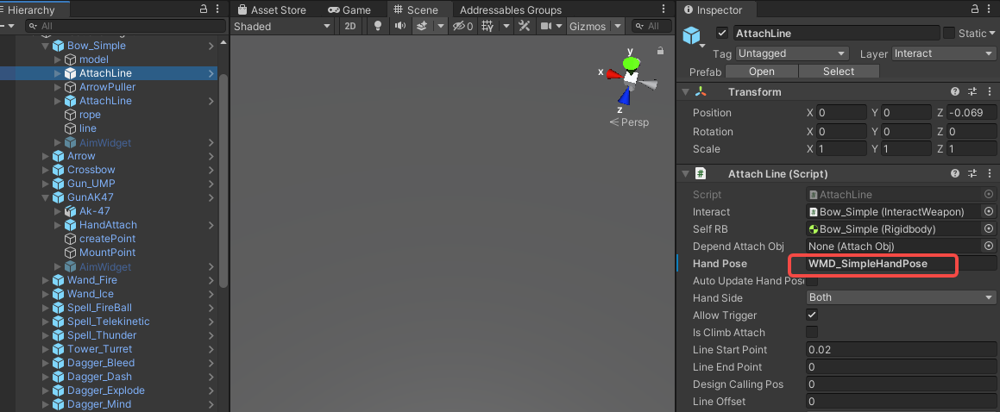

  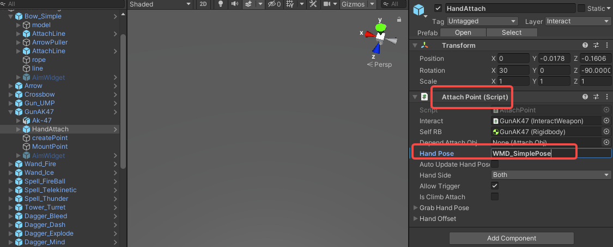

3. Done!
