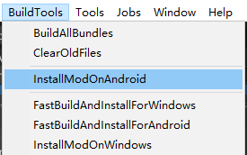

### 1. Refresh addressables

For PC **(Recommend for debugging)**:
* Make sure you have Battle Talent installed (Steam).
* In Unity: Click `BuildTools` > `InstallModOnWindows`.

For Quest:
* Make sure you have Battle Talent installed on your Quest (Quest store).
* Make sure you've connected your headset correctly.
* Make sure you've allowed sideloading.(if you are not sure how to do this, you can follow this tutorial: https://www.youtube.com/watch?v=RoIXxIfRNTw)
* In Unity: Click `BuildTools` > `InstallModOnAndroid`.

### 2. Spot the issues via log panel

Now that it's installed it's time to see if it's working correctly. See if the console gives you some errors. It'll be opened when you toggle Cheat Menu on.

### 3. Upload your mod to mod.io

1. Zip your mod.
2. Go to https://battletalent.mod.io/.
3. Click `Add mod`.
4. Authenticate (login).
5. Fill in the required fields.
