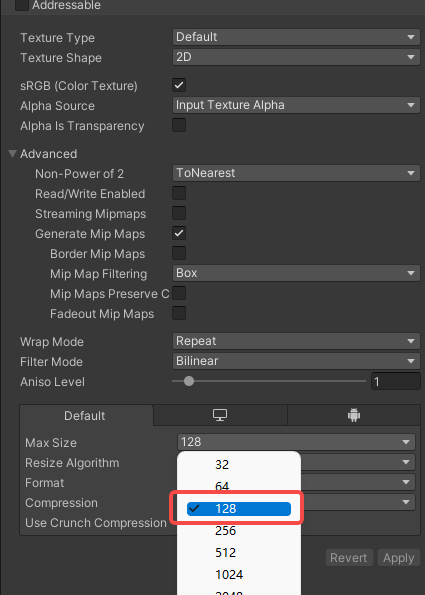

#### 1.Take a screenshot

Select the Prefab, model, or scene (depending on what you are creating) and take a screenshot from the Inspector window.

* Save the screenshot to **ICon** folder. (tips: or you can create you own one)
* make sure the image name is the same as folder above ICon. (example: WeaponName > ICon > WeaponName.png)
* Set the Max size to 128 or 256 and click “Apply” to save.

