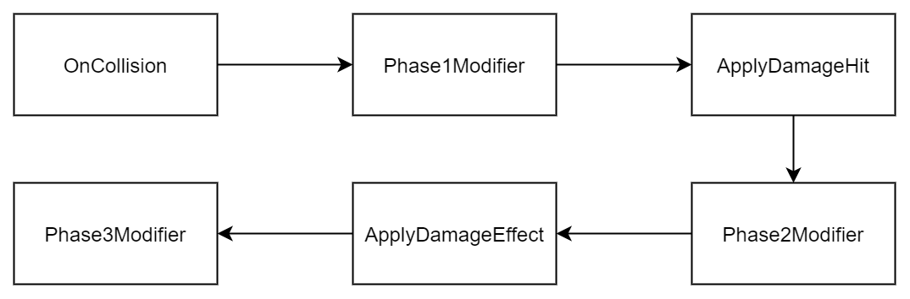

# Damage Pipeline


### Data Driven Damage Pipeline

The basic idea is that we divide the damage process into data, you can modify them to change the result. 

For example if you want to make a weapon that can knockdown each enemy when hitted their head. All you need to do is to listen to the event from the hitinfo of your weapon, then check if we hit enemy's head(DamageBasicData.beHittedMu.muscleName == "Head"), then modify the DamageEffectData.knockout to true.


### Damage Pipeline

here's the damage pipeline, and we'll inject our code to modify the data though to pipeline to get the result we want




### How we register the phase event

for local event, such as for specific hit, you can get the RagdollHitInfo structure, then register the functions below

```
OnInteractRoleHitPhase1Event // used for hit detetion, built-in function will fill those data here

OnInteractRoleHitPhase2Event // you can modify the damage effect here

OnInteractRoleHitPhase3Event // we can do extra stuff, such as recover hp from attack
```

[DamageBasicData](http://jjyy.guru/BTModToolkit/class_cross_link_1_1_damage_basic_data.html)

Basic collision data, such as collider, point, normal, rigidbody, impact... You can read the data from here to know what's going on in this hit.

[DamageHitData](http://jjyy.guru/BTModToolkit/class_cross_link_1_1_damage_hit_data.html)

Determines the damage calculation, such as you can set the damage larger or smaller.

[DamageEffectData](http://jjyy.guru/BTModToolkit/class_cross_link_1_1_damage_effect_data.html)

Behaviour by this damage, such as knockdown, dizzy, floating... You can set this data to apply different hit effect.