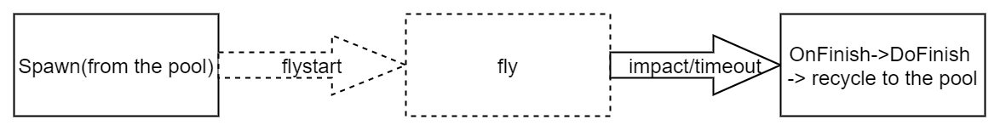

# FlyObject component- Bullet&FireBall

##### Introdution

FlyObject is for simulating object that have their own trajectory and short life cycle. Such as fireball and bullet.

##### Life Cycle

Here's description of a **FlyObject**'s life cycle from spawn to the end.

##### Fly Logic

In fly state, FlyObject can play trail and keep track of the trajectory.

Once collision count meet with collisionFlyCount, then flyobject will enter flystop state.

##### Collision Ignore Settings

You can setup the flyobject ignore specific type of objects.

ignoreDamageList: you can ignore collision with specific type objs

ignoreHolder: you can also ignore the role spawn this flyobj

##### Collision Callback Functions:

Note: collision event will override the original functions in lua, so you need to call the OnCollisionUpdate manually to maintain the life cycle, please check out the FlySpellBaseScript.txt for example.

|            | Collision                 |                          |
| ---------- | ------------------------- | ------------------------ |
| PlayerHand | OnCollisionWithPlayerHand | OnTriggerWithPlayerHand  |
| Player     | OnCollisionWithPlayer     | OnTriggerWithPlayer      |
| HitScan    | OnCollisionWithHitScan    |                          |
| Scene      | OnCollisionWithScene      | OnTriggerWithStaticScene |
| Role       | OnCollisionWithRole       | OnTriggerWithRole        |
| default    | OnCollision               | OnTrigger                |