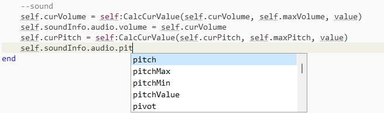
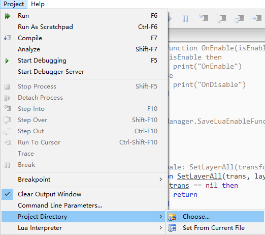

# Lua IDE Setup

#### Download ZeroBrane IDE

Please download it here: https://studio.zerobrane.com/

#### ZeroBrane IDE auto-complete and  .txt file support

1. open folder: ModProj\Assets\Toolkit\Tools\ZeroBraneAutoCompleteTool
2. copy syntax.lua to ZeroBraneStudio/api/lua
3. replace the C:/Users/[username]/.zbstudio/user.lua file from the project

#### Setup the Project Directory

Then choose the folder BTModToolkit/ModProj, then you will see the file structure in the file window.

