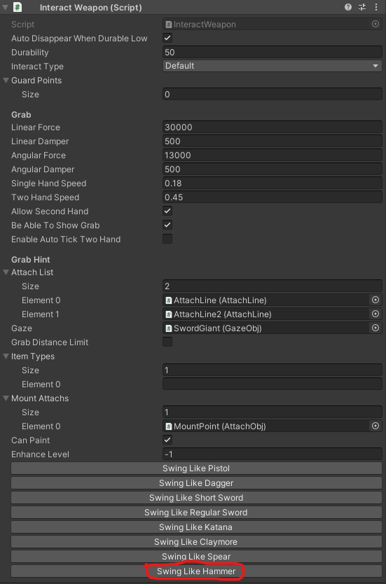
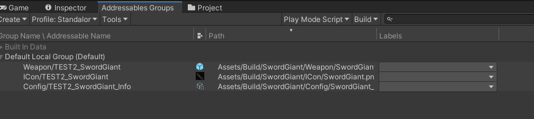

# Create your first mod without coding

### Step by Step

This tutorial is less than 1000 words, follow these steps will take you about 18 mins.

Making a mod is quite easy, here's a step to step guide to help you from beginning to uploading your first mod:

* Phase1: define how your mod works

* Phase2: describe your mod to the game

* Phase3: debug and upload your mod

### Phase1: Define your weapon in the toolkit

#### 1.Open the Modproj by Unity2019.4.12f1

Please check the  [Mod Toolkit Overview](../getting-started/1.modtoolkit-overview.md) 

#### 2.Place the model

Drag the **RootWeaponNode**(under Assets/Toolkit/Prefabs/) to the scene.

Place the model of the sword under the **RootWeaponNode**.

Rotate the model towards the **Z axis** of **RootWeaponNode**.

Reference the **MeshRenderer** from the model to **Skill Change Colors**.(quick tips: if you want to place multiple renderer at the same time, you can click the lock button to lock the inspector, then drag them all at once) (the **Skill Change Colors** will be used for change weapon color when it's needed, such as damaged)

#### 3.Add Collider for colliding

Click **Add Component** to add **Mesh Collider**, select **Convex** and change default layer to **Interact layer**. (quick tips: if you want accurate collision, we recommend Collider Creator in the unity asset store, but it's not free.)

#### 4. Define HitInfo and CollisionEffect

Change the value as screenshot in the **RootWeaponNode**

Then add these component to the handle as screenshot below, to distinguish between the whole and the handle.

To know more about HitInfo and CollisionEffect, please read [HitInfo and CollisionEffect](../details/hitinfo-and-collisioneffect.md).

In short, **HitInfo** defines how a collider deal damage and **CollisionEffect** defines what's the collision physics material is.

#### 5.Add AttachLine for grabbing

Drag **AttachLine** from the path **Asset/Prefabs** to the **RootWeaponNode**. **AttachLine** describes how your hand grabbing it, If you toggle **Gizmos** in the scene editor, then you will see a blue line where your hand will attach to. Adjust the size of the **Line Start Point** and the **Line End Point** to modify the grab area.

Because this is a two handed weapon, so we add another **AttachLine**. Then one of them needs to set **DependAttachObj** to the other. 

Set **Index Limit** to **Both**, so that this attach will limit to player's hand in two direction of your index finger.

At last, reference these **AttachLine**s to the **InteractWeapon** component from the **RootWeaponNode**.

#### 6.Add MountPoint for backpack

Create Empty node name **MountPoint** and add **AttachPoint** Component. Then move it to the relative position where they should attach to backpack.

Reference the **MountPoint** to the **InteractWeapon** from the **RootWeaponNode** like before.

#### 7.Add StabObject for stabbing

Add **StabObject** to **RootWeaponNode**.

Define the StabArea to surround the blade. (Tips: you can hover the mouse over the parameter to view the tips.)

#### 8.Select the how your weapon feels like when swinging 

We click "Swing Like Hammer" here. (it'll modify the grab force and hand speed)

#### 9.Save Prefab and done

Create these folder under Build folder. 

Drag the **RootWeaponNode** you created from the scene to the Weapon folder and rename it to GiantSword.

### Phase2: Prepare to export your mod

#### 1.Take a screenshot for the store

Select the Prefab and take a screenshot from the Inspector window. Save the screenshot to **ICon** folder. (tips: or you can create you own one)

Set the Max size to 128 or 256(this is optional).

#### 2. Config as an item

Right click under your mod's **Config** folder, then create an **ItemInfoConfig**, then rename it as you need.(**ItemInfoConfig** is one of our entry point of your mod. Battle Talent will load all the **ItemInfoConfig** files in your mod, and add them into the game. Another entry point of mod, is entry script. Battle Talent will always load this script if your mod have it with addressable path "Entry"(we'll cover this later))

**ItemInfoConfig** is the way the game knows your mod, so please make sure you have addressable associate with it before building mod (we will cover this part later on)

#### 3. Update addressable path

Select the file **AddressableConfig**(Assets/Resources/AddressableConfig or **shortcut: ctrl-shift-e**)

Click **Clear Addressables** to remove all unrelated items from the Toolkit.

Enter your **Prefix** and **File path**, then click **Create And Refresh Addressable Name**.

Then you will see this tool has already setup addressable path for you in the **Addressables Groups** window. (**Window/Asset Management/Addressables/Groups** to open this window)

#### 4. Build and export

Now it's time to name your mod, click **File/Build Settings/PlayerSettings/Player** to fill in your **ProductName**.

Click **BuildTools/BuildAllBundles** to Build your mod. (tips: first time will take a bit longer)

Once you build it successfully,  then you will find your mod in the Assets/Mods. If something errors, please checkout the Console information, unity will tell you what's going wrong. And feel free to ask questions on our discord server.

### Phase3: Test your mod and spot

#### 1. Install the mod 

Click **BuildTools/InstallModOnAndroid**(for quest) or **BuildTools/InstallModOnWindows**(for PCVR)

PCVR version(download from steam) can be used without headset, it's recommend to use it for quick debugging.

Quest version please make sure you've connected your headset correctly, and allow to be sideloaded.

#### 2. Spot the issues via log panel

It'll be opened when you toggle Cheat Menu on.

#### 3. Upload your mod to mod.io

Please follow the guide on https://battletalent.mod.io/, basically is zip your mod then upload it on the website.
