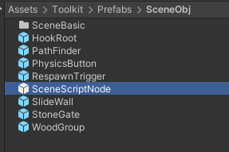

import ModTutorialFragmentPhaseBuild from '../_fragments/_fragment-phase-build.mdx';
import ModTutorialFragmentPhaseTest from '../_fragments/_fragment-phase-test.mdx';
import ModTutorialFragmentStepCreateIcon from '../_fragments/_fragment-step-create-icon.mdx';

# Create a scene mod

Here is a step by step tutorial for making a **scene** mod.

## Phase 1: Define your mod

<ModTutorialFragmentStepOpenUnity />

#### Create Config, ICon, Scene folders

#### 2.Create a new scene

#### 3.Place items, place DirectionalLight and adjust it, place HookRoot, SlideWall, StoneGate, etc.

To know how to make a **Combat Room**, please read [Create Combat Room](../tutorials-advanced/2.create-combat-room.md).

#### 4.Place the SceneScriptNode, set the CharacterPos under the SceneScriptNode to adjust the character generation position

#### 5.Set the height of the [DeadZone](../details/deadzone-respawntrigger.md) under the SceneScriptNode and place the  [RespawnTrigger](../details/deadzone-respawntrigger.md)  respawn point

#### 6.Set the BoxCollider of the PathFinder under the SceneScriptNode to enclose the whole scene

#### 7.Using [occlusion culling](https://docs.unity3d.com/2019.4/Documentation/Manual/occlusion-culling-getting-started.html), follow the tutorial steps until the baking is complete and delete the camera when finished

#### 8.Save the scene

Create a folder under the Build folder and save the scene in `scene` (for example: `Build > SimpleScene > Scene`).

## Phase 2: Prepare to export your mod

<ModTutorialFragmentStepCreateIcon />

#### ItemInfoConfig

Generate ItemInfoConfig in the Config folder, named after the scene name

Fill in Scene information

## Phase 3: Build the mod

<ModTutorialFragmentPhaseBuild />

## Phase 4: Test & publish the mod

<ModTutorialFragmentPhaseTest />