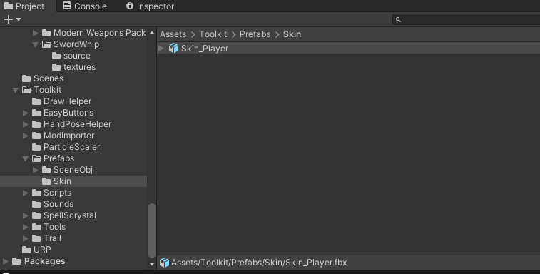
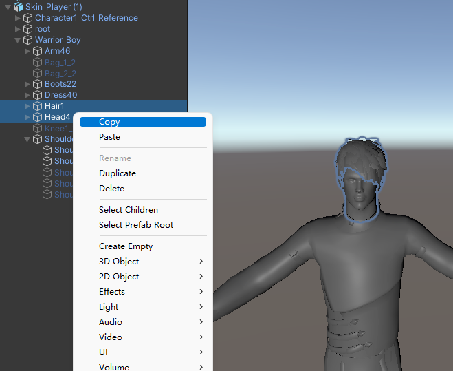
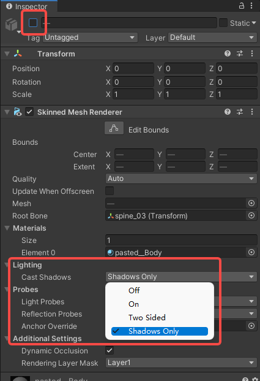
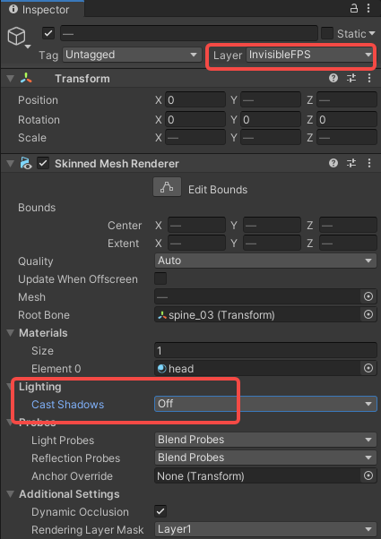
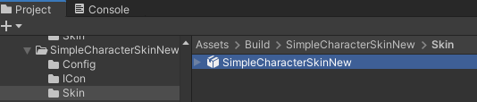
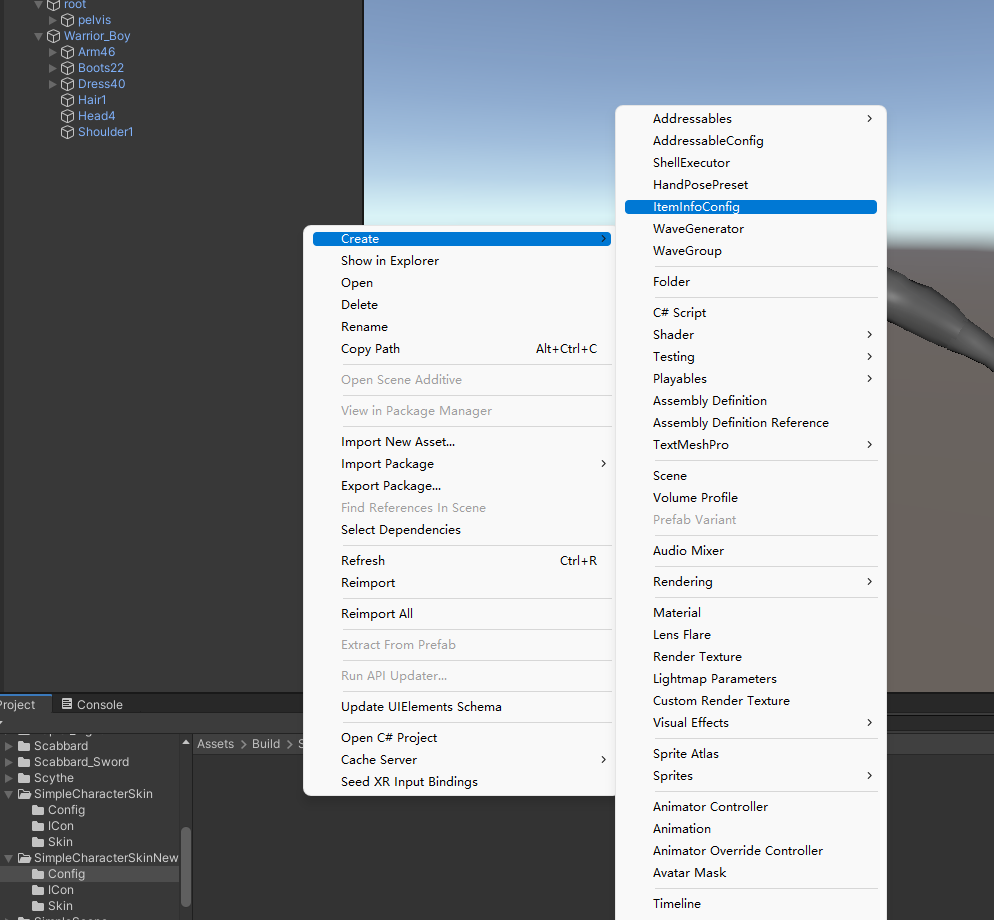
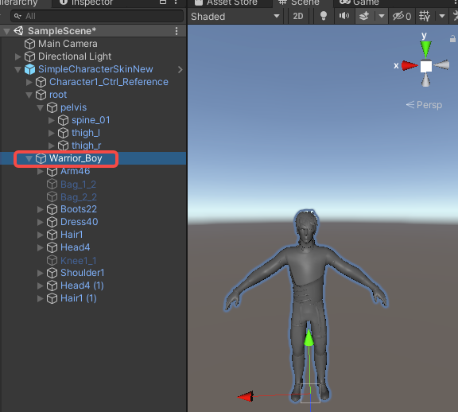
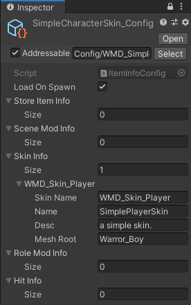

import ModTutorialFragmentPhaseBuild from '../_fragments/_fragment-phase-build.mdx';
import ModTutorialFragmentPhaseTest from '../_fragments/_fragment-phase-test.mdx';
import ModTutorialFragmentStepCreateIcon from '../_fragments/_fragment-step-create-icon.mdx';

# Create a skin mod

Here is a step to make a simple **player's skin** mod .

## Phase 1: Define your mod

<ModTutorialFragmentStepOpenUnity />

#### 2.Use the model in ToolKit as a template to bind your model

#### 3.Save Model

Save your model.

Create these folder under the "Build" folder.

#### 4.Hide the head of the model

Place the model into the scene.

To prevent the head from blocking the view, we need to set the head.

First we select and copy the head node

Set the original node CastShadows to "ShadowsOnly".

Set the copied node layer to InvisibleFPS and set CastShadows to "Off"

#### 5.Save Prefab

Drag the model into the Skin folder to save and name it

## Phase 2: Prepare to export your mod

<ModTutorialFragmentStepCreateIcon />

#### ItemInfoConfig

Create an ItemInfoConfig file in the Config folder, name it with "YourModName"

Fill in the SkinInfo，

**skinName**: The name of the model in the Skin folder you created，**Needs to be prefixed with your prefix**.

**Name**: The name displayed in the store.

**Desc**:The **description** of the item displayed in the store.

**MeshRoot**:Name of the root node of all meshes in the prefab.

## Phase 3: Build the mod

<ModTutorialFragmentPhaseBuild />

## Phase 4: Test & publish the mod

<ModTutorialFragmentPhaseTest />

