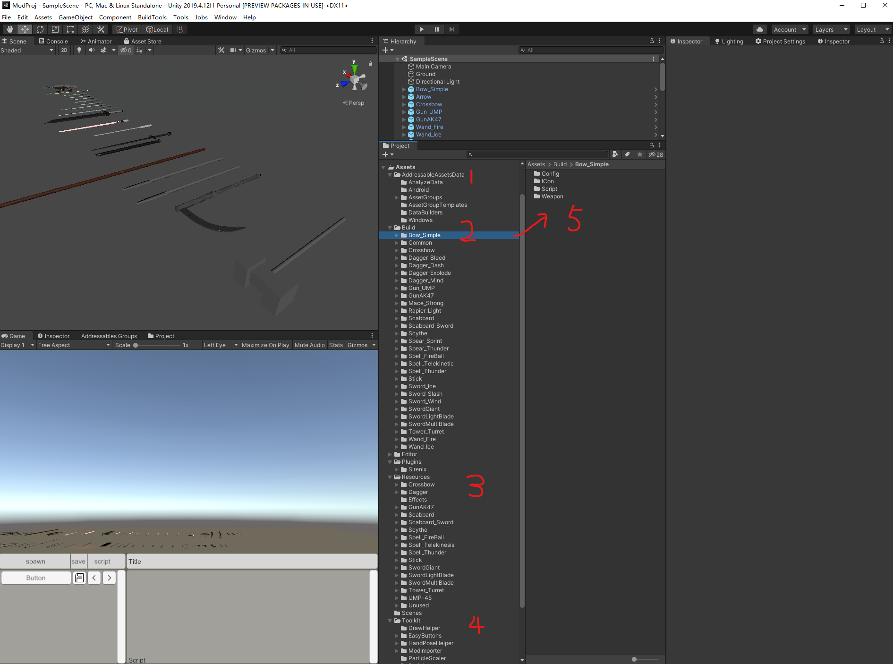
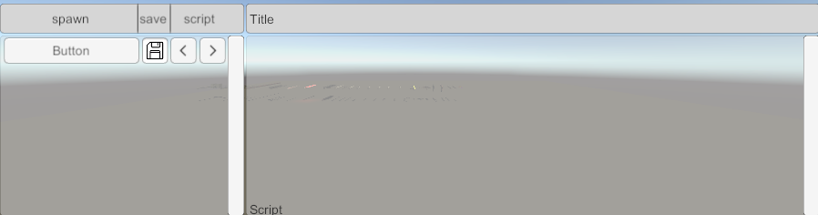

# Mod Toolkit Overview

### Build this project in a few clicks

1. Click `BuildTools -> BuildAllBundles` in the toolbar of Unity.
2. When the mod has been built it can be found in the ModProj project location at `ModProj\Assets\Mods`
3. Copy the mod files(mod files are located ) to the corresponding path:
   * To run on Windows(or click BuildTools -> InstallModOnWindows): `C:\Users[username]\AppData\LocalLow\CrossLink\BattleTalent\Mods`
   * To run on Quest(or click BuildTools -> InstallModOnAndroid): `/sdcard/Android/data/com.CrossLink.SAO/files/Mods/`
4. Done!

### Open the sample scene

Once you opened the toolkit with Unity and SampleScene(Assets/Scenes/SampleScene), you will see something like this:

### Project Folder Structure

Let me explain the folder stucture:

| Index                                | Explanation                                                  |
| ------------------------------------ | ------------------------------------------------------------ |
| 1-AddressableAssetsData              | This is generated by unity, just leave them alone            |
| 2-Build                              | It's the object you want to be associate with addressable path, so that you can load them via script or built-in system. such as weapon(prefab), effect, flyobject, audio, icon, config...etc. You should place them in the coorsponding predefined folder, so that we'll handle the addressable path for you automatically. We'll explain addressable path later. |
| 3-Resources                          | We place the resources don't need addressable path here. such as fbx, texture, shader. Because they will be loaded within the prefab, so we don't need to define a addressable path for them. Unity's addressable system will handle this for us. |
| 4-Toolkit                            | It's the toolbox provided by developer, we'll dive in this place later. |
| 5-Inner folder of a mod source files | As you can see, we place the object under the coorsponding predefined folder. So that they will be associate with the coorsponding addressable path. Then the script or built-in system can load them correctly. |

### Mod Importor

Mod importor can load and save the mod files you placed in the PCVR mod folder(Tools/OpenPCModFolder). It lets you to visit the inside resources of a mod even you don't have the source file. It's a good way to learn how to mod.

To use this tool, is to run the SampleScene. Then you'll see the mods list from PCVR mod folder.

PS: currently, Mod Importor can not save the mesh(fbx) from mod, because we can't not access the mesh from memory. If anyone knows how to make a mesh readable from addressable at runtime, please let me know.

### PC VR Simulator Shortcut

| Shortcut       | Function at Body Mode | Function at Hand Mode    |
| -------------- | --------------------- | ------------------------ |
| WASD           | walk                  | walk                     |
| Shift          | run                   | hand rotation            |
| Alt            | switch to Hand Mode   | switch to Body Mode      |
| Tab            |                       | switch between your hand |
| Mouse Movement | body rotation         | hand movement            |
| Ctrl           |                       | hand movement on Z axis  |

| Shortcut | Function                         |
| -------- | -------------------------------- |
| F12      | open or close MainMenu           |
| F11      | open or close CheatMenu          |
| F10      | reload mods(not working for now) |
| F9       | remove mods(not working for now) |
| F8       | jump to test scene               |
| F4       | hide mouse                       |
| PageDown | select next target               |
| U        | kill target                      |
| Y        | stun target                      |
| PadNum   | target attacks                   |
| Home     | enable target's AI               |
| End      | disable target's AI              |
| K        | kill all                         |
| Space    | jump                             |
| G        | jump(no cooldown)                |
| V        | dash(no cooldown)                |

### Log Path

| Log     | Log Path                                                     |
| ------- | ------------------------------------------------------------ |
| Windows | https://docs.unity3d.com/Manual/LogFiles.html                |
| Quest   | adb command: .\adb.exe logcat -s Unity -d > .\quest_log.txt  you can also read it on **in-game console** or using **adb log command** or using **sidequest's adb window** |
|         |                                                              |

