# Create a role mod

here is a step to make a simple role mod .

#### 1.Open the ModProj by Unity2019.4.12f1

#### 2.Set the Animation Type to humanoid and Avatar Definition to Create From This Model

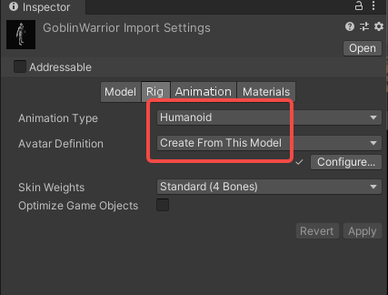

#### 3.Placement of the model into the scene

Create an Empty node under the left hand node, named "LWeapon Point", and do the same for the right hand node.

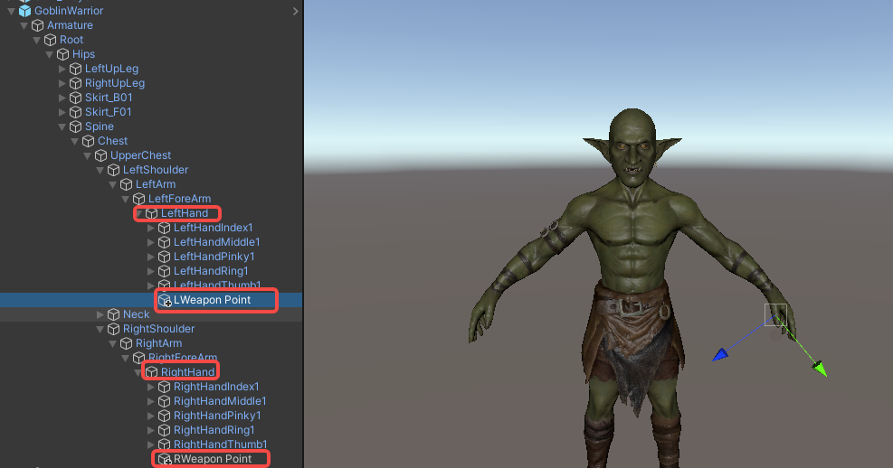

Adjust the direction of the node, the z-axis direction of LWeapon Point is the direction of the weapon

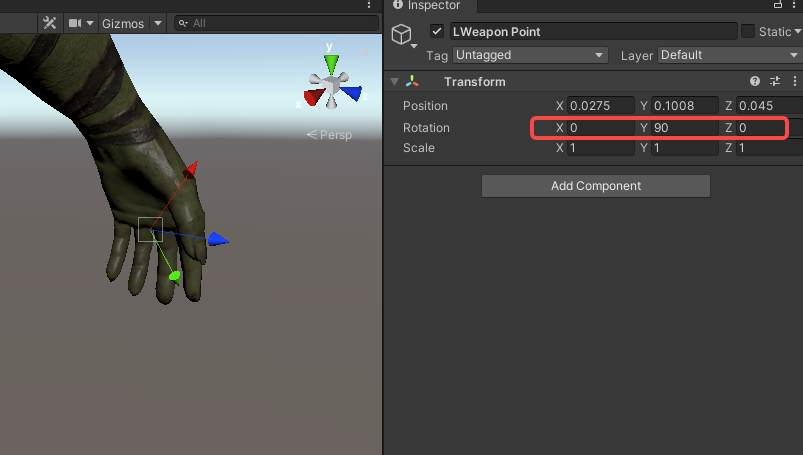

Create two empty nodes under the Chest node, named "LWeapon Spine" and "RWeapon Spine",  This is the hanging point of the weapon, again requiring an angle adjustment.

Apply.

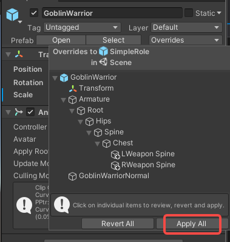

#### 3.Save Model

Create these folder under Build folder.

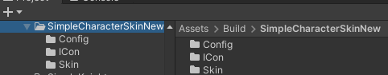

Drag the character of the scene to the role folder.

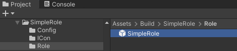

#### 4.Take a screenshot

Select the Prefab and take a screenshot. Save the screenshot to ICon folder.

Set the Max size to 128 and click “Apply” to save.

#### 5.Use ItemInfoConfig

1.Create an ItemInfoConfig file in the Config folder, name it with your mod name + "_Info”

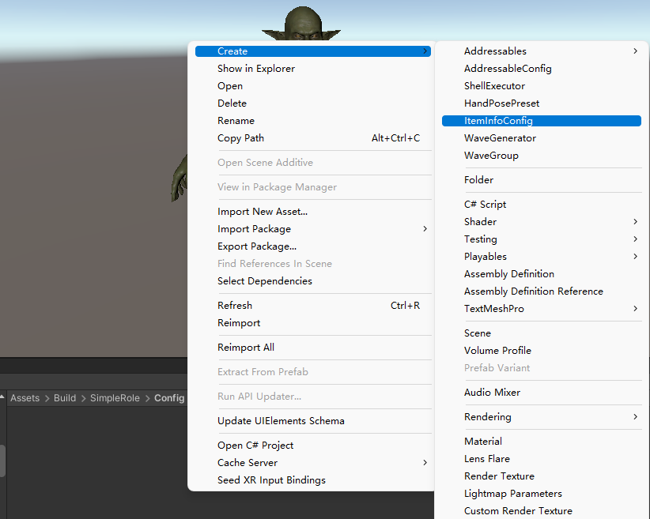

Fill in the RoleModInfo

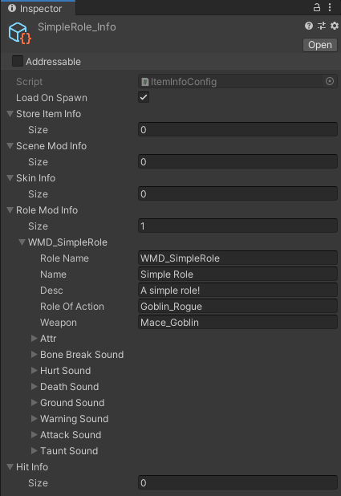

**ReplaceRole**: Replaceable NPC in the game.

**Weapon**: character's weapon.

To know more about **ReplaceRole** and **Weapon**, please read [Role and Weapon](../details/role-and-weapon.md).

**attr**: character's attribute, read only the first data of this array, Use default data when array length is 0.

If you want to modify the sound effects of your character, you will need to place the sound files in the Audio folder.

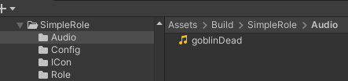

Fill in the sound file name in the config under SoundNames, and don't forget to add your prefixes.

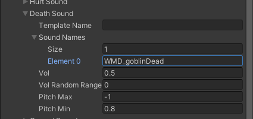

### 6.Build

Select the **AddressbleConfig**(Assets - Resources - AddressableConfig), fill in the “Prefix” and “Addressable Paths”，Click ”**Clear Addressables**“ and “**Create And Refresh Addressable Name**”

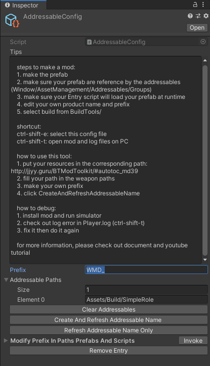

Fill in the ProductName

Click BuildTools - **BuildAllBundles** to Build.

Done!