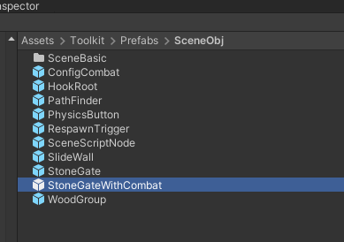
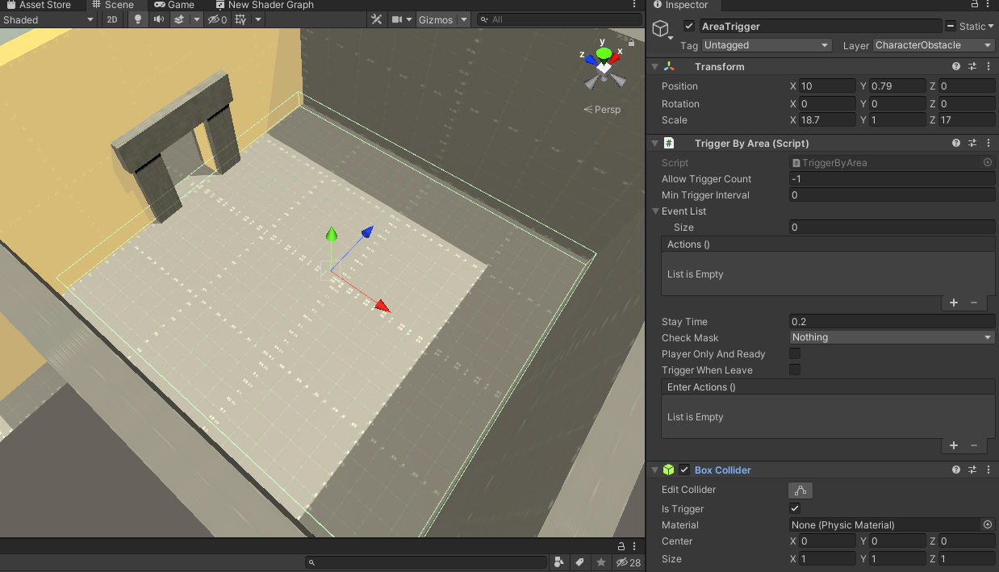
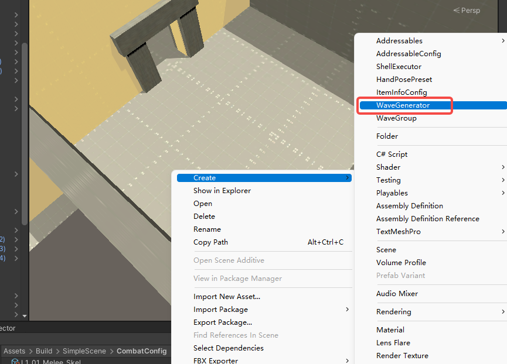
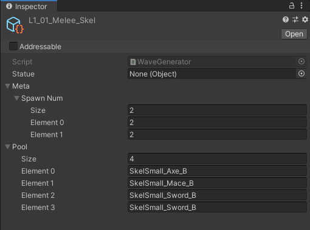
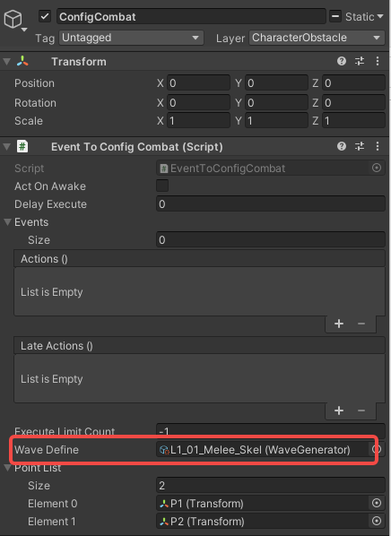
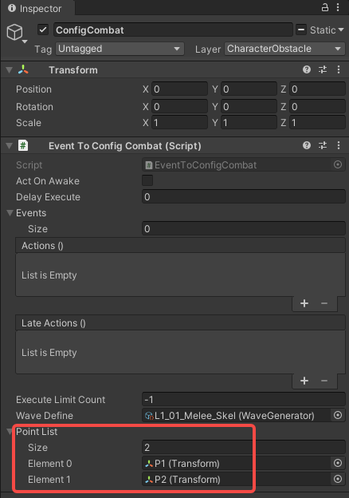

# Create Combat Room

Here is an example of creating a battle room in a scene.

#### 1.Place StoneGateWithCombat

#### 2.Set the size of the AreaTrigger under StoneGate to cover the entire room.

#### 3.Create the WaveGenerator file

Fill in the number of enemies generated at the same time in the "SpawnNum" field, the number will go up in the array as you kill more enemies. Fill in the enemy name in the "Pool" field.

Specify WaveGenerator to ConfigCombat under StoneGateWithCombat.

#### 5.Adjust the position of the spawn points of EventToConfigCombat, you can increase or decrease the generation points as needed.

#### 6.Done!